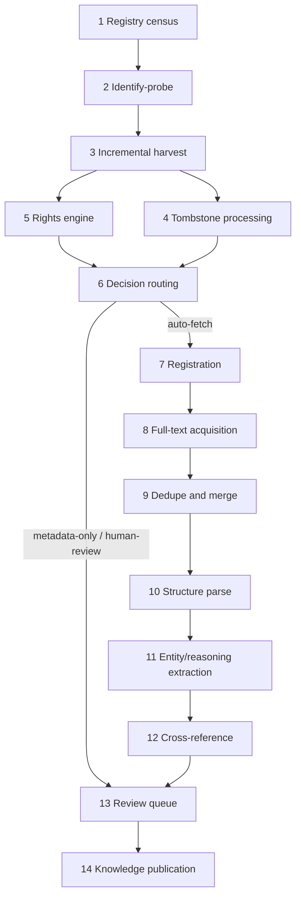
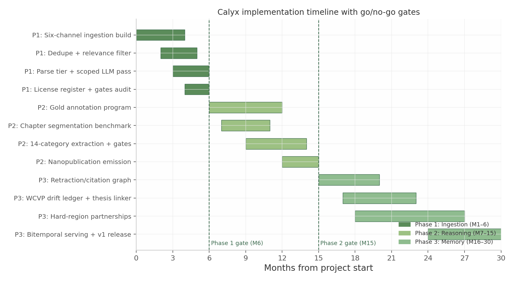

# Calyx: Automated Discovery, Acquisition, and Analysis of Graduate Botanical Research — An Implementation Research Report

*Prepared for the Orchid Continuum — Chief Research Librarian mission brief. Research verified live 2026-07-21. Companion research artifacts: /mnt/agents/output/research/.*

## Executive Summary

The Orchid Continuum commissioned this report to determine whether — and how — the Calyx platform can automatically discover, acquire, organize, and analyze graduate botanical research, building toward a Scientific Reasoning Corpus that preserves the evolution of scientific reasoning. The findings rest on live endpoint probes conducted on 2026-07-21 (OAI-PMH verbs, REST APIs, bulk-channel checks across dozens of repositories), official documentation, and peer-reviewed benchmark and infrastructure studies; every quantitative claim is traced to one of these three evidence classes, with confidence levels flagged where the evidence is thinner.

Six findings carry the decision. **First, discovery is solved; the asset is the rights-verified store.** Between OpenAlex (20.26M dissertation-typed records including extended provenance), DataCite (818,074 dissertation DOIs), the NDLTD union archive (~7.9M records, live across all six OAI verbs), and CORE (291M records in its 2023 dataset paper; ~452M currently claimed), finding theses costs effectively nothing.[^1^][^2^][^3^][^4^] What no free channel supplies is per-record licence state and rights-aware full text — so Calyx's defensible asset is a licence-registered, provenance-logged document store on free metadata spines, not another index. **Second, Phase 1 is six channels, not six hundred endpoints.** Roughly 44% of registered OAI-PMH endpoints are dead and direct long-tail harvesting means permanent "endpoint gardening"; the plan therefore ingests via OpenAlex (snapshot plus Content API), the CORE dump, the NDLTD union archive, theses.fr, EThOS, and about ten live-verified botanical repositories (Leiden, Kew, OpenUCT, UPM, and peers).[^5^][^1^] **Third, value and difficulty are anti-correlated.** Orchid theses concentrate in Latin America, South/Southeast Asia, and southern Africa — precisely where infrastructure is weakest — while the easiest sources are orchid-sparse (Kew holds roughly 15–30 orchid theses among 9,361 records); a hard-region partnership strategy is therefore a first-class workstream, not an afterthought.[^6^] **Fourth, reasoning extraction is annotation-gated, not model-gated.** Three key reasoning categories (assumptions, alternative explanations, speculation/hypothesis boundaries) have no training corpora at all; a double-annotated gold set (~12 chapters, 220–260 person-hours, USD 8,000–15,000) is the critical path, after which fine-tuned small models beat zero-shot LLMs by 15–40 F1 at ~20× throughput.[^7^] **Fifth, compute is trivial and staff is the cost.** Full ingestion and extraction at 100,000-thesis scale costs under USD 5,000 in compute and storage (0.3/3/30 TB at 10k/100k/1M scales); the dominant line is 0.5–1.0 FTE/year of permanent engineering, and the project's largest unpriced liability is that no funding model currently exists for it.[^8^] **Sixth, the legal posture is five automatable rules, not a legal opinion.** Lawful access only; no redistribution of non-CC full text; machine-readable opt-out honoring; default all-rights-reserved when no licence is found; locality fuzzing for sensitive taxa — all encodable as a three-lane policy engine (auto-allow / auto-deny / human-review) with licence snapshots at acquisition and a quarterly legal watch.[^9^] OpenAlex's Content API (60M+ open-access PDFs plus pre-parsed TEI at USD 0.01/file) is simultaneously the best full-text channel and the biggest dependency risk, answered by a mirror-on-first-touch doctrine: download every free snapshot, mirror everything consumed, and never let a serving path depend on a live upstream query.[^1^]

The plan runs in three gated phases. Phase 1 (months 1–6) builds working automated ingestion over the six channels — rights-verified store, deduplication, two-track parsing, nomenclature mining, scoped LLM passes, and an InvenioRDM registry — and advances only if it delivers ≥30,000 orchid-relevant parsed theses, ≥85% dedupe precision on audit, a complete licence register, and under USD 5,000 compute. Phase 2 (months 7–15) front-loads the gold annotation program and ships fourteen-category reasoning extraction with verbatim-span hallucination gates, emitting one provenance-locked nanopublication per claim. Phase 3 (months 16–30) adds scientific memory — the retraction/correction graph, citation contexts, the WCVP drift ledger that makes taxonomic re-circumscription a measurable idea-evolution signal unique to botany — and closes with Calyx Corpus v1, a DOI'd, versioned, re-harvestable snapshot.[^10^]

The honest verdict, reached adversarially, is conditional. If the near-term goal is serving orchid researchers, the full build is the wrong first move: a curated 5,000–10,000-document orchid-only corpus on a dump-first spine delivers more value per dollar (~USD 5,000, under one FTE-year) while sidestepping the four largest documented risks — endpoint mortality, anti-bot escalation, licence sparsity, and permanent staffing. The full three-phase build is justified only if the Scientific Reasoning Corpus is the true objective, because claim-level argumentation structure at six-figure scale can neither be curated nor rented from ProQuest — and even then it must carry binding Phase-1 gates, a named funding model, and a 0.25–0.5 FTE maintenance commitment before Phase 2 begins. Only ~32% of the world's theses are open access at all, so coverage is legally capped and the corpus must publish what it cannot see.[^11^]

The immediate next action is a two-download, two-week pilot: pull the free OpenAlex quarterly snapshot and the free CORE plaintext dump, filter to the Orchidaceae-concept dissertation slice (497 core records verified, 667 with extended provenance), and run the rights-verification cascade and parse tier end-to-end on that sample. This costs under USD 200, requires no partnerships or permissions, and directly measures the two quantities the whole decision turns on — real orchid-corpus yield per channel and dedupe precision — before any larger commitment is made.

## 1. Global Repository Survey

This chapter inventories every practical channel through which the Calyx platform can discover and acquire electronic theses and dissertations (ETDs) at scale, based on live endpoint probes executed on 2026-07-21, official documentation, and peer-reviewed infrastructure studies. Each repository is characterized on the 21-field profile defined in the project brief (organization, coverage, volume, access model, protocol support, bulk capability, licensing, and botanical relevance); the full profiles are compressed here into a master ranking table (Section 1.5.1) and a four-tier ingestion assignment (Section 1.5.2) that downstream chapters treat as binding input. Two methodological caveats frame everything that follows. First, record counts are point-in-time measurements: where a count was verified live (via an OAI-PMH `completeListSize`, an API response, or an official dataset), the verification method and date are stated; where a count rests on an operator's marketing page, it is flagged. Second, "reachable" means reachable from the probe environment on 2026-07-21; several national systems are geo-blocked or anti-bot-screened and are reported as observed, with the blocking mechanism identified.

### 1.1 The Global ETD Landscape in 2026

#### 1.1.1 Market structure: three tiers

The global supply of machine-readable graduate research organizes into three structurally distinct tiers, and the tier determines the acquisition strategy.

The first tier is the **commercial silo**. ProQuest Dissertations & Theses Global (PQDT, Clarivate) is the largest curated ETD corpus: the official FAQ states "over 5.5 million" dissertation and thesis citations with full text for "over 3 million" works, drawn from 4,100+ institutions in 60+ countries, growing at roughly 250,000 works per year; alternative official figures range from 5 million to 6 million citations, so the figure is best treated as approximately 5.5 million or more with low-to-medium confidence (Conflict Zone C4).[^12^] PQDT exposes no public API, no OAI-PMH endpoint, and no bulk channel; the only sanctioned machine-scale route is the TDM Studio workbench (Section 1.2.3). The second tier is the **open aggregators**. OpenAlex (OurResearch) indexes 11,023,419 works typed `dissertation` in its core corpus and 20,257,594 when the XPAC expanded corpus is included (live API queries, 2026-07-21);[^13^] OATD indexes 7,464,811 open-access theses (homepage counter, July 2026);[^14^] the NDLTD union archive exposes 7,908,563 records over OAI-PMH (live probe);[^15^] and CORE aggregates roughly 452 million metadata records with about 57 million full texts across all document types on its current service pages (operator-declared figures; the peer-reviewed 2023 dataset paper reported 291 million records as of February 2023).[^16^] The third tier is the **national and institutional repository layer**: national thesis platforms (theses.fr, EThOS, Deutsche Nationalbibliothek, Shodhganga, RISS, Trove) and several thousand institutional repositories running DSpace, EPrints, Digital Commons, or WEKO3 software, most of which expose the Open Archives Initiative Protocol for Metadata Harvesting (OAI-PMH).

The practical consequence, developed in Section 1.5, is that discovery is a solved problem while acquisition is not: the open aggregators collectively enumerate more theses than any single-tier source, but only the repository layer supplies rights-annotated full text.

#### 1.1.2 Consolidation and churn

The survey period is marked by exceptional churn, which must shape any long-lived harvesting architecture. DART-Europe — for two decades the European thesis portal of record — closed permanently on 3 February 2025, with no institutional successor; its function devolved onto general aggregators (OpenAIRE lists approximately 2.6 million theses, BASE approximately 3.75 million) and onto national nodes.[^17^] CiNii Dissertations (Japan) ended service on 2025-05-12 and was merged into CiNii Research, removing roughly 600,000 dissertation records from a thesis-specific discovery channel.[^18^] The Netherlands' NARCIS portal was retired in 2023, pushing Dutch harvesting to per-university endpoints such as Wageningen's `library.wur.nl/oai` (probe-verified live).[^19^] NDLTD's own discovery interfaces (`search.ndltd.org`, `union.ndltd.org`) returned HTTP 503 "under redevelopment" on 2026-07-21, even though the underlying union archive remains fully harvestable.[^20^] OpenAlex, the emergent metadata spine, shifted to keyed freemium access in 2026: API keys are now mandatory, the free tier is a one-dollar-per-day credit, and the free snapshot moved from monthly to quarterly cadence.[^21^]

The structural reading of this churn comes from a peer-reviewed 2026 persistence study (Macgregor, arXiv:2601.04015): in a registry-scale crawl, more than one in five repositories were offline and approximately 44% of OAI-PMH endpoints were dead, with about 25% of HTTP requests to repository URLs failing.[^5^] Endpoint-level harvesting is therefore a maintenance treadmill, not a one-time crawl. The implication, stated here and operationalized in Section 1.5.2, is that Calyx should harvest a small number of large, verified channels (Tier A), treat aggregators as the discovery and full-text-resolution layer for everything else (Tier B), and never build a Phase-1 dependency on hundreds of long-tail endpoints.

### 1.2 Americas and Global Aggregators

#### 1.2.1 NDLTD union archive: the primary global harvest channel

The Networked Digital Library of Theses and Dissertations (NDLTD) union archive, operated with the University of Cape Town, is the single most important open acquisition channel verified in this survey. Live probing of `https://ndltdunion.cs.uct.ac.za/OAI-PMH/` on 2026-07-21 returned valid responses to all OAI-PMH verbs: `Identify` reports protocol version 2.0, persistent deleted-record handling, and an earliest datestamp of 2011-09-07; `ListSets` exposes 212 sets keyed to source collections (BOSTON, IBICT, ADTP for the Australasian Digital Theses Program, LACETR for Library and Archives Canada); `ListMetadataFormats` advertises six prefixes (`oai_dc`, `oai_etdms`, `etdms`, `etdms11`, `etd-ms`, `mods`); and `ListIdentifiers` reports `completeListSize="7,908,563"`.[^22^] The archive is actively ingesting — the portal's recent-submissions list showed records dated 2026-07-20 — even though the NDLTD search interfaces are down; the discovery UI and the harvest channel are independent systems, a distinction earlier estimates missed (the live OAI count supersedes the 6.54 million figure on the portal statistics page).[^20^]

Three operational caveats apply. Record-level format availability is source-dependent: a `GetRecord` request with `metadataPrefix=oai_etdms` against an ADTP record returned `cannotDisseminateFormat`, so `oai_dc` is the reliable baseline and ETD-MS is opportunistic. No terms-of-use or rate policy is published, so throughput must be established by a pilot harvest before a full 7.9-million-record pull (open question U4). And the infrastructure is single-host: everything harvested should be mirrored into Calyx's own store on first touch. Within these constraints, the union archive provides Dublin Core metadata plus, via `dc:identifier`, direct links to source-repository full text (sample records resolve to PDF URLs), making it both a metadata spine and a full-text locator.[^23^]

#### 1.2.2 OATD, EBSCO Open Dissertations, and the discovery-only layer

OATD (Open Access Theses and Dissertations) is the largest dedicated open-access ETD index at 7,464,811 records from 1,100+ institutions, but it is deliberately not an acquisition channel: OATD hosts no full text (it indexes about the first 30 pages of some theses for snippet display), offers no API or dump, and sits behind aggressive Cloudflare bot screening that defeated both scripted and headless-browser access on 2026-07-21.[^14^][^24^] Its value to Calyx is its source map. The canonical page `oatd.org/oatd-repositories.html` enumerates every contributing repository with its exact OAI base URL, thesis set(s), and metadata prefix; the live page is bot-walled, but the Wayback Machine snapshot of 2024-07-08 renders fully and yields the complete 1,100+ entry seed list (Conflict Zone C7, resolved).[^25^] The two-year staleness of that snapshot is real but bounded: each base URL is re-verified with a `?verb=Identify` probe before scheduling, and dead entries are expected given the 44% endpoint-mortality rate cited above.

EBSCO Open Dissertations (opendissertations.org) provides a secondary, free discovery layer of 1.4 million+ OAI-harvested records from 320+ universities, incorporating the American Doctoral Dissertations 1933–1955 print index (about 100,000 records) — useful for pre-war botanical taxonomy coverage that open repositories lack — but with no public API, no re-exposed OAI feed, and no bulk option, it is a discovery and traffic-referral layer only.[^26^]

#### 1.2.3 ProQuest PQDT: licensed-only, metadata export feasible

PQDT Global is inaccessible to automated ingestion by design: no API, no OAI-PMH, license terms that prohibit systematic downloading. The one sanctioned channel is ProQuest TDM Studio, a cloud workbench over an institution's licensed ProQuest content. Multi-institution library documentation, current as of July 2026, fixes the workbench limits at up to 10 simultaneous datasets of 2,000,000 documents each, with a rolling export cap of 15 MB per week and an absolute prohibition on exporting full text or "any consumptive information that would allow the researcher to reconstruct the full text."[^27^] Critically for Calyx, two metadata export types — Citation Metadata and Extended Metadata (subject fields and publication information explicitly described as "valuable metadata for text and data mining purposes") — are permitted, making TDM Studio a lawful enrichment source for PQDT-held records (at roughly 7,500–15,000 enriched records per week under the cap) while excluding full-text corpus building. PQDT Open, the free OA subset, returned HTTP 521 (origin down) on its search page on 2026-07-21 and is not a viable channel.[^28^] ProQuest therefore sits in Tier C: partnership/licensed, metadata-only.

#### 1.2.4 HathiTrust and Theses Canada

HathiTrust offers the most mature bulk machinery in the Americas — HathiFiles monthly full dumps (~4 GB compressed, 26+ tab-delimited fields) plus daily incrementals, and the HTRC Extracted Features dataset of 18.7 million volumes via unauthenticated rsync — but it has no thesis genre field. Column 20 (`bib_fmt`) distinguishes books from serials, not dissertations; thesis identification requires heuristics over description/imprint strings ("Thesis (Ph. D.)"), collection-code clusters, and MARC 502 dissertation notes retrieved through the Bibliographic API (Conflict Zone C6, resolved in favor of heuristics).[^29^] Full OCR is available only for public-domain volumes; in-copyright theses are non-consumptive (Extracted Features) unless a Data Capsule is approved. HathiTrust is thus a Tier-B channel valuable chiefly for historic, public-domain botanical theses.

Theses Canada (Library and Archives Canada, LAC) inverts the usual pattern: LAC is a harvester, not a provider. Its official university-facing specification requires OAI-PMH 2.0 with ETD-MS 1.0/1.1 metadata and identifiers that are direct file links, but LAC exposes no OAI endpoint or bulk API of its own.[^30^] The practical bulk path is the NDLTD union archive's `LACETR` set — 199,832 records live-verified — whose records link through to source-university handles; LAC-hosted e-thesis PDFs (1998 onward, 217,000+ files) are free, while ProQuest-digitized retrospective theses carry an approximately four-year contractual lag.[^31^]

### 1.3 Europe

#### 1.3.1 theses.fr: the best-in-class national platform

France's national thesis platform, operated by ABES (Agence Bibliographique de l'Enseignement Supérieur), is the strongest single national acquisition target in this survey. Its OAI-PMH endpoint at `staroai.theses.fr/OAIHandler` (note: the `theses.fr/OAIHandler` path 404s) was probe-verified live with protocol 2.0, two metadata formats (native TEF XML per the AFNOR TEF 2.0 schema, and `oai_dc`), and 289 sets including roughly 100 Dewey discipline sets — among them `ddc:580` (Plantes. Botanique), `ddc:570` (life sciences), and `ddc:630` (agronomy) — plus per-institution sets and a `diffusable` set flagging records cleared for full-text dissemination.[^32^] The complementary REST search API (`theses.fr/api/v1/theses/recherche/`, open-source with an OpenAPI specification) returned 1,042 hits for *botanique* in a live probe, supports status, accessibility, discipline, and date-range filters, and is capped at 100,000 records per query with a documented 99.99% availability target.[^33^] Bulk access is provided via the data.gouv.fr dataset "Thèses soutenues en France depuis 1985" (CSV/JSON/NDJSON) under the Etalab Licence Ouverte / Open Licence 2.0, which permits free reuse including commercial use with attribution and date-of-retrieval statements; the dump's last full refresh was 2024-01-08, so OAI/API incrementals are needed for gap-filling.[^34^] Because sets cannot be cross-filtered server-side, the botanical acquisition recipe is: harvest `ddc:580` (and `570`/`630`), intersect locally with `diffusable` membership, extract the full-text URL from the TEF record, and fetch the PDF. License clarity, protocol depth, and discipline-set granularity are all maximal; residual risk is low.

#### 1.3.2 EThOS post-relaunch

The British Library's EThOS service, offline since the October 2023 cyber-attack, relaunched on a new platform by 2026-07-08 with 650,000+ UK doctoral-thesis records (including 14,000 added during the outage), no login requirement, and no centrally hosted PDFs: approximately 65% of records carry an "Access thesis from university" link, and 400,000+ theses are openly downloadable from institutional repositories.[^35^] The bulk channel is the "UK Doctoral Thesis Metadata from EThOS" CSV dataset on the BL Research Repository; the latest fully verified version is v9 (2022, DOI 10.23636/kvwc-ty06, 610,535 records, CC0 per independent reuse statements), and whether a refreshed post-relaunch snapshot has been published is an open question (U3) to check at harvest time.[^36^] EThOS is therefore a metadata-plus-link-out channel: CC0 for the metadata layer, per-record licenses and robots discipline for full text at each university.

#### 1.3.3 DNB and the rest of Europe

The Deutsche Nationalbibliothek (DNB) probe-verified both of its machine interfaces on 2026-07-21: OAI-PMH at `services.dnb.de/oai/repository` (earliest datestamp 1945-01-01, deleted-record transient) and SRU at `services.dnb.de/sru/dnb` (CQL queries, MARCXML, no key). The set tree `dnb:reiheH` (Hochschulschriften) mirrors DDC Sachgruppen, giving a direct botany route via `dnb:reiheH:sg580` (Botanik) plus sibling sets for biology, zoology, and agriculture; catalogue metadata is free without registration and GND authority data is CC0, while full text (DissOnline, d-nb.info links) is per-record rights-managed.[^37^]

Four further European channels were probe-verified live and enter Tier A or B. Norway's NVA (Nasjonalt vitenarkiv) public API returned exact degree-category counts on 2026-07-21 — DegreePhd 36,162, DegreeMaster 225,445 — with per-artifact license names in JSON records.[^38^] Greece's EADD (`didaktorika.gr/eadd-oai/request`) exposes a dedicated open-access full-text set `hdl_10442_2` among its 43,000+ doctoral theses.[^39^] Catalonia's TDR/TDX (`www.tdx.cat/oai/request`) is a DSpace-7 XOAI provider with per-university `com_10803_*` sets, an OpenAIRE `oaire` format, and directly fetchable OA PDFs.[^40^] Portugal's RCAAP main portal was unreachable from the probe environment, but the INESC-ID mirror `rcaap.inesc-id.pt/oai-pmh` answered a live Identify (earliestDatestamp 2025-11-23, indicating a recent re-platform whose completeness must be validated before production use).[^41^] Wageningen University & Research — the world's leading plant- and agriculture-science institution — serves a live OAI endpoint at `library.wur.nl/oai`.[^19^] Two friction cases qualify the picture: Sweden's Swepub remains legally free-for-reuse with documented OAI/SRU/JSON APIs and dumps, but its SRU endpoint returned an Anubis proof-of-work challenge on 2026-07-21, so harvesting needs whitelisting or the dump route;[^42^] and Spain's TESEO remains a bibliographic database with no full text, no API, and no official bulk export — scraped third-party dumps of TESEO exist but are legally dubious and are excluded (Tier D).

### 1.4 Asia, Latin America, Africa, Oceania

#### 1.4.1 South Asia: Shodhganga and KrishiKosh

Shodhganga (INFLIBNET, India) officially passed 600,000 theses in May 2025, but its OAI endpoint and site were unreachable from two non-Indian egresses on 2026-07-21; no official geo-block policy is published, so this is reported as an observed access restriction rather than a stated one.[^43^] The verified fallback runs through OpenAlex: source `S4377209701` holds 117,620 Shodhganga works — a stale snapshot whose coverage collapses after 2020 (2,202 works in 2020, 7 in 2021) — but whose `primary_location.landing_page_url` values point directly at Shodhganga bitstream PDFs (handle pattern `10603/xxxxx`), giving a workable metadata-plus-PDF pattern for the pre-2021 backfile.[^44^] A full harvest requires Indian egress (partner institution or cloud region) or harvesting of member-university DSpace repositories, which duplicate deposits. KrishiKosh (ICAR's agricultural repository, approximately 180,000 theses including the KrishiPrabha backfile) has migrated to DSpace 7; its standard OAI path `/server/oai/request` is probable but unverified after intermittent DNS failures on probe day.[^45^] Both are high-botanical-value, high-friction sources: Tier C pending access arrangements.

#### 1.4.2 East Asia and Oceania: CNKI, IRDB, RISS, Trove

China's CNKI doctoral (CDMD, 500,000+) and master's (CMFD, 5 million+) databases had international access restored in April 2024 via `oversea.cnki.net` under East View licensing — correcting the earlier "suspended" framing — but access remains licensed-only with no open API, OAI, or bulk channel, and OpenAlex's coverage of Chinese theses is negligible (7 CN dissertations in the orchid full-text sample), so no aggregator workaround exists.[^46^] Japan moved the opposite direction: CiNii Dissertations closed in May 2025, but the national institutional-repository aggregator IRDB serves a live OAI-PMH endpoint (`irdb.nii.ac.jp/oai`, protocol 2.0, earliest datestamp 2013-01-01), and OpenAlex ingested 4.6 million IRDB records in Q1 2026; per-institution WEKO3 endpoints remain the granular full-text path, and Japan's Copyright Act Article 30-4 gives the firmest legal footing worldwide for TDM of lawfully accessed OA thesis PDFs.[^18^][^47^] Korea's RISS holds approximately 2.29 million theses with free reading access; a documented OpenAPI exists but is application-based via KERIS, and the terms of use prohibit systematic scraping, so RISS is Tier C.[^48^] Australia's Trove API v3 supports thesis-filtered harvesting (`l-format=Thesis`) with a purpose-built `bulkHarvest=true` paging mode, but keys are tier-reviewed: thesis metadata is a routine Level-1 approval, while AI/ML use triggers Level 3–4 review and a possible data-sharing agreement — Calyx must declare its intended use upfront.[^49^]

#### 1.4.3 Latin America and Africa: federations behind anti-bot walls

LA Referencia, the Latin American federation whose portal claims roughly 4.65 million documents, exposes a dedicated re-exposure OAI endpoint at `oai.lareferencia.info/request` that is live and *not* behind the Anubis anti-bot screen that blocks the portal and Peru's RENATI: 1,480,679 records with per-country and per-node sets were live-verified on 2026-07-21.[^50^] The 1.48M-versus-4.65M gap is unexplained (Conflict Zone C3, unresolved — likely an OAI subset or harvest lag; action item is per-country set diffing plus a RedCLARA inquiry), the `earliestDatestamp` field is buggy, and no thesis-type sets exist at union level, so incremental harvesting requires local set-snapshot diffing and client-side filtering on `dc.type`. Brazil's BDTD holds a confirmed 565,311 dissertations plus 214,079 theses across 129 institutions (2026 secondary source), but its VuFind OAI endpoint sat behind an "Oasisbr" browser-check interstitial on probe day; because BDTD links out to member institutions for full text, the interim strategy is direct harvesting of member repositories (USP TEDE, UFRGS Lume, UNESP, UNICAMP — all DSpace OAI) plus an IBICT whitelisting request.[^51^] National nodes remain harvestable directly in Mexico (UNAM, live OAI), Chile (Universidad de Chile, live OAI), and South Africa (SUNScholar and WIReDSpace, both live DSpace-7 XOAI on 2026-07-21), while UPSpace (Pretoria) and UKZN ResearchSpace timed out from the probe environment and need ZA-egress verification.[^52^] This region carries the survey's central strategic asymmetry: Latin America, South/Southeast Asia, and South Africa are the orchid-richest geographies (388 of 2,296 Orchidaceae-keyword dissertations in OpenAlex are Latin American) and simultaneously the least machine-accessible — acquisition difficulty and botanical value are anti-correlated, which the tiering in Section 1.5.2 makes explicit.

### 1.5 Ingestion Suitability Ranking

Figure 1.1 plots the ten largest sources by verified record count on a logarithmic scale; counts mix live-probe measurements (NDLTD union `completeListSize`, OpenAlex/DataCite/Crossref/LA Referencia API responses), versioned-dataset figures (EThOS), and operator-declared figures (OATD homepage, BDTD, Shodhganga), as annotated in Sections 1.2–1.4. The three orders of magnitude spanned by the chart are the quantitative argument for the aggregator-first strategy: the four largest channels alone enumerate more thesis metadata than the entire long tail of national platforms combined.

#### 1.5.1 Master ranking table

Table 1.1 compresses each surveyed repository's 21-field profile into the ten decision columns that drive Phase-1 scheduling. "Est. theses" is the best current figure with its basis noted in the text; botanical relevance is scored 1–10 from orchid/botany yield evidence in the research files (aggregator scores reflect thesis-slice yield, not total index size); the scoring rationale for tiers is given in Section 1.5.2.

**Table 1.1 — Master repository ranking (n=36), surveyed 2026-07-21**

| Repository | Org/Country | Coverage | Est. theses | Access | Protocol | Bulk | License clarity | Botany (1–10) | Tier |
|---|---|---|---|---|---|---|---|---|---|
| NDLTD Union Archive | NDLTD/UCT, global | 100+ repos, global | 7,908,563 records (live) | OA metadata | OAI-PMH (6 prefixes, 212 sets) | Yes, full harvest | Medium (inherits source terms) | 8 | A |
| theses.fr / STAR | ABES, France | France, 1985– | ~900k works (API) | OA | OAI-PMH + REST API + dump | Yes (dump + OAI) | High (Etalab OL 2.0) | 8 | A |
| DNB | Germany | Germany, 1945– | Large (reiheH set tree) | OA metadata | OAI-PMH + SRU | Yes | High (GND CC0; text per-record) | 6 | A |
| EThOS | British Library, UK | UK doctoral | 650k+ (CSV v9: 610,535) | OA metadata | CSV dump (CC0) | Yes | High (CC0 metadata) | 6 | A |
| OhioLINK ETD Center | OhioLINK, US | 36 Ohio institutions | 100,000+ (NDLTD: 119,712) | OA | OAI-PMH (oai_etdms license fields) | Yes | Medium-High (CC/ARR machine-capturable) | 6 | A |
| EADD | EKT, Greece | Greece doctoral | 43,000+ | OA | OAI-PMH (OA set hdl_10442_2) | Yes | Medium (open-data page) | 5 | A |
| eScholarship | CDL/UC, US | 10 UC campuses | 73,231 theses | OA | OAI-PMH; verified PDF pattern | Yes | Medium (ARR default, some CC) | 8 | A |
| OpenAlex | OurResearch, global | All sources | 11.02M core / 20.26M XPAC dissertations (live) | Freemium | REST API + S3 snapshot (CC0) | Yes | High (CC0) | 8 | B |
| CORE | Open University, UK | Global OA | Large thesis slice of 452M records | Freemium | API v3 + ResourceSync dump (ODC-BY) | Yes (dump registration-gated) | Medium-High | 7 | B |
| OpenAIRE Graph | OpenAIRE, EU | 70k+ sources | ~2.6M theses | OA | API + Zenodo dump (CC-BY 4.0) | Yes | High (CC-BY) | 6 | B |
| DataCite | Global registry | DOI-registered theses | 818,074 Dissertation DOIs (live) | OA | REST + OAI-PMH (query setspecs) | Yes | High (CC0) | 5 | B |
| Crossref | Global registry | DOI-registered theses | 1,062,500 type:dissertation (live) | OA | REST API, cursor harvest | Yes | High (metadata open) | 5 | B |
| LA Referencia | RedCLARA, LatAm | 9–11 national nodes | 1,480,679 OAI records (portal claims 4.65M) | OA metadata | OAI-PMH (oai_dc/xoai) | Yes | Medium (CC BY 4.0 portal; per-repo text) | 10 | B |
| NVA | Sikt, Norway | Norway | DegreePhd 36,162 + DegreeMaster 225,445 (live) | OA | REST API (JSON) | Yes (paged API) | Medium (per-artifact licenses) | 5 | B |
| TDR/TDX | CSUC, Spain | Catalonia + ES partners | 30,000+ full texts | OA | OAI-PMH (XOAI, oaire) | Yes | Medium-High (per-record CC) | 5 | B |
| WUR Library | Wageningen, NL | WUR output | Moderate | OA | OAI-PMH | Yes | Medium | 9 | B |
| HathiTrust/HTRC | US consortium | Global, digitized | Unquantified thesis slice of 18M+ vols | Mixed (PD/in-copyright) | HathiFiles dumps + Bib API + EF rsync | Yes | Medium (PD clear; IC non-consumptive) | 5 | B |
| Theses Canada (LACETR) | LAC, Canada | ~70 universities | 199,832 (NDLTD set); 217k+ PDFs | OA | Via NDLTD OAI set | Yes (indirect) | Medium (personal/academic use) | 6 | B |
| Digital Commons network | Elsevier/bepress, US-heavy | 700+ institutions | 4M+ items (ETD-major slice) | OA | Per-repo OAI-PMH (`/do/oai/`) | Yes (per repo) | Medium (per-work) | 6 | B |
| IRDB | NII, Japan | Japan IRs | 4.6M records (in OpenAlex) | OA | OAI-PMH + WEKO3 per-repo | Yes | Medium; Art. 30-4 TDM-safe | 6 | B |
| RCAAP | FCCN, Portugal | Portugal | 1M+ docs | OA | OAI-PMH (mirror live) + REST | Yes | Medium | 5 | B |
| Swepub/DiVA | KB, Sweden | ~40 HEIs | Swepub ~1M+ records | OA legally; Anubis on SRU | OAI-PMH/SRU/API/dumps | Yes (dump route) | High for metadata | 6 | B |
| BASE | Bielefeld, Germany | Global | ~3.75M theses | Freemium | API (registered non-commercial) | Partial | Medium | 5 | B |
| EBSCO Open Dissertations | EBSCO/BiblioLabs, US | 320+ universities | 1.4M+ | OA web | None public | No | Medium | 4 | B |
| Shodhganga | INFLIBNET, India | India | 600,000+ declared | OA, geo-restricted (observed) | OAI-PMH (unreachable); OpenAlex stale backfile | Blocked | Low (no TDM grant) | 8 | C |
| BDTD | IBICT, Brazil | 129 institutions | 779,390 (565,311 + 214,079) | OA, anti-bot interstitial | OAI-PMH (blocked); member repos open | Blocked centrally | Medium | 9 | C |
| ProQuest PQDT + TDM Studio | Clarivate, global | 4,100+ institutions | ~5.5M+ citations / 3M+ full text | Licensed | Workbench only; metadata export 15 MB/wk | Metadata only | High (contractual) | 8 | C |
| CNKI CDMD/CMFD | CNKI, China | China | 500k+ doctoral, 5M+ master's | Licensed (East View) | None open | No | High (contractual) | 7 | C |
| RISS | KERIS, Korea | Korea | ~2.29M | Free read; scraping barred | OpenAPI (application-based) | Conditional | Medium | 6 | C |
| Trove | NLA, Australia | Australia/NZ | Large (l-format=Thesis) | Tiered API keys | API v3 bulkHarvest | Conditional (Level 3–4 for AI) | Medium-High | 6 | C |
| KrishiKosh | ICAR, India | ICAR + SAUs | ~180,000 | OA; DNS-flaky | OAI-PMH (DSpace 7, unverified) | Probable | Medium | 9 | C |
| Taiwan NCL NDLTD | NCL, Taiwan | Taiwan | ~1.17M (NDLTD union stats) | Mixed (author permission) | Web; no documented API/OAI | No | Low-Medium | 7 | C |
| YÖK Tez Merkezi | YÖK, Türkiye | Türkiye | ~50k/yr growth | Geo-restricted (observed) | None | No | Low | 4 | C |
| OATD | OATD Inc., global | 1,100+ institutions | 7,464,811 index records | Index only; Cloudflare-walled | None (consumes OAI) | No (scrape-prohibited) | Medium (defers to local statements) | 7 | D |
| WorldCat Dissertations | OCLC, global | Global | 26M+ records claimed | Licensed | None open | No | High (contractual) | 6 | D |
| TESEO | Ministry, Spain | Spain, 1976– | 300k+ bibliographic | Restricted; no full text | None official | No | Low (scraped dumps excluded) | 4 | D |
| DATAD | AAU, pan-Africa | Africa | 15–20k | Subscription index | None | No | Medium | 5 | D |
| GANJ | IranDoc, Iran | Iran | Large; embargoed full text | Embargo model (18–30 mo) | None documented | No | Low | 4 | D |

The table makes three structural patterns visible. First, the Tier-A row set is deliberately small: seven channels whose protocols, licenses, and live-verified endpoints jointly justify unattended automated harvest, and which span North America (OhioLINK, eScholarship), Europe (theses.fr, DNB, EThOS, EADD), and the global union layer (NDLTD). Second, Tier B is dominated by registries and aggregators whose thesis slices are large but whose value to Calyx is metadata, dedupe keys, and full-text resolution rather than rights-clean text — OpenAlex's 20.26-million-record dissertation pool is the extreme case, CC0 for metadata while the underlying full texts retain per-repository licenses. Third, botanical relevance is uncorrelated with tier: the four highest-scoring rows for orchid yield (LA Referencia 10, BDTD 9, KrishiKosh 9, WUR 9) split across Tiers B and C, confirming that a convenience-driven harvest order would systematically under-collect exactly the flora Calyx targets; Chapter 2 develops the botanical priority list that compensates for this.

#### 1.5.2 Tier assignment

Tier definitions follow from the protocol, bulk, and license columns of Table 1.1: Tier A = direct, unattended, protocol-sanctioned harvest with clear bulk channel and acceptable license posture; Tier B = aggregator-mediated acquisition (metadata and/or full text resolved through an intermediary); Tier C = partnership, license, whitelisting, or regional-egress precondition; Tier D = excluded from automated ingestion, with the reason stated.

**Table 1.2 — Tier assignments with rationale**

| Tier | Sources | Rationale |
|---|---|---|
| A — direct harvest (7) | NDLTD union OAI; theses.fr/STAR; DNB; EThOS CSV; OhioLINK; eScholarship; EADD | Live-verified endpoints 2026-07-21; bulk channel (OAI-PMH or versioned dump); machine-readable or open metadata licenses (Etalab OL 2.0, CC0, per-record oai_etdms rights); no anti-bot screening observed |
| B — aggregator-mediated | OpenAlex (snapshot + Content API); CORE dump; OpenAIRE; DataCite; Crossref; LA Referencia OAI; NVA; TDR/TDX; WUR; RCAAP; Swepub (dump route); IRDB; HathiTrust (PD/EF); Theses Canada (via LACETR); Digital Commons per-repo OAI; BASE; EBSCO OD | Open or freemium programmatic access; used as discovery spine, dedupe crosswalk, and full-text resolver; per-record rights still gate text use |
| C — partnership/licensed | ProQuest PQDT (TDM Studio metadata only); CNKI; RISS; Trove (Level 3–4 for AI use); Shodhganga (Indian egress); BDTD (IBICT whitelisting); KrishiKosh (egress + endpoint verification); Taiwan NCL; YÖK | Technically or contractually gated: licenses to negotiate, anti-bot whitelisting, geo-egress, or key approval with AI-use declaration |
| D — excluded | OATD (scraping prohibited — use its Wayback source list instead); WorldCat Dissertations (licensed, redundant with free spines); TESEO scraped dumps (legal ambiguity); DATAD (subscription index, tiny); GANJ full text (embargoed); PQDT Open (521/unstable); Google Scholar (ToS prohibits scraping) | Acquisition would be unlawful, ToS-violating, unstable, or redundant |

Table 1.3 consolidates the protocol evidence behind those assignments for the channels that Phase 1–2 will actually touch. "Verified live" means the interface answered a correct protocol response from the probe environment on 2026-07-21; "documented" means official documentation exists but the probe was blocked, unreachable, or not performed.

**Table 1.3 — Protocol-support matrix, principal acquisition channels**

| Channel | OAI-PMH | REST API | Bulk dump/snapshot | SRU/other | Status 2026-07-21 |
|---|---|---|---|---|---|
| NDLTD Union Archive | Yes (6 prefixes, 212 sets) | No | No | Resumption tokens | Verified live |
| OpenAlex | No | Yes (keyed, $1/day free credit) | Yes (S3 JSONL+Parquet, quarterly free) | Changefiles API (paid) | Verified live (429 enforcement observed) |
| theses.fr/STAR | Yes (tef, oai_dc) | Yes (search, 100k cap) | Yes (data.gouv.fr, stale 2024-01) | — | Verified live (both interfaces) |
| EThOS | No | No | Yes (CC0 CSV, v9 2022) | — | Dump verified; refresh unknown (U3) |
| DNB | Yes (reiheH set tree) | No | No | SRU (CQL, MARCXML) | Verified live (both) |
| OhioLINK | Yes (oai_dc, oai_etdms, marc21) | No | No | — | Verified live |
| eScholarship | Yes (one global set) | Undocumented | No | Direct PDF URL pattern | Verified live |
| EADD | Yes (OA set hdl_10442_2) | No | No | — | Verified live |
| DataCite | Yes (query-encoded setspecs) | Yes (REST v2) | Yes (periodic dumps) | GraphQL (retires 2027-07-01) | Verified live |
| Crossref | No | Yes (cursor paging) | Yes (public snapshots) | — | Verified live |
| CORE | No | Yes (API v3) | Yes (2024-07-12, ODC-BY, registration-gated) | FastSync (enterprise) | Documented; key not held during research (U7) |
| LA Referencia | Yes (oai_dc, xoai) | No | No | earliestDatestamp buggy | OAI verified live; portal Anubis-blocked |
| NVA | No | Yes (JSON, paged) | No | — | Verified live |
| TDR/TDX | Yes (XOAI: oaire, uketd_dc, dim…) | No | No | — | Verified live |
| RCAAP | Yes (INESC-ID mirror) | Yes (OpenAPI, docs URL unconfirmed) | No | — | Mirror verified live; portal unreachable |
| Swepub | Yes | Yes (JSON) | Yes (KB dumps) | SRU | Documented; SRU Anubis-blocked on probe |
| IRDB | Yes (junii2, oai_dc) | No | No | WEKO3 per-repo OAI | Verified live |
| Shodhganga | Yes (DSpace, path documented) | No | No | — | Unreachable from non-Indian egress |
| BDTD | Yes (VuFind `/vufind/OAI/Server`) | No | No | — | Correct endpoint behind Oasisbr interstitial |
| Trove | No | Yes (v3, bulkHarvest=true) | No | — | Documented; tiered key approval |
| ProQuest TDM Studio | No | Workbench (Jupyter/R/Python) | No | Metadata CSV export (15 MB/wk cap) | Documented (multi-institution guides) |

The matrix exposes the protocol reality beneath the marketing: OAI-PMH remains the lingua franca of the repository layer (12 of 21 rows), but it is never the whole answer — every high-value channel pairs it with either a dump (theses.fr, Swepub), an API (NVA), or a full-text URL convention (eScholarship, TDR), and three of the four biggest channels (OpenAlex, DataCite, Crossref) do not speak OAI-PMH to consumers at all. Two deprecations inside the matrix carry forward-risk for pipeline design: DataCite's GraphQL retirement (2027-07-01) and the free OpenAlex snapshot's quarterly cadence both reward a snapshot-first posture — bulk artifacts mirrored on first touch, APIs reserved for deltas. The anti-bot column of experience (Anubis on Swepub and the LA Referencia portal, Oasisbr on BDTD, geo-restriction on Shodhganga) is the survey's most operationally important row pattern: blocked hosts are routine, not exceptional, and each maps to a defined fallback (dump route, whitelisting request, regional egress, or aggregator mediation) rather than to any form of circumvention.

The Tier-A list operationalizes the survey's central finding — six channels plus one union archive, not six hundred endpoints, is the honest Phase-1 scope. The seven Tier-A sources plus the Tier-B spine (OpenAlex snapshot first, then DataCite/Crossref deltas) yield global metadata coverage of the order of 20 million thesis records while touching fewer than a dozen hosts; everything in Tier C enters the roadmap as a negotiation or infrastructure workstream (partner egress in India and South Africa, an IBICT whitelisting request, a Trove Level-3 application, a ProQuest TDM Studio license decision), and Tier D documents what Calyx will *not* do and why — which matters legally as much as technically, since every Tier-D exclusion traces to a prohibition (scraping bans, subscription terms, embargo law) rather than to technical incapacity. These assignments are the fixed input to Chapter 3's protocol engineering and Chapter 10's roadmap sequencing; any tier change should be justified by a re-probe on the model of this chapter's 2026-07-21 verification pass, because the churn documented in Section 1.1.2 guarantees that some of these facts — endpoint paths, anti-bot postures, even record counts — will drift within quarters, and the survey method, not any single number, is the durable asset.

## 2. Botanical Priority Sources

Chapter 1 established the global acquisition spine — OpenAlex, DataCite, NDLTD, and the Tier-A/B/C/D channel ranking — and the aggregate counts that bound the problem. This chapter moves one layer down: within that landscape, which specific repositories actually contain Orchidaceae-relevant graduate research, in what measured quantities, and with what access constraints. The analysis is grounded in 28 live Open Archives Initiative Protocol for Metadata Harvesting (OAI-PMH) probes executed on 2026-07-21 against botanical-priority endpoints, cross-referenced with same-day OpenAlex queries.[^53^] The intended reader is a technical decision-maker assembling the Phase 1 harvest list; protocol mechanics are treated in Chapter 3 and cited here only where they determine yield.

### 2.1 Where Orchid Dissertations Live

#### 2.1.1 The OpenAlex orchid census and why its numbers diverge

Four OpenAlex queries (executed 2026-07-21 against `type:dissertation` records) bracket the orchid-relevant universe: 5,767 dissertations match the full-text search term "orchid"; 2,296 match "Orchidaceae"; 527 contain "orchid" in the title; and 497 are tagged with the Orchidaceae concept (C2781370656).[^54^] The spread between these figures is structural, not noise. Full-text keyword matching is the most permissive selector: it captures any thesis that mentions orchids in passing — a tropical-ecology dissertation measuring epiphyte loads, a horticulture thesis using *Phalaenopsis* as a model organism — and therefore maximizes recall at the cost of precision. The Orchidaceae-concept count is the most restrictive: OpenAlex assigns concepts algorithmically, and the tag attaches only where orchid content is thematically central, which is why 497 < 527 despite concept matching nominally covering more surface than a title string. Title matching sits between: a dissertation with "orchid" in the title is almost certainly orchid-focused, but the filter misses the large class of systematics and mycorrhiza theses titled by genus (*Pseudolaelia*, *Pterostylis*) or by process ("stable isotope evidence for mycoheterotrophy"). The planning implication is that no single selector defines the target corpus. Calyx's working definition should be the union of the title and concept sets (high-precision seed, ~700–800 records after overlap) expanded by a full-text keyword set filtered downstream by a genus-name and topic classifier; the 5,767-record keyword pool is the recall ceiling for that pipeline, not the corpus itself. Manual sampling of the OpenAlex dissertation slice returned 10/10 precision in the core set, though the XPAC-only slice remains unsampled (cross-verification item U5).[^55^]

#### 2.1.2 Regional concentration

Geography, not platform, is the strongest predictor of orchid-dissertation density. Source-level groupings of the 2,296 Orchidaceae-keyword dissertations show Latin America as the largest single bloc: the LA Referencia federation alone accounts for 388, with Universidad Industrial de Santander (Colombia) contributing 37 and Lume/UFRGS (Brazil) 31 as separately indexed sources.[^54^] South and Southeast Asia follow: Universiti Putra Malaysia holds 21 orchid-title dissertations — the highest orchid-title count of any single institutional repository (IR) worldwide — Universiti Malaysia Sabah 15 Orchidaceae dissertations, and India's Shodhganga 42 orchid-title records, although the Shodhganga figure derives from a stale OpenAlex snapshot (117,620 works indexed versus 600,000+ officially claimed; coverage collapses after 2020) and must not be extrapolated.[^44^] South Africa forms a third pole: OpenUCT 36, ResearchSpace UKZN 24, SUNScholar 20.[^54^] Europe's concentration is institutional rather than national — Kew, Leiden/Naturalis, and the Czech National Repository of Grey Literature (NUŠL, 44 orchid-title records reflecting the Central-European orchid-ecology school) — while Oceania contributes a small but distinctive Australian terrestrial-orchid and orchid-mycorrhizal-fungi (OMF) corpus at ANU (7 orchid-title) and UWA (10 orchid-title).[^54^]

![Regional distribution of orchid-relevant dissertations. Bars sum the named institutional and aggregator sources in OpenAlex's 2026-07-21 group_by of type:dissertation records matching "Orchidaceae" (Latin America: LA Referencia 388, UIS 37, UFRGS 31; South Africa: UCT 36, UKZN 24, SUNScholar 20, UP 3; S/SE Asia: UPM 18, UMS 15, Shodhganga 17, Unila 12; Europe: HAL 17, Ghent 8, Imperial 7, Bayreuth 7, Leiden 4; North America: UH 17, eScholarship 14, Cornell 5, UW 4; Japan: IRDB 31; Oceania: UWA 8, ANU 6, Minerva 6). Sums are partial — the query total is 2,296 — and LA Referencia may overlap its member nodes. Source: OpenAlex API queries, 2026-07-21.](charts/orchid_dissertations_by_region.png)

The chart makes the inversion visible: the region with roughly twenty times the named-source volume of Oceania (Latin America) is also the region whose federation portal is anti-bot-blocked and whose per-node infrastructure is weakest. That pattern is quantified in §2.3.3.

### 2.2 Tier-1 Botanical Harvest List

#### 2.2.1 Verified endpoints with measured yields

All endpoints below answered a live OAI-PMH `Identify` (and, where noted, `ListIdentifiers`) probe on 2026-07-21; record counts are `completeListSize` values returned by the endpoint itself on that date, not third-party estimates.[^53^] Orchid-yield figures combine live endpoint counts (HIGH confidence) with OpenAlex-derived estimates (MED confidence, flagged inline).

| Institution/Repository | OAI endpoint (verified 2026-07-21) | Est. total records | Est. orchid theses | Orchid relevance (1–10) | License signal | Priority |
|---|---|---|---|---|---|---|
| Leiden Scholarly Publications (Naturalis) | https://scholarlypublications.universiteitleiden.nl/oai2 | 7,764 (OpenDissertations set) | 30–60 [MED; OpenAlex undercounts at 4] | 10 | Licence per thesis; `open_access` set flag | P0 |
| Kew Research Repository | https://kew.iro.bl.uk/catalog/oai | 9,361 | 15–30 of est. 130–180 theses [MED] | 10 | Green OA, UKRI/Plan S; per-record licence | P0 |
| OpenUCT | https://open.uct.ac.za/server/oai/request | Tens of thousands | 36 [HIGH, OpenAlex] | 8 | UCT OA policy 2014; CC per record | P0 |
| UH Mānoa ScholarSpace | https://scholarspace.manoa.hawaii.edu/server/oai/request | Large | 17 + 9 orchid-title [HIGH] | 8 | OA; some campus-only 2020+ (rights field) | P0 |
| CUNY Academic Works (NYBG) | https://academicworks.cuny.edu/do/oai/ | ~50,000+ | 5–15 [MED] | 8 | dataPolicy: full content may not be robot-harvested without written approval | P0 metadata / P2 full text |
| EPub Bayreuth | https://epub.uni-bayreuth.de/cgi/oai2 | ~10,000 | 7 [HIGH] | 7 | Non-profit reuse with attribution (Identify policy) | P0 |
| KU Leuven Lirias | https://lirias.kuleuven.be/oai | Very large | 5–10 [MED] | 7 | OA mandate; licence per record | P0 |
| Imperial Spiral | https://spiral.imperial.ac.uk/server/oai/request | Very large | 7 [HIGH] | 7 | OA theses; CC-BY common | P0 |
| Ghent Biblio (Meise Botanic Garden) | https://biblio.ugent.be/oai | Very large | 8 [HIGH] | 6 | OA; licence metadata field | P1 |
| ERA Edinburgh (RBGE) | https://era.ed.ac.uk/server/oai/request | Large | 5–10 [MED] | 5–6 | OA theses; CC per record | P1 |
| Cornell eCommons (Bailey Hortorium) | https://ecommons.cornell.edu/server/oai/request | Very large | 5 [HIGH] | 7 | OA; rights per record | P1 |
| UPM PSASIR (Malaysia) | http://psasir.upm.edu.my/cgi/oai2 | Tens of thousands | 21 orchid-title [HIGH] | 8 | OA EPrints | P1 |
| Reading CentAUR (Kew degree-awards) | https://centaur.reading.ac.uk/cgi/oai2 | Medium | Kew-registered PhDs [HIGH, exemplar] | 6 | OA | P1 (Kew dedupe pair) |
| ScholarBank@NUS | https://scholarbank.nus.edu.sg/server/oai/request | Large | 5–10 [MED] | 6 | OA theses; some restricted | P1 |
| Refubium FU Berlin (BGBM) | https://refubium.fu-berlin.de/oai/request | Large | 3 [HIGH] | 5 | OA (FU OA policy) | P1 |
| IPB/Bogor (Indonesia) | https://repository.ipb.ac.id/oai/request | Large | Orchid ETDs present [MED] | 6 | Mixed OA | P1 |
| teses.usp.br (USP, Brazil) | None — OAI confirmed 404; site fully open | ~300,000+ theses | Orchid taxonomy corpus (Singer lineage) [MED] | 8 | Open, no login; author copyright | P1 (crawler path) |

Three features of this table deserve emphasis. First, precision and volume trade off inversely: Kew's repository is small (9,361 records total, an estimated 130–180 theses after the 2023 baseline of 105 theses among ~5,106 records was revised upward on probe day) yet offers the highest orchid precision per harvested record of any known source — roughly every fifth thesis is orchid-relevant, versus 0.5–0.8% density in Leiden's 7,764-record OpenDissertations set.[^53^][^56^] Leiden's count is endpoint-measured (HIGH), but its orchid estimate rests on institutional knowledge of 25+ years of Gravendeel/Merckx-group PhDs because OpenAlex indexes only four Leiden Orchidaceae dissertations — a documented undercount that illustrates why OpenAlex source-level figures are a floor, not a census. Second, the P0 set splits into two access classes: unrestricted OAI harvest (Leiden, Kew, OpenUCT, ScholarSpace, Bayreuth, Lirias, Spiral) and metadata-only harvest pending permission (CUNY, whose bepress dataPolicy explicitly prohibits robot harvesting of full content without prior written approval — metadata harvest is permitted).[^57^] Third, teses.usp.br is the outlier that breaks the OAI assumption entirely: the endpoint is confirmed absent (404 on probe day), yet the site is fully open without login and holds one of the world's most important orchid-pollination corpora, so it enters the plan as a crawler target, not a harvest endpoint.[^53^]

#### 2.2.2 The mycoheterotrophy triangle and the UKZN pollination school

Orchid mycorrhiza and mycoheterotrophy research is concentrated in three laboratories whose output lands in three verified OAI-open repositories: Bayreuth (Gebauer group, stable-isotope methods; 7 Orchidaceae dissertations), KU Leuven (Jacquemyn group; an estimated 5–10 theses), and Imperial College (Bidartondo group, Kew-linked; 7).[^53^] The absolute counts are small, but the content is irreplaceable: these theses contain the primary stable-isotope and fungal-barcode datasets for the mycoheterotrophic orchid lineages, material that appears nowhere else in the ETD corpus, and all three endpoints passed live probes with clean license signals. The analogous single-lab concentration for pollination biology is the Steve Johnson school at the University of KwaZulu-Natal — 24 Orchidaceae dissertations in OpenAlex — which is precisely the source Calyx cannot reach (§2.2.3). The strategic reading is that laboratory-school targeting converts a 2,296-record global pool into a short watch-list: harvest the triangle now, treat UKZN as a named gap with a workaround budget.

#### 2.2.3 Blocked-but-valuable sources and workaround protocols

Three high-value sources were unreachable to scripted clients on 2026-07-21, each for a different reason and each requiring a distinct workaround.[^53^][^44^]

UKZN ResearchSpace (24 Orchidaceae dissertations, the Johnson pollination corpus) timed out at network level — a firewall or egress restriction, unchanged across two research sessions. The documented workaround is OpenAlex pmh-ID resolution: OpenAlex already holds the 24 records with `primary_location.id` values of the form `pmh:oai:researchspace.ukzn.ac.za:…`, so complete metadata and landing URLs are obtainable without touching the blocked host; full text then routes via NDLTD/OATD aggregator mirrors that carry UKZN handles, with a manual batch from a non-blocked egress as the fallback.[^53^] Shodhganga (India) is geo-blocked from non-Indian egress; the quantified fallback is OpenAlex source S4377209701 (117,620 works, stale after 2020) whose landing URLs point directly at legacy bitstream PDFs, plus member-university DSpace repositories (IARI, TNAU, BHU) that duplicate deposits, plus an Indian-egress partner for a proper OAI harvest of the 600,000+ thesis corpus.[^44^] UCL Discovery, QMUL QMRO, and Royal Holloway Pure — three of the six Kew doctoral-training-partner IRs — sit behind Cloudflare/JavaScript web application firewalls; their OAI endpoints are presumed live behind the WAF, so the protocol is browser-automation retry or administrator contact, and in the interim the Kew repository's own copies (with its `Publisher` field naming the awarding university as dedupe join key) cover much of the same material.[^53^]

### 2.3 Botanical Institution Libraries and Coverage Gaps

#### 2.3.1 Which botanical institutions host theses directly

A consistent finding across the botanical-garden sector is that gardens index and supervise but rarely host. Kew is the exception that proves the rule: it operates a genuine thesis repository (Hyku, British Library shared service) with a dedicated `thesis_or_dissertation` work type and verified OAI.[^56^] Missouri Botanical Garden trains graduates through Washington University, UMSL, and SLU — the theses land in those universities' repositories, and Tropicos holds specimens, not ETDs. The New York Botanical Garden's Plant Sciences PhD program is physically based at NYBG but its theses deposit at CUNY Academic Works, where the dataPolicy restriction (§2.2.1) means Calyx must request written permission for full-text harvest or locate OA copies via OpenAlex.[^57^] The Smithsonian confers no degrees; Smithsonian Research Online hosts staff output and was Cloudflare-blocked to scripted probes, while fellows' theses remain at home universities. The operational consequence is a two-hop harvesting model for garden-linked research: garden repository where one exists (Kew), partner-university IR everywhere else (Reading, Birkbeck, Imperial for Kew; WashU for MOBOT; CUNY for NYBG; Edinburgh ERA for RBGE; Ghent for Meise; FU Berlin for BGBM), with title-plus-author-plus-year dedupe across the double-deposited pairs.[^53^]

#### 2.3.2 Topic→lab map

The topics named in the research brief map onto a small set of laboratories whose thesis output is traceable to specific repositories:

| Topic | Laboratories (supervisor) | Repository where theses land | Access status (2026-07-21) |
|---|---|---|---|
| Mycorrhiza / mycoheterotrophy | Bayreuth (Gebauer); Imperial+Kew (Bidartondo); KU Leuven (Jacquemyn); Naturalis (Merckx); UWA/Kings Park (Dixon); ANU; Kobe (Suetsugu) | EPub Bayreuth; Spiral; Lirias; Leiden; UWA Esploro; ANU Digital Collections; Kobe WEKO3 via IRDB | OAI verified ×3; UWA/ANU OAI unconfirmed; IRDB OAI live |
| Pollination biology | UKZN (Johnson); USP/UFMG (Singer lineage); Naples/Catania (Cozzolino); Stellenbosch | ResearchSpace UKZN; teses.usp.br; SUNScholar | UKZN blocked; USP crawler path; SUNScholar OAI live |
| Taxonomy / systematics | Kew (Chase/Fay); Leiden/Naturalis (Malesian orchids); JBRJ/ENBT; UNAM; UPM/UMS | Kew repo; Leiden; BDTD member repos; repositorio.unam.mx; UPM PSASIR | OAI verified except JBRJ (via BDTD, anti-bot wall) and UMS (endpoint empty on probe day) |
| Conservation genetics | ANU; UWA; Kew partners | ANU Digital Collections; UWA; Reading/Imperial/Spiral | Partner IRs verified; ANU/UWA harvest path unresolved |
| Horticulture / germination | UF (Kane); UPM; Kyoto lineage | UFDC; UPM PSASIR; IRDB/Kyoto WEKO3 | UPM verified; UFDC OAI unconfirmed; IRDB live |

The map's main lesson is that every topic has at least one verified-OAI entry point, but no topic is fully covered by verified endpoints alone. Mycorrhiza is the best-served topic (three of seven repositories verified, including all three European flagship labs); taxonomy is the worst-served relative to its volume, because JBRJ's Brazilian corpus routes through the anti-bot-walled BDTD federation and Mexico's output requires degree-level filtering to exclude *tesis de licenciatura*. The map also doubles as a risk register: each "unconfirmed" cell is a named probe task for implementation week one (UWA's Esploro OAI base path, ANU's post-DSpace harvest API, UFDC's rebuilt platform), not an open-ended investigation.[^53^]

#### 2.3.3 The anti-correlation problem

The quantitative core of this chapter is a negative correlation: botanical value and acquisition difficulty run in opposite directions. The technically easiest sources — the US/EU Tier-A OAI endpoints — are orchid-sparse (Kew 15–30 orchid theses among 9,361 records; Leiden 30–60 among 7,764), while the orchid-richest regions present the hardest infrastructure: LA Referencia's regional portal behind Anubis proof-of-work, BDTD behind an Oasisbr browser check, Shodhganga geo-blocked, UKZN firewalled, and Chinese CAS repositories (KIB/XTBG) effectively invisible to global indexes — OpenAlex holds only seven Chinese orchid-fulltext dissertations against a documented SW-China orchid-conservation research base.[^55^][^44^][^58^] Stale indexing compounds the blockage: Shodhganga's OpenAlex coverage ends around 2020, and Chinese, Indian, Korean, and Turkish thesis corpora are indexed at single-digit levels, so the discovery spine itself under-represents exactly the regions where orchid megadiversity and orchid research co-locate.[^44^] A harvest plan built purely on endpoint reachability would therefore systematically under-collect the flora the system exists to serve. The corrective is to fund a hard-region workstream as a first-class Phase 1 activity — partner egress in India, South Africa, and Brazil; national-node MoUs; OpenAlex XPAC resolution for pre-blockage backfiles; and curated manual batches for UKZN and Shodhganga — rather than treating blocked hosts as exceptions to be retried. Chapter 9's roadmap sizes this workstream; the conclusion this chapter hands forward is that the Tier-1 list above buys precision cheaply, but the corpus's representativeness — and hence the evidentiary value of every downstream analysis — will be decided in the blocked regions, not at the verified endpoints.

## 3. Technical Access Mechanisms

Chapters 1 and 2 established which repositories and aggregators hold orchid-relevant theses; this chapter specifies, at engineering level, how the Calyx acquisition layer connects to each: endpoint, protocol, authentication, rate policy, license signal, and full-text resolution pattern, verified in live probes on 21 July 2026. Access mechanisms stratify into three families — Open Archives Initiative Protocol for Metadata Harvesting (OAI-PMH) 2.0, REST-style application programming interfaces (APIs), and bulk file channels — and Calyx connects automatically to every Tier-A channel today, while a growing minority of Tier-B endpoints require anti-bot negotiation. The chapter closes with the identifier infrastructure that Chapter 4 assembles into the deduplicating pipeline.

### 3.1 Protocol Landscape

#### 3.1.1 OAI-PMH 2.0 as the dominant channel

OAI-PMH 2.0 remains the ground-truth acquisition protocol for electronic theses and dissertations (ETDs): every major repository platform — DSpace, EPrints, Digital Commons (bepress), Hyku, WEKO3, VuFind-based national aggregators — exposes its six verbs (`Identify`, `ListMetadataFormats`, `ListSets`, `ListIdentifiers`, `ListRecords`, `GetRecord`) over HTTP with XML responses.[^59^] Five mechanics matter for the acquisition layer:

1. **Verbs and paging.** `ListIdentifiers` and `ListRecords` return incomplete lists continued via an opaque `resumptionToken`; an empty token element signals list end, and optional attributes (`completeListSize`, `cursor`, `expirationDate`) support progress tracking. The maintained Python client is oaipmh-scythe (BSD-3-Clause), a fork of the stalled Sickle library built on httpx and lxml, which follows tokens automatically; Calyx must persist the last token itself to resume after a crash, since OAI idempotency guarantees a repository accepts re-issued tokens.[^60^]
2. **Sets.** Selective harvesting via `setSpec` is the primary precision instrument: the NDLTD union archive exposes 212 collection sets, theses.fr STAR exposes Dewey discipline sets (`ddc:580` = "Plantes. Botanique") plus a `diffusable` full-text-dissemination set, and the German National Library (Deutsche Nationalbibliothek, DNB) mirrors the DDC hierarchy under `dnb:reiheH:sg5*` for Hochschulschriften.[^22^][^32^][^37^]
3. **Incremental harvesting.** `from`/`until` datestamps are inclusive at both ends; granularity (day vs. second) is declared in `Identify`, which Calyx queries first per endpoint, caching granularity, earliestDatestamp, deletedRecord policy, and adminEmail. A 2-day overlap on `from` compensates for day-granularity and timezone drift.
4. **deletedRecord policies.** `Identify.deletedRecord` ∈ {no, transient, persistent}. Persistent repositories (NDLTD union, OhioLINK, LA Referencia) advertise deletions indefinitely; transient ones (DNB, Wageningen) only within a window. Deleted headers carry no metadata and are Calyx's embargo/takedown compliance path: they are processed into tombstone events that quarantine the corresponding full text within one sync cycle. Repositories with `deletedRecord=no` require periodic full `ListIdentifiers` diffing.[^59^][^60^]
5. **Metadata richness.** `oai_dc` (simple Dublin Core) is mandatory but thin. The thesis-specific ETD-MS vocabulary (`oai_etdms`/`etdms11`) carries degree name/level/discipline/grantor and, on OhioLINK, machine-capturable license text distinguishing Creative Commons (CC) from all-rights-reserved deposits.[^61^] Theses.fr STAR serves native AFNOR TEF 2.0 XML embedding full-text access URLs; DSpace-derived endpoints (LA Referencia, TDR, most Tier-1 botanical repositories) serve `xoai`/`dim` with bitstream and license bundles. Format availability is record-dependent — the NDLTD union returns `cannotDisseminateFormat` for `oai_etdms` where the source exposed only `oai_dc` — so Calyx harvests `oai_dc` as baseline and attempts richer prefixes opportunistically.[^22^]

The countervailing evidence is fragility: a 2026 peer-reviewed infrastructure study found approximately 44% of OAI-PMH endpoints dead and roughly one in five repositories offline.[^62^] OAI-PMH is therefore Calyx's precision instrument for Tier-1 botanical sources and national aggregators — not a strategy for endpoint-gardening the long tail.

#### 3.1.2 REST APIs, GraphQL, and SRU

The second family, JSON REST APIs, now carries most of the discovery load. OpenAlex (`api.openalex.org`) has required an API key since February 2026: free keys carry a $1/day credit (anonymous $0.10/day), singleton lookups are free, list/filter calls cost $0.10 per 1,000, search $1 per 1,000, and a 100 requests/second cap is enforced by live 429 responses observed on 21 July 2026.[^21^] DataCite (`api.datacite.org/dois`, JSON:API v2) is unauthenticated with tiered limits — 500 requests/5 min anonymous, 1,000/5 min identified, 3,000/5 min authenticated; its GraphQL endpoint retires 1 July 2027 and legacy REST v1 endpoints were retired in July 2026, so integration targets REST v2 or the DataCite OAI-PMH service, which accepts base64url-encoded query setspecs (e.g., harvest exactly `types.resourceTypeGeneral:Dissertation` per member).[^63^] Crossref remains keyless with a mailto-identified polite pool (~50 requests/second guidance). National-node APIs complete the picture: theses.fr REST (100,000-result cap), Norway's NVA (36,162 DegreePhd records live), Trove API v3 (thesis metadata at Level-1 approval with a purpose-built `bulkHarvest=true` paging mode; artificial-intelligence training use triggers Level 3–4 review and possibly a data-sharing agreement), and Korea's RISS OpenAPI (application-based via KERIS).[^64^][^38^][^65^] Search/Retrieval via URL (SRU) persists at DNB (verified live) and Swepub — whose SRU returned an Anubis proof-of-work anti-bot challenge on probe day, a new friction for a formally free-reuse service.[^37^][^42^]

#### 3.1.3 Bulk channels

Bulk files are the cost-optimal seed for every large channel, consistent with the snapshot-first posture. The OpenAlex snapshot (CC0) distributes from the public S3 bucket `s3://openalex` (us-east-1, anonymous access): approximately 330 GB compressed JSONL (~1.6 TB decompressed) partitioned by entity and update date, with Parquet mirrors since June 2026 and per-entity `manifest.json` completeness signals; free-tier refresh is **quarterly** (the older help-center "monthly" copy is superseded by June 2026 developer documentation), with daily snapshots and 60-day changefiles on paid plans.[^66^] The CORE Dataset dump (latest: 12 July 2024, 749 GB compressed, registration-gated) is licensed Open Data Commons Attribution (ODC-BY) and structured as a ResourceSync Resource Dump with per-resource MD5 fixity; CORE FastSync applies the same standard (ANSI/NISO Z39.99-2017) for incremental, always-current local copies at enterprise tier.[^16^] theses.fr publishes a full CSV/JSON/NDJSON dump on data.gouv.fr under Etalab Open Licence 2.0 — stale since 8 January 2024, so OAI/API incrementals gap-fill.[^34^] EThOS distributes a versioned CC0 CSV (v9, 2022, 610,535 records).[^67^] HathiTrust HathiFiles provide monthly full plus daily incremental bibliographic dumps. The World Checklist of Vascular Plants (WCVP) issues annual DOI'd snapshots (v15, January 2026, DOI 10.34885/rvc3-4d77) — the model Calyx adopts for its own releases.[^10^]

### 3.2 Connection Matrix

#### 3.2.1 Per-channel matrix for Tier-A/B sources

Table 3.1 consolidates verified connection parameters for every Tier-A and Tier-B channel. "License metadata" indicates whether a machine-readable license is available in the channel itself; "full-text resolution" gives the pattern by which a record yields a PDF.

**Table 3.1. Connection matrix, Tier-A and Tier-B acquisition channels (verified 21 July 2026).**

| Channel | Endpoint/URL | Protocol | Auth | Rate limit/etiquette | License metadata | Full-text resolution | Docs link |
|---|---|---|---|---|---|---|---|
| NDLTD union archive | `https://ndltdunion.cs.uct.ac.za/OAI-PMH/` | OAI-PMH 2.0 | None | No published policy; 1 req/2–5 s; pilot required | dc:rights sparse; oai_etdms where source permits | dc:identifier → source URL (often direct PDF) | openarchives.org spec; portal footer feeds[^22^] |
| OpenAlex API | `https://api.openalex.org/works` | REST/JSON | API key (free) | $1/day credit; 100 req/s; 429 enforced | `best_oa_location.license` per location | `best_oa_location.pdf_url`; Content API (§3.2.2) | docs.openalex.org[^21^] |
| OpenAlex snapshot | `s3://openalex` (us-east-1) | S3 bulk (JSONL+Parquet) | None (`--no-sign-request`) | AWS Open Data; quarterly free refresh | CC0 dataset; per-location license fields | URLs in records; manifest completeness | developers.openalex.org[^66^] |
| OpenAlex Content API | `https://content.openalex.org` | REST file delivery | Key | $0.01/file | License per manifest row | 60M+ OA PDFs + GROBID TEI direct | developers.openalex.org[^68^] |
| DataCite | `https://api.datacite.org/dois`; OAI `https://oai.datacite.org/oai` | REST JSON:API v2; OAI-PMH | Optional | 500/1000/3000 req per 5 min tiers | CC0 metadata; `rightsList` (SPDX IDs) | `url`/`contentUrl` fields, inconsistent | support.datacite.org[^63^] |
| Crossref | `https://api.crossref.org/works` | REST/JSON | None | mailto polite pool; ~50 req/s | CC0-ish metadata; license arrays sporadic | link[] full-text URLs where members deposit | github.com/CrossRef/rest-api-doc[^69^] |
| CORE | `https://api.core.ac.uk/v3`; dump 749 GB | REST; ResourceSync dump/FastSync | Free key | Unregistered ~5 req/10 s | ODC-BY dump; per-record licenses | ~57M hosted full texts; downloadUrl | api.core.ac.uk/docs/v3[^16^] |
| theses.fr (STAR) | `http://staroai.theses.fr/OAIHandler`; `https://theses.fr/api/v1/theses/recherche/` | OAI-PMH; REST | None | 100k result cap; no published limit | Etalab OL 2.0 metadata; TEF access flags | TEF access URL → STAR/CINES/HAL PDF; `diffusable` set | documentation.abes.fr[^32^] |
| EThOS | `bl.iro.bl.uk` dataset collection | CSV dump (CC0) | None | Versioned DOI chain | CC0 metadata; per-university full-text terms | Institutional-link field → university IR PDF (~65%) | bl.uk/collection/ethos[^67^] |
| DNB | `https://services.dnb.de/oai/repository`; SRU `services.dnb.de/sru/dnb` | OAI-PMH; SRU/CQL | None | Fair use; `from`/`until` incrementals | Catalogue data free; GND CC0 | URN:NBN/d-nb.info → DissOnline/university PDF | services.dnb.de[^37^] |
| NVA (Norway) | `https://api.nva.unit.no/search/resources` | REST/JSON | None (read) | Undocumented; polite paging | Per-artifact license names | `associatedArtifacts` file identifiers | GitHub Unit-no/nva[^38^] |
| TDR (Catalonia) | `https://www.tdx.cat/oai/request` | OAI-PMH (XOAI, DSpace 7) | None | Standard etiquette | CC0 catalogue claim; per-record CC | Bitstream PDFs on tdx.cat | tdx.cat[^70^] |
| EADD (Greece) | `https://www.didaktorika.gr/eadd-oai/request` | OAI-PMH | None | Standard etiquette | Open-data page; OA set `hdl_10442_2` | Handles 10442/* → OA collection PDFs | didaktorika.gr/eadd/opendata[^71^] |
| WUR eDepot | `https://library.wur.nl/oai` | OAI-PMH | None | Day granularity; transient deletions | Per-record rights | WUR DOI resolution → eDepot PDF | library.wur.nl[^19^] |
| IRDB (Japan) | `https://irdb.nii.ac.jp/oai` | OAI-PMH | None | Standard etiquette | junii2/oai_dc rights fields | Source WEKO3 IR bitstreams | irdb.nii.ac.jp[^47^] |
| Trove (NLA) | `https://api.trove.nla.gov.au/v3/result` | REST | API key, tiered approval | ~200 calls/min baseline tier; `bulkHarvest=true` | Rights fields per record | Source-university repositories | trove.nla.gov.au v3 guide[^65^] |
| LA Referencia | `http://oai.lareferencia.info/request` | OAI-PMH | None | earliestDatestamp buggy → set-diff incrementals | CC BY 4.0 portal; xoai license bundles | dc:identifier → national-node repos | github.com/lareferencia[^50^] |
| BDTD (Brazil) | `https://bdtd.ibict.br/vufind/OAI/Server` | OAI-PMH (VuFind) | None | **Oasisbr anti-bot interstitial on probe day** | DRIVER types; member-repo licenses | Full text at member institutions (USP TEDE, Lume, UNESP) | bdtd.ibict.br[^72^] |
| OhioLINK ETD | `https://etd.ohiolink.edu/acprod/odb_etd/ws/oai/oai` | OAI-PMH | None | No completeListSize; count during pull | oai_etdms rights: CC vs ARR machine-capturable | rave.ohiolink.edu landing → PDF | OhioLINK OAI manual[^61^] |
| Leiden (Naturalis) | `https://scholarlypublications.universiteitleiden.nl/oai2` | OAI-PMH | None | Standard | `open_access` set flag | handle 1887/* → access/item PDF | —[^53^] |
| Kew Research Repository | `https://kew.iro.bl.uk/catalog/oai` | OAI-PMH (Hyku) | None | OAI passes; HTML UI Cloudflare-blocked | Per-record license field; Plan S green OA | `concern/thesis_or_dissertations/<uuid>` | —[^53^] |
| OpenUCT | `https://open.uct.ac.za/server/oai/request` | OAI-PMH (DSpace 7) | None | Standard | CC per record; UCT OA policy | `/server/api/core/items/<uuid>/bundles` bitstreams | —[^53^] |
| UH ScholarSpace | `https://scholarspace.manoa.hawaii.edu/server/oai/request` | OAI-PMH (DSpace 7) | None | Standard | OA; watch campus-only rights field | items/<uuid> bitstreams | —[^53^] |
| EPub Bayreuth | `https://epub.uni-bayreuth.de/cgi/oai2` | OAI-PMH (EPrints 3.4.3) | None | Standard | Non-profit metadata reuse policy in Identify | `/id/eprint/<n>/1/<file>.pdf` | —[^53^] |
| KU Leuven Lirias | `https://lirias.kuleuven.be/oai` | OAI-PMH | None | gzip/deflate supported | License per record; OA mandate | Bitstream links in record | —[^53^] |
| UPM PSASIR | `http://psasir.upm.edu.my/cgi/oai2` | OAI-PMH (EPrints) | None | Standard | OA EPrints | `/id/eprint/<n>/` | —[^53^] |
| RISS (Korea) | KERIS application | OpenAPI (XML) | Application-based key | Quota per approval | Licensed | dCollection university instances | librarian.riss.kr[^48^] |
| Swepub (SRU) | `https://swepub.kb.se/sru` | SRU | None | **Anubis challenge on probe day** | MODS free-reuse | National-linkage records | kb.se Swepub data access[^42^] |

The matrix exposes three structural regularities. First, authentication is nearly free: only OpenAlex (keyed credits), Trove (tiered approval), CORE (free key), and RISS (application) gate access at all, and every gate is surmountable without payment for Calyx's use class — the constraint is budgeted throughput, not permission. Second, license metadata is the weakest column: only DataCite (`rightsList` with SPDX identifiers), OhioLINK (oai_etdms rights), the Nordic/EPrints repositories, and OpenAlex location records carry machine-readable licenses reliably; the rest require the rights-verification fallback chain (dc:rights parsing → CC REL/RDFa on landing pages → repository-default policy).[^60^] Third, full-text resolution bifurcates into hosted-PDF channels (CORE, TDR, DSpace bitstream repositories, OpenAlex Content API) and link-out channels (EThOS, BDTD, LA Referencia, DataCite), where Calyx inherits per-host politeness obligations and anti-bot exposure — BDTD, Swepub, RENATI, Shodhganga, and YÖK were all blocked or geo-restricted on probe day, and the correct response is aggregator fallback plus administrator contact, never challenge-solving.[^72^] The implication for Chapter 4 is a scheduler-driven downloader with per-host token buckets, treating blocked hosts as routine with a defined fallback order (CORE → OpenAlex Content API → Unpaywall for Crossref-keyed records → admin contact → manual queue).

#### 3.2.2 OpenAlex Content API as full-text channel

The most consequential 2026 addition is the OpenAlex Content API at `content.openalex.org`, serving more than 60 million open-access PDFs and their GROBID-generated Text Encoding Initiative (TEI) XML at predictable URLs for $0.01 per file, indexed by a 62-million-row Parquet manifest.[^68^] For the OA subset of the dissertation corpus this collapses the polite per-host download problem: one keyed endpoint delivers both file and pre-parsed structure (GROBID achieves F1 ≈ 0.87–0.90 on reference extraction), replacing thousands of heterogeneous bitstream negotiations. Two disciplines follow: Calyx mirrors every consumed file into its own content-addressed store on first touch, and no live-query dependency is designed into serving paths — the same entity is both the best full-text pathway and the canonical freemium-drift risk.

### 3.3 Identifier and Resolution Infrastructure

#### 3.3.1 The PID stack

Theses arrive under four persistent identifier (PID) families with asymmetric registry coverage. Live counts on 21 July 2026: Crossref holds 1,062,500 works typed `dissertation` (dominated by national agencies — ABES 192,563; USP consortia 125,090 — and Brazilian universities); DataCite holds 818,074 DOIs typed `resourceTypeGeneral:Dissertation` plus approximately 740,202 free-text `resourceType:Thesis` records.[^69^][^63^] The namespaces are disjoint by registration-agency prefix, so a case-normalized DOI is a safe global merge key across both. Handles (hdl.handle.net) are the DSpace default, appearing as landing-page URLs in OpenAlex locations and DataCite `url` fields; URN:NBN serves national-library theses in Germany, the Netherlands, Finland, Norway, and Sweden via nbn-resolving.org; OAI identifiers (`oai:{repo}:{local-id}`) survive verbatim inside OpenAlex `primary_location.id` as `pmh:oai:…` strings and in CORE's `identifiers.oai` field — a free pre-built crosswalk.[^69^]

One resolution gap is structural: Unpaywall keys exclusively on Crossref DOIs — verified live, a DataCite thesis DOI returns HTTP 404 — so DataCite-registered theses are systematically invisible to it; Calyx resolves OA status for non-Crossref theses via OpenAlex `best_oa_location` and repository records instead.[^73^] Unpaywall's free snapshots are discontinued, with bulk users directed to the OpenAlex snapshot.

**Table 3.2. Identifier schemes: resolution and metadata payload comparison.**

| Identifier | Example form | Resolver | Metadata payload on resolution | Registry scale (theses) | Role in Calyx |
|---|---|---|---|---|---|
| DOI (Crossref) | `10.31274/rtd-180813-580` | doi.org content negotiation | Citeproc JSON, relations, Crossmark updates | 1,062,500 typed dissertation | Primary merge key; Unpaywall/Crossref enrichment |
| DOI (DataCite) | `10.7939/r3c24qv9q` | doi.org | Schema 4.4 JSON incl. `rightsList`, `relatedIdentifiers` | 818,074 Dissertation + ~740k Thesis | Primary merge key; license + crosswalk fields |
| Handle | `hdl.handle.net/1887/NNNNNN` | hdl.handle.net | None native; scrape/OAI companion record | Ubiquitous in DSpace ETDs | Secondary key, extracted by URL regex |
| URN:NBN | `urn:nbn:de:kobv:83-opus-16117` | nbn-resolving.org | None native; catalogue record | National-library ETD corpora | Secondary key for DE/NL/FI/NO/SE theses |
| OAI identifier | `oai:union.ndltd.org:ADTP/100073` | Originating repository only | Full OAI-PMH GetRecord payload | All OAI-harvested records | Composite key (baseURL, local id); tombstone tracking |
| OpenAlex WID | `W2789295406` | api.openalex.org | Richest aggregate: locations, indexed_in, ids.mag | 11.02M core / 20.26M XPAC dissertations | Cluster seed; never sole merge authority |

Table 3.2's key asymmetry is payload: only DOI and OpenAlex identifiers resolve to structured metadata; Handle and URN:NBN resolve to landing pages, and OAI identifiers resolve nowhere outside their originating repository — which is why the composite (repository base URL, local id) must be stored at harvest time rather than reconstructed. The OpenAlex work-ID cluster is the strongest free pre-join available (one observed thesis aggregated eight locations spanning repository OAI, CiteSeerX, a union catalog, a DOI, and MAG), but OpenAlex mis-merges occur, so clusters are candidate merge groups validated against Calyx's own keys, with XPAC records quarantined until key-matched.[^69^]

#### 3.3.2 Dedupe crosswalk precedence

The merge-key ranking applied at ingest is: **DOI** (case-normalized, doi.org form) > **Handle** (regex-extracted from any URL field) > **URN:NBN** > **OAI identifier** (composite) > **canonicalized repository URL** (DSpace `/handle/`, EPrints `/id/eprint/`, Digital Commons `cgi/viewcontent` patterns collapse into the Handle/local-id space) > **fuzzy fallback** on normalized title + first-author surname + year. Title normalization lowercases, strips diacritics and punctuation, and collapses whitespace; scoring uses a token-set ratio with blocking on (surname, year). Theses are long-titled, giving high separability: scores ≥ 0.95 auto-merge (with author-surname and year ±1 corroboration), 0.85–0.95 routes to a human conflict queue, and below 0.85 records stay separate — thresholds consistent with published repository-dedupe practice (CORE's LSH-plus-embeddings; OpenAIRE's DOI-then-title) and tunable against a gold set.[^60^][^16^] Master records are repository-native (richest license, embargo, provenance state) enriched by registry records; OAI deleted-record events and DataCite state changes override all other copies within one sync cycle; no merged record is ever deleted — it is tombstoned-as-duplicate with a PROV link. Chapter 4 assembles these channels and keys into the scheduled harvest, rights-verification, and registration pipeline.

## 4. Automated Ingestion Workflow

This chapter specifies the automated pipeline that moves a thesis from a remote repository endpoint to a published, provenance-complete entry in the Calyx knowledge base. The design refines the project brief's sketch with four structural improvements: (1) a registry census with `Identify`-probes replaces ad-hoc endpoint configuration; (2) a rights-verification engine executes before any full-text download, so no copyrighted byte is fetched without a recorded legal basis; (3) full-text acquisition is aggregator-first, per-host download second; and (4) deduplication runs before parsing, so parse and extraction compute is never spent twice. Each stage specifies input, tooling, output, and failure handling; Chapters 5 and 6 detail the parse and extraction logic named here — this chapter defines only their interfaces.

### 4.1 Reference Pipeline

#### 4.1.1 The improved fourteen-stage pipeline

The pipeline is event-driven: every stage emits a typed event onto a message bus and every downstream stage consumes events, so that each document moves through the system independently and a stalled stage never blocks an upstream one.

For renderers without Mermaid support, the equivalent ordered list:

1. **Registry census** — enumerate candidate endpoints from OpenDOAR, union-archive source lists, and the connection matrix in Chapter 3; persist one registry row per endpoint.
2. **Identify-probe** — issue an OAI-PMH `Identify` request per endpoint; cache granularity, `earliestDatestamp`, `deletedRecord` policy, and `adminEmail`.
3. **Incremental metadata harvest** — `ListIdentifiers`/`ListRecords` with `from = last_successful_run − 2 days`; checkpoint every `resumptionToken` page.
4. **Tombstone processing** — headers with `status="deleted"` become registry tombstone events; associated full text is quarantined.
5. **Rights engine** — run the license-signal cascade of §4.2.1 against each record.
6. **Decision matrix routing** — assign each record to auto-fetch, metadata-only, or human-review per §4.2.2.
7. **Registration** — create or update the InvenioRDM record with the `calyx:` lineage namespace.
8. **Polite full-text acquisition** — aggregator-first resolution, then per-host token-bucket download, ClamAV quarantine, SHA-256 content-addressed storage.
9. **Deduplication and merge** — exact identifier crosswalk, then blocked fuzzy title scoring; merges are links, never deletions.
10. **Structure parse and chapter segmentation** — GROBID 0.9.0 plus layout parser; emits TEI/JSON with section hierarchy.
11. **Entity and reasoning extraction** — taxon names, scientific entities, reasoning spans (interfaces only; Chapters 5–6).
12. **Cross-reference** — link the thesis to derived publications and retraction/correction signals.
13. **Review queue** — three lanes (rights, dedupe, extraction confidence) with human adjudication.
14. **Knowledge publication** — registry exposure via OAI-PMH provider, OpenSearch index, and annual DOI'd snapshots.

Table 4.1 gives the full stage-by-stage specification, including the failure-handling contract that makes the pipeline resumable at scale.

Table 4.1. Stage-by-stage pipeline specification (versions verified against vendor repositories and PyPI, 2026-07-21).

| # | Stage | Input | Process/tool | Output | Failure handling |
|---|---|---|---|---|---|
| 1 | Registry census | Endpoint candidates (OpenDOAR, source lists) | Registry DB (PostgreSQL); seed from connection matrix | Endpoint registry rows | Duplicate endpoint URLs merged; unreachable seed lists logged for manual triage |
| 2 | Identify-probe | Registry row | oaipmh-scythe 0.14.2 `Identify` call [^74^] | Cached capability profile (granularity, deletedRecord policy, adminEmail) | Endpoint marked `unreachable` after 3 retries; re-probed on 30-day cycle |
| 3 | Incremental harvest | Capability profile + last checkpoint | oaipmh-scythe; `from = last_run − 2d`; httpx retry transport honoring `Retry-After` | Raw OAI XML pages (WORM store) + parsed records | resumptionToken checkpoint per page; crash recovery re-issues last token (protocol idempotent); persistent 503 → backoff, max 6 retries, freshness-lag alert |
| 4 | Tombstone processing | Deleted headers (`status="deleted"`) | Tombstone worker; full `ListIdentifiers` diff fallback for `deletedRecord = no/transient` repos | Tombstone events; quarantine orders for held files | For `no`-policy repos, scheduled monthly diff; diff failures escalate to admin-email contact |
| 5 | Rights engine | Parsed metadata record | License-signal cascade (§4.2.1); reservation scanner (robots.txt per RFC 9309, TDMRep, X-Robots-Tag) | Rights verdict object: license ID/URI, signal source, embargo dates, reservation flags | Unparseable license text → verdict `unknown` → metadata-only lane; never auto-fetch on ambiguous parse |
| 6 | Decision routing | Rights verdict | Rules engine (config-driven, Table 4.2) | Lane assignment + routing event | Rule-eval errors default to human-review; every decision logged with rule version |
| 7 | Registration | Record + verdict | InvenioRDM v13 REST deposit; `calx:` UUIDv7 PID; `calyx:` custom-field namespace | Registry record with lineage fields | Deposit conflicts resolved by OAI-ID upsert; API 5xx → retry with jitter; poison records to dead-letter queue |
| 8 | Full-text acquisition | Registry record, auto-fetch lane | Aggregator-first (OpenAlex Content API, CORE, HTRC); else per-host token bucket 1 req/2 s, per-host semaphore 1–2; ClamAV `clamd` quarantine→scan→promote; SHA-256 CAS | `sha256/ab/cd/<hash>.pdf` blob + size/hash in registry | 403/Cloudflare → aggregator fallback → admin contact → manual queue; 429/503 → backoff; ClamAV detection → permanent quarantine; no challenge-solving or stealth user agents |
| 9 | Dedupe/merge | Registry record + blob hash | Exact crosswalk (DOI, Handle, URN:NBN, OAI-ID, SHA-256); blocking (surname+year, title-4-gram); RapidFuzz `token_sort_ratio` | Merge decision or cluster link (`IsIdenticalTo`) | Review band 0.85–0.95 (consistent with published cross-database dedupe thresholds [^75^]) → dedupe lane; merged records tombstoned-as-duplicate with PROV link, never deleted |
| 10 | Structure parse | CAS blob URI | GROBID 0.9.0 (CPU, Docker) + layout parser tier (interface to Chapter 5) | TEI XML + section-hierarchy JSON in object store | Parse failure / low structure confidence → parse-error lane; magic-byte and smoke-test validation before parse (fail-fast) |
| 11 | Entity/reasoning extraction | TEI/JSON + sections | gnfinder/gnverifier sidecars; classifiers and scoped LLM passes (interface to Chapter 6) | Anchored span objects with confidence scores | Confidence below threshold → extraction lane; model version pinned per run |
| 12 | Cross-reference | Record + extracted citations | OpenAlex/Crossref matching; retraction-flag merge | Publication-link edges; retraction/correction annotations | Unmatched references kept as raw strings; ambiguous matches → extraction lane |
| 13 | Review queue | Lane-routed items | INCEpTION 41.1 with external-recommender HTTP loop | Adjudicated decisions fed back to stages 5/9/11 | Queue aging alerts; disagreement → senior-reviewer escalation; corrections re-run only the affected stage |
| 14 | Knowledge publication | Cleared records + spans + edges | InvenioRDM OAI provider; OpenSearch indexer; annual snapshot job with DataCite DOI | Public metadata/claims exposure; versioned snapshot | Publish gate: no record exits without rights verdict and provenance graph; snapshot aborts on incomplete manifest |

Three properties deserve emphasis. First, the ordering of stages 5–9 is the main improvement over the original sketch: rights verification precedes download, and dedupe precedes parsing, so parse compute — the second-largest cost center after LLM passes — is spent at most once per unique document. Second, failure handling is fail-fast and stage-local, following CORE's CHARS production pattern: validation after each task rather than at end-of-pipeline, and automatic task resumption after failure because the queue re-delivers rather than loses [^76^]. Third, every stage writes both a data artifact and a provenance event (§4.3.2).

On throughput, a harvest worker politeness-limited to 1–2 s per paged request of roughly 100 records sustains about 180,000–360,000 records per host-day serially; parallelized across hundreds of endpoints, a first full pass over a multi-million-record thesis universe is a days-to-two-weeks operation [^77^]. Full text is the tighter constraint: a 2 s per-host cadence across 64 workers yields a theoretical 1.5–2.7 million fetch attempts per day, realistically 300,000–800,000 after retries and failures (operational estimates, not measured benchmarks) — consistent with CHARS sustaining 70M-record aggregation with the same worker/queue shape [^76^].

#### 4.1.2 Queue architecture and orchestration

The backbone replicates the CHARS pattern verified in production at CORE: Celery workers behind RabbitMQ 4.3.3 queues with priority classes `{new-repo bootstrap, freshness re-harvest, takedown-urgent, manual}` [^76^]. RabbitMQ is chosen over Kafka for the same reason CORE chose it — message *priorities* and task-queue semantics, not log replay — and because RabbitMQ is already embedded in InvenioRDM, so one broker serves both [^76^]. Dead-letter queues absorb rights-rejected and poison records; the takedown-urgent queue lets tombstone events preempt routine traffic.

Orchestration (scheduled harvest flows, embargo-lift re-check timers, snapshot and retraining jobs) runs on Prefect 3.7.8, chosen over Airflow because self-hosted Airflow costs an estimated 0.5–1 FTE of operations a 1–3-engineer team cannot absorb, while Prefect runs on one VM with PostgreSQL [^78^]. Two contracts are load-bearing. First, every harvest flow persists the last `resumptionToken` plus request parameters per page; oaipmh-scythe follows tokens within a run but provides no cross-restart checkpointing, so Calyx implements this itself — re-issuing the last token is the correct recovery primitive because OAI-PMH servers must accept re-issued tokens [^79^][^77^]. Second, flows honor server flow control: a 503 with `Retry-After` is respected via the httpx retry transport, since ignoring it may escalate to 403 [^79^][^80^]. Where a repository exposes a ResourceSync capability list (ANSI/NISO Z39.99-2017), Calyx prefers ResourceSync change lists and dumps — the basis of CORE FastSync — and falls back to OAI-PMH otherwise, which remains near-universal on DSpace, EPrints, and Digital Commons [^81^].

### 4.2 Rights Verification as a Machine

Compliance here is treated as a policy engine, not as legal judgment: the five hard rules (lawful access only, no redistribution of non-Creative-Commons full text, honoring machine-readable opt-outs, default all-rights-reserved, embargo compliance via deleted records) are all mechanically encodable, while genuinely ambiguous cases are routed to humans. The engine therefore has exactly three output lanes — auto-fetch, metadata-only, human-review — sized for an initial review fraction of roughly 10–30% of records, shrinking as repository-default policies accumulate [^9^].

#### 4.2.1 The license-extraction cascade

The engine evaluates signals in fixed precedence, stopping at the first decisive signal and recording both verdict and *where* it was found:

1. **DataCite `rightsList`** (schema 4.4): machine-parseable `rightsURI`, `rightsIdentifier` (e.g., `CC-BY-4.0`), and SPDX `rightsIdentifierScheme`; also `info:eu-repo/semantics/openAccess` access values [^82^].
2. **`dc:rights`** in oai_dc or oai_etdms records — free text or URL, matched against SPDX URIs and a Creative Commons URL regex; OhioLINK's oai_etdms rights text is a verified example of license text machine-capturable at this layer [^83^].
3. **Embargo and access fields**: EThOS-pattern embargo end dates, `dc.date.available`, DSpace `dc.embargo.lift` and bitstream policies. The engine parses `dc:accessRights` (who may access — the embargo dimension) separately from `dc:license` (reuse terms), per the DCMI distinction [^82^].
4. **CC REL on landing pages and in PDFs**: the W3C ccREL submission defines RDFa (`rel="license"`, `cc:attributionName`) as the default syntax for web pages and XMP for standalone media; the engine fetches and parses the landing page when metadata is silent [^84^].
5. **Repository-default policy**: deposit-license or `Identify`-level rights statements stored per endpoint with confidence tag `repo-default`, used only to shrink the review queue, never to justify redistribution [^83^].

In parallel, a **reservation scanner** checks opt-out surfaces on every host: robots.txt per RFC 9309 (404 robots = allowed; 5xx robots = assume full disallow; cache ≤24 h) [^85^]; the W3C TDMRep standard finalized May 2024 (`/.well-known/tdmrep.json`, `<meta name="tdm-reservation" content="1">`, the `tdm-reservation` HTTP header); and `X-Robots-Tag: noai` [^9^]. Machine-readability is the operative legal test: *Kneschke v. LAION* (OLG Hamburg, 2025-12-10) held an Article 4(3) DSM Directive opt-out valid only if machine-readable — robots.txt, X-Robots-Tag, and TDMRep qualify; natural-language terms do not — and the EU AI Act (Art. 53(1)(c), in force for general-purpose AI providers since 2025-08-02) likewise requires RFC 9309 compliance [^9^]. Embargoed records are registered immediately as metadata-only with a re-check at lift date +1 day; deleted-record events are honored immediately regardless of lane (§4.2.2).

#### 4.2.2 Decision matrix

Table 4.2 is the routing core of the rights engine. Signal mechanics are HIGH-confidence (verified against specifications, 2026-07-21); the action column encodes a conservative policy posture for counsel review, particularly the TDM-reservation rows.

Table 4.2. Rights decision matrix.

| Signal combination | Lane | Rationale |
|---|---|---|
| CC license (SPDX ID or CC URI in rightsList / dc:rights / CC REL), open access, no reservation | Auto-fetch | License grants reuse; store license ID, attribution, and signal source with the blob |
| CC license, open access, TDMRep/robots reservation on the PDF host | Auto-fetch with reservation logged; NC/ND excluded from AI-training uses; periodic review | License grants reuse, but the reservation is a live legal signal (OLG Hamburg); posture under counsel review as of July 2026 |
| No license; `info:eu-repo/semantics/openAccess` or OA repository default; no reservation | Auto-fetch for internal text-and-data mining only; flagged no-redistribution | EU Art. 3 (research TDM, no opt-out, lawful access required) / US fair-use precedent; redistribution never excused |
| No license; unknown access status; no reservation | Metadata-only | Default all-rights-reserved; registration preserves discoverability without copying |
| Any license; embargo active (`dc.date.available`, EThOS end-date, DSpace lift) | Metadata-only; scheduled re-check at lift +1 day | Register now, fetch later; embargo is a temporal access restriction, not a rights denial |
| Conflicting signals (CC in metadata vs © on landing page; NC vs intended use) | Human review | Conflict implies at least one signal is wrong; automation must not guess |
| Landing page 403/login wall; persistent anti-bot challenge | Human review → admin contact → aggregator copy | Legitimate paths only; no challenge-solving, stealth user agents, or IP rotation |
| Deleted header / takedown notice | Tombstone within 72 h; file quarantined | OAI deleted-record compliance path; takedown-urgent queue priority |
| Positive TDM reservation, no CC license | Metadata-only (EU Art. 4 posture); logged | Reservation is honored as config, not code — jurisdictional drift is expected [^9^] |

The matrix converts unbounded legal risk into a bounded workload: three lanes, one review queue, a complete decision log. Every routing decision records rule version, signals, and sources, so any historical decision is reproducible after policy change. The 72-hour takedown target is an operational commitment (no external standard mandates a latency); the takedown-urgent queue class exists to make it attainable. For repositories with `Identify.deletedRecord` policy `no` or `transient`, deletions are detected by periodic full `ListIdentifiers` diffs — the technique InvenioRDM recommends to its own harvesters [^79^][^86^].

### 4.3 Acquisition, Dedupe, and Provenance

#### 4.3.1 Polite full-text acquisition

Direct long-tail endpoint crawling is operationally fragile — peer-reviewed infrastructure measurement as of 2026 finds roughly 44% of OAI-PMH endpoints dead and about a quarter of repository HTTP requests failing — and anti-bot escalation is systemic rather than incidental across the target regions. Acquisition is therefore **aggregator-first**: the engine first attempts OpenAlex's Content API (which serves 60M+ open-access PDFs and GROBID TEI at $0.01 per file under the 2026 keyed-credit model [^68^]), then CORE (≈57M full texts, API and ODC-BY-licensed dumps), then HathiTrust/HTRC channels (Extracted Features for non-consumptive use), and only then falls back to direct per-host download [^82^][^87^]. Everything consumed from an aggregator is mirrored into Calyx's own store on first touch, so no serving path ever depends on a live upstream query.

Direct download, when required, is deliberately conservative: a descriptive User-Agent with contact information plus a `From` header; a per-host token bucket defaulting to 1 request per 2 s; a per-host concurrency semaphore of 1–2 (arXiv's published rule of one request per 3 s on a single connection is the exemplar ceiling); `Crawl-delay` and `Retry-After` honored with exponential backoff, jitter, and at most six retries; robots.txt fetched and cached ≤24 h with 5xx-on-robots treated as disallow-all [^77^][^85^][^88^]. Cloudflare-blocked hosts have exactly three legitimate resolutions — alternate aggregator copy, email to the `adminEmail` from the endpoint's `Identify` response requesting bulk or ResourceSync access, or the manual-contact queue — and stealth techniques are excluded by policy as both abusive and incompatible with the AI-Act compliance posture [^9^]. Every downloaded file streams to temporary storage, is scanned by ClamAV `clamd` in a quarantine→scan→promote flow (the daemon run sandboxed with resource limits and auto-restart, since ClamAV's own PDF parser has a CVE history), passes a `%PDF-` magic-byte and size check, and is then promoted to a SHA-256 content-addressed store of the form `sha256/ab/cd/<hash>.pdf`, with size and hash recorded in the registry and cross-checked against ResourceSync fixity where available [^81^][^89^].

#### 4.3.2 Provenance: PROV-O, WORM retention, and nanopublication-compatible registration

Every pipeline activity emits a W3C PROV-O record: `prov:Entity` (the harvested record version, identified by content hash), `prov:Activity` (harvest run, rights decision, download, dedupe merge, parse, extraction), `prov:Agent` (pipeline version, endpoint) [^90^]. Recorded fields include source endpoint, OAI identifier, harvest timestamp, metadata prefix, the license observed and *where* (metadata, landing page, or PDF), the transformation chain from raw XML to registry record, and software versions. Two retention rules make this audit-grade: raw OAI XML responses are kept in write-once-read-many (WORM) storage for at least the license-dispute horizon, and a **license snapshot is taken at acquisition time** — a document's license state is frozen when fetched, so a later upstream license change never silently alters the basis on which Calyx holds a copy. Registration is nanopublication-compatible: each document emits a registration nanopublication with assertion, provenance, and pubinfo graphs (CC0 on the record itself), so claim-level publication in later chapters inherits a consistent provenance shape [^91^]. InvenioRDM v13's audit logs and compare-revisions complement this at platform level [^92^].

#### 4.3.3 Registry: InvenioRDM as system of record

InvenioRDM v13 (released 2025-07-22, MIT license) is the registry. Three v13 features are directly load-bearing: the Thesis optional-field group and dedicated copyright field (a first-class home for ETD metadata and rights statements); audit logs with compare-revisions (platform-level auditability); and the Celery-backed Jobs feature for recurrent tasks [^92^]. Calyx adds a `calyx:` custom-field namespace — configured via `RDM_NAMESPACES`, `RDM_CUSTOM_FIELDS`, and `RDM_CUSTOM_FIELDS_UI` and initialized with `invenio rdm-records custom-fields init` — carrying lineage fields: source endpoint, harvest run ID, license-observed plus license-source, PROV record URI, dedupe cluster ID, and SHA-256 [^92^]. Internal persistent identifiers are `calx:` + UUIDv7 (time-ordered), with all external identifiers kept in a typed `alternateIdentifiers` crosswalk (DOI, Handle, URN:NBN, `oai:{repo}:{id}`, OpenAlex work ID, ProQuest); the exact crosswalk precedence is specified in Chapter 3's connection matrix and applied at ingest. Because InvenioRDM is itself an OAI-PMH provider (invenio-oaiserver, with configurable set definitions, ID prefix, granularity, page size, and resumption-token expiry), Calyx re-exposes its registry through the same protocol it consumes — feeding the corpus back into NDLTD, OpenAlex, and OpenAIRE at zero marginal cost — while publishing annual versioned snapshots with DataCite DOIs on the WCVP model, so that each "Calyx Corpus vN" is a citable, reproducible scholarly object [^86^]. One caveat is mirrored honestly: InvenioRDM's own deleted-record policy is `no`, so Calyx's downstream consumers must diff `ListIdentifiers` against it — and Calyx documents this in its own `Identify` response, closing the loop on the same compliance discipline it demands of upstream endpoints [^86^].

The pipeline specified here is deliberately unglamorous: every stage a small, replaceable service behind a queue; every legal constraint a logged rule evaluation; every artifact content-addressed and provenance-complete. That shape lets a 1–3-engineer team operate a rights-clean corpus at 100k-thesis scale, and makes the parse and extraction machinery of Chapters 5 and 6 safe to attach at full throughput — because nothing reaches them that has not already been cleared, registered, and deduplicated. How well that machinery copes with the messy, chapter-structured reality of thesis PDFs is where the report turns next.

## 5. Document Structure Recognition

Chapter 4 delivered parsed PDFs at the "structure parse" stage; this chapter specifies how Calyx converts those parses into a thesis-aware structural model: fifteen explicitly labeled elements (Abstract, Research Question, Literature Review, Hypotheses, Materials & Methods, Results, Discussion, Conclusions, Limitations, Future Research, References, Appendices, Figures, Tables, Supplementary Material), each carrying span-level provenance for the reasoning-extraction layer consumed in Chapter 6. The design constraint, established by live-verified benchmark evidence on 2026-07-21, is that no current parser natively models thesis chapter semantics, and hierarchical structure recovery is the single largest measured weakness across all evaluated systems [^93^][^94^]. Structure recognition is therefore treated as a layered problem: a two-engine parsing base, a five-level chapter-segmentation fallback chain, and a per-element recognition map whose methods and expected accuracies are specified element by element.

### 5.1 Parsing Architecture

#### 5.1.1 Two-engine design

Calyx adopts a two-engine architecture in which each engine is assigned the task class it is benchmark-proven to perform. Engine A is GROBID 0.9.0 (Apache-2.0), responsible for reference segmentation and parsing (0.87–0.90 F1 on the PMC and bioRxiv evaluation sets, >0.90 F1 instance-level reference parsing, 0.76–0.91 F1 citation-context resolution, >0.95 F1 DOI/PMID resolution after consolidation), at a verified throughput of 10.6 PDF/s full-text on a 16-CPU server (36 PDF/s header-only); the 0.9.0 changelog (2025-05-11) adds model "flavors" for non-standard article segmentation and customizable header start/end pages, both directly relevant to thesis front matter [^95^][^96^]. Engine B is Docling (IBM / LF AI & Data, MIT license — the permissively licensed safe default), whose DocLayNet RT-DETR layout model and TableFormer table model emit per-item provenance records (`prov` = page number + bounding box + character span, shape verified in emitted JSON), making it the system of record for layout, reading order, and section hierarchy [^97^][^98^]. Independent benchmarking places Docling at roughly 0.5 s/page on GPU and 3 s/page on CPU [^99^].

Two conditional branches complete the design. MinerU 3.x — distributed under the MinerU Open Source License, a custom Apache-2.0-based license permitting commercial use below 100M monthly active users or $20M monthly revenue, verified verbatim in the repository LICENSE file — is the accuracy-first engine for the scanned and complex-layout tier: it leads OmniDocBench v1.6 (pipeline 86.2, hybrid 95.39), ships 109-language PP-OCRv6, and provides a sliding-window long-document mode explicitly designed so that "tens of thousands of pages no longer need to be split manually" [^100^]. Marker occupies a research branch pending license review: its code was relicensed from GPL-3.0 to Apache-2.0 on 2026-07-20, but the model weights historically carried an OpenRAIL-M-derived license (free for research and startups under $2M funding/revenue) whose post-relicense status was not re-verified as of 2026-07-21; this conflict-zone item is carried as an explicit open question, and Docling remains the default precisely because its MIT terms keep Calyx's commercial path clean [^101^][^6^]. A PyMuPDF/pymupdf4llm preflight pass (AGPL-3.0; acceptable for internal service use, excluded from distributed artifacts) supplies bookmarks, font histograms, and text-layer coverage at negligible cost [^102^].

Table 5.1 compares the four candidate engines on the dimensions that drove this assignment.

**Table 5.1. Parser tool comparison (verified 2026-07-21).**

| Tool | Version | License | Role in Calyx | Throughput | Thesis-scale fitness |
|---|---|---|---|---|---|
| GROBID | 0.9.0 (2025-05) | Apache-2.0 | References, citations, consolidation; section cross-check via TEI coordinates | 10.6 PDF/s fulltext; 36 PDF/s header (16-CPU) | Article-oriented; struggles with thesis front/back matter and chapters — run per segmented chapter [^95^][^96^] |
| Docling | 2.x line (DocLayNet RT-DETR + TableFormer) | MIT (verbatim in tech report) | Default structure engine: layout, reading order, tables, page/bbox/charspan provenance | ~0.5 s/page GPU, ~3 s/page CPU (independent benchmark) | Linear, memory-bounded pipeline; no thesis semantics — hierarchy must be layered on [^97^][^99^] |
| MinerU | 3.3–3.4 (2026-06) | MinerU Open Source License (Apache-2.0-based; commercial OK <100M MAU / <$20M monthly revenue) | Accuracy-first engine for scanned/CJK/complex theses | ~0.2 s/page GPU (independent); READoc 214.9 s/doc | Sliding-window long-document mode; OmniDocBench accuracy leader; best scanned-tier fitness [^100^][^103^] |
| Marker | 2.0.0 (code; pre-relicense line was GPL-3.0); Chandra 2 sibling model | Code Apache-2.0 (relicensed 2026-07-20); weight license unresolved (was OpenRAIL-M-derived) | Research branch only, pending weight-license legal read | 0.18 s/page single stream; READoc 27.7 s/doc; "projected 122 pages/s H100" | Best speed/quality on born-digital (LLM-judge 4.24); documentation still advises manual splitting of very long PDFs [^101^][^103^] |

The table makes the division of labor concrete. GROBID is an order of magnitude faster than any layout engine and its reference accuracy is production-proven at OpenAlex, Semantic Scholar, HAL, and CERN, but it has no chapter or table-of-contents model and is explicitly weak on non-article layouts — so it receives chapter segments rather than whole theses. Docling and MinerU are near-complementary on the quality/cost frontier: Docling wins on license cleanliness and provenance fidelity, MinerU on raw accuracy and on the scanned tier, which is exactly the tier where the only thesis-native layout dataset (ETD-ODv2) shows layout-model performance collapsing (AP@0.5 of 0.34–0.69 on scanned pages versus 0.86–0.93 on born-digital) [^104^]. Marker's raw speed is unmatched — roughly 7.8× MinerU per document on READoc — but until the weight-license question resolves, routing production traffic through it would embed an unquantified legal dependency in the core pipeline; the architecture therefore treats it as a drop-in acceleration branch sharing the same output schema, not a load-bearing component [^101^][^6^][^103^].

#### 5.1.2 The thesis-scale problem

The defining risk of this chapter is measured, not conjectural. The READoc v2 benchmark — whose Zenodo subset of 1,343 long documents explicitly includes theses — found that hierarchical table-of-contents tree construction is the largest cross-system weakness: pipeline tools lose approximately 22 TEDS (Tree-Edit-Distance-based Similarity) points when scored on the full heading tree rather than on concatenated headings (average decrease 22.00 on the arXiv subset), while flat reading order is nearly solved (a Tesseract heuristic baseline already achieves 96.70/98.48 token-level Kendall-tau similarity on arXiv/GitHub) [^93^][^94^]. End-to-end vision-language models are worse still cross-domain: Nougat-base falls from 88.50 TEDS on arXiv to 37.01 on GitHub documents [^93^]. The implication for Calyx is that any single engine's section hierarchy will silently mis-nest roughly one heading level in five on thesis-length documents, and boundary F1 alone will not detect this — the evaluation gate (Section 5.3.2) must score tree structure directly.

The naive shortcut — reading PDF bookmarks — is unreliable for the thesis genre. Institutional accessibility mandates requiring bookmarked first-level headings (WCAG 2.1 AA conformance for public-institution ETDs) took effect only around April 2026 and adoption is patchy; older ETDs, LaTeX PDFs produced without hyperref bookmarks, and all scanned theses lack usable outlines [^105^]. Bookmarks must therefore be treated as a prior, never as ground truth. The correct response, developed in Section 5.2.3, is a fallback chain that combines bookmarks, printed table-of-contents alignment, layout-model headings, typographic rules, and scoped LLM arbitration.

### 5.2 The Fifteen-Element Recognition Map

The fifteen target elements divide into two methodologically distinct groups. Structural elements (Abstract, Materials & Methods, Results, References, Figures, Tables, Appendices, Supplementary Material, and the heading-bearing prose sections) are recognized primarily by layout and citation machinery with heading lexicons as anchors; semantic elements (Research Question, Hypotheses, Limitations, Future Research) often lack dedicated headings and require sentence-level discourse classification with LLM arbitration as a fallback.

#### 5.2.1 Structural elements

Heading-lexicon mapping is the workhorse: canonical maps ("Literature Review|Related Work|Background" → LiteratureReview; "Materials and Methods|Methodology|Experimental Setup" → Methods; "References|Bibliography|Works Cited" → References; "Appendix|Annex" → Appendices, and multilingual Abstract variants) cover an estimated 60–80% of STEM theses at high precision. Position priors add disambiguation: the Abstract sits within the first five pages; References follow the last content chapter (or recur per chapter in stapled-article theses, detected by GROBID reference-model hit density); Appendices follow References. Figures and Tables are recognized by the layout models directly — ETD-OD's thesis-specific taxonomy shows `Figure`/`Figure Caption` (6,359/5,722 instances) among its strongest detection classes — with captions associated by proximity and cross-validated against the List of Figures/Tables [^104^]. Table structure recognition has a measured ceiling: TableFormer scores 93.6 TEDS on PubTabNet and 96.8 structure-only on FinTabNet, while in-the-wild OmniDocBench table TEDS is ~0.78 for MinerU versus ~0.57 for Marker heuristic mode — so Calyx plans for 0.75–0.85 TEDS on real thesis tables and flags spanning-cell, borderless, and multi-page tables for QA [^106^][^107^]. References are delegated wholesale to GROBID (0.87–0.95 F1 end-to-end with consolidation), with user-trainable anystyle (BSD license) as the fallback for idiosyncratic thesis bibliography styles and a non-DOI long tail — floras, herbarium monographs, nineteenth-century works — handled by two-stage candidate-retrieval-plus-validation matching against OpenAlex/Crossref, the same pattern as Crossref's SBMV matcher (F1 0.966; 71% of deposited references arrive without DOIs) [^95^][^108^][^109^]. Supplementary Material splits into two cases: in-PDF supplements are treated as Appendices, while separately submitted files are metadata-declared in ETD-MS records (multiple files per thesis with direct links; ETD-MS v2.0 adds explicit `ETD_File` entities) and external data deposits are linked via DataCite `relatedIdentifiers` with relation type `IsSupplementTo` — detection is ~1.0 when harvesting via OAI-PMH but only 0.5–0.7 when inferring from in-text data-availability statements [^110^][^111^].

#### 5.2.2 Semantic elements

Research Questions, Hypotheses, Limitations, and Future Research statements are frequently unlabeled or embedded in prose, and — critically — no thesis-native labeled corpus exists for any of them, a gap verified by targeted searching [^112^]. The method stack, in order of increasing cost, is: (1) heading cues and numbering patterns ("Research Questions", "Objectives", numbered "H1/H2" hypothesis regexes, "Limitations", "Future Work"); (2) position priors (Limitations and Future Research occur overwhelmingly inside the final 15% of the discussion/conclusion chapter, consistent with BioScope's finding that Conclusions sections are significantly more speculative [^113^]); (3) fine-tuned sentence classifiers in the CoreSC/Argumentative-Zoning lineage — the decisive evidence being a CONSORT-style study showing that a fine-tuned encoder with nested section headers prepended plus neighboring-sentence context reaches 0.71 micro-F1, versus 0.65 sentence-only and 0.46–0.51 for GPT-4 few-shot: direct, measured evidence that classifier-with-context beats LLM few-shot on rhetorical sentence labeling [^114^]; (4) LLM arbitration with span anchoring only when the first three routes disagree or coverage is low. CoreSC supplies the closest existing labeled resource (265 articles; Hypothesis, Motivation, Goal, Conclusion classes; SVM/CRF baselines F1 0.53–0.76), and BioScope/CoNLL-2010 supply the hedging cue-and-scope machinery that separates limitations and speculation from plain statements [^112^][^115^]. Expected accuracies reflect this asymmetry: heading-cued detection of any semantic element reaches ~0.95 precision, while uncued sentence-level detection ranges from 0.55–0.70 (Limitations, the thinnest-evidence element) to 0.6–0.75 (Research Questions, Future Research) — these are MED-confidence extrapolations that the gold benchmark (Section 5.3.2) is designed to replace with measured values.

Table 5.2 consolidates all fifteen elements into the recognition map.

**Table 5.2. Fifteen-element recognition method map.**

| Element | Primary method | Fallback | Expected accuracy/confidence | Key failure mode |
|---|---|---|---|---|
| Abstract | TOC/bookmark anchor + layout heading in first 5 pages; ETD-OD `Abstract Heading` class | GROBID header model cross-check | ≥0.97 boundary F1 born-digital; ~0.90 scanned [HIGH] | Multiple abstracts (technical/general/translated) in one ETD |
| Research Question | Heading cue + interrogative/"this study investigates" sentence classifier (CoreSC Goal/Motivation lineage) | LLM extraction with span anchoring | ~0.95 P cued; 0.6–0.75 F1 implicit [MED] | RQs scattered across introduction; RQ vs objective vs aim confusion |
| Literature Review | Heading lexicon + early-chapter position + citation-density heuristic (GROBID citation contexts) | Few-shot LLM chapter classification | 0.90–0.95 [HIGH method / MED accuracy] | Lit review fused into Introduction; per-chapter "related work" in stapled theses |
| Hypotheses | Numbered H1/H2 regex + heading cue + CoreSC Hypothesis class | LLM extraction with evidence links | ~0.95 cued/numbered; 0.6–0.7 free-text [MED] | Hypotheses embedded in RQ prose; prediction-vs-hypothesis conflation |
| Materials & Methods | Heading lexicon (very strong across STEM) + chapter-position prior | Verb-density/passive-voice features; Plazi-style material-citation route for specimen lists | ≥0.95 heading-cued [HIGH] | Monograph theses: "Materials examined" lists inside treatment chapters |
| Results | Heading cue + table/figure-reference density + CoreSC Result class | Sentence classifier for merged sections | 0.90–0.95 [HIGH/MED] | Combined "Results and Discussion" (emit both labels with sub-spans) |
| Discussion | Heading cue + discourse markers + hedging density (BioScope signal) | Sentence classifier (~0.7 uncued) | 0.90 cued; 0.70 uncued [MED] | "General Discussion" final chapter vs per-chapter discussions |
| Conclusions | Heading cue + final-chapter position + CoreSC Conclusion class | Position prior + classifier | ~0.95 [HIGH] | "Summary of the thesis" front sections; conclusion absorbed into Discussion |
| Limitations | Subsection heading cue ("Limitations", "Threats to Validity") + cue-lexicon sentence classifier + hedge scope | LLM fallback with span anchors | ~0.95 cued; 0.55–0.70 uncued [MED/LOW — thin corpora] | Limitations dispersed through prose; limitation-vs-future-work boundary |
| Future Research | Heading cue + deontic/future-tense classifier ("further research is needed") | LLM fallback | ~0.95 cued; 0.6–0.75 uncued [MED] | Fused "Limitations and Future Research" sections |
| References | GROBID reference model + consolidation (biblio-glutton/Crossref/OpenAlex) | anystyle retrained on thesis styles; per-chapter GROBID runs for stapled theses | 0.87–0.95 F1 [HIGH] | Non-DOI long tail (floras, herbaria, 19th-c. works); OCR-degraded bibliographies |
| Appendices | TOC/bookmark anchor + `/^appendix\s+[A-Z]/i` pattern + post-References position | ETD-OD appendix-as-chapter title discrimination | 0.90–0.95 [HIGH/MED] | Appendices inside chapters; content misrouted as main-chapter results |
| Figures | Layout `Figure` + `Figure Caption` detection (Docling/MinerU; ETD-ODv2 strong class) + caption proximity linking | List-of-Figures cross-validation | Detection 0.90–0.95; caption-linking 0.85–0.90 [HIGH/MED] | Multi-panel figures; captions split across pages; figures-as-scans |
| Tables | Layout detection + structure recognition (TableFormer / MinerU table models); TEDS-risk flagging | LLM-assisted parse (Marker-style `--use_llm` pattern); QA queue | In-the-wild TEDS 0.75–0.85 [HIGH ceiling / MED extrapolation] | Borderless botanical character tables; rotated landscape tables; multi-page species lists |
| Supplementary Material | (a) in-PDF → Appendices route; (b) separate files → ETD-MS metadata + DataCite `IsSupplementTo` links | Data-availability statement detection (grobid datastet lineage) | ~1.0 metadata-declared; 0.5–0.7 inferred from text [HIGH mechanism / MED coverage] | Embargoed files; broken links; paywalled ProQuest-only supplements |

Reading the map column-wise exposes the governing pattern. For the eight heading-anchored elements, accuracy is bounded by the segmentation chain of Section 5.2.3 rather than by element recognition itself — once the correct span is delimited, labeling it is a near-solved lexicon problem. For the four semantic elements, the binding constraint is training data, not model capacity, which is why the annotation program (Section 5.3.2) rather than model selection is the critical path; fine-tuned small models beat zero/few-shot LLMs by 15–40 F1 points at roughly 20× throughput once such data exists. And for the three object-level elements (Figures, Tables, References), the failure modes are domain-specific to botanical theses — borderless character tables, OCR-degraded bibliographies of nineteenth-century floras — so the QA-flagging routes are first-class parts of the design rather than afterthoughts. Every row emits the same output contract: element label, verbatim span, page/bounding-box/character-span provenance, labeling method, and confidence, so that downstream reasoning extraction (Chapter 6) can audit any claim back to the page.

#### 5.2.3 Five-level chapter segmentation fallback chain

Chapter segmentation — recovering the canonical chapter tree — is layered on top of the two-engine parse as a five-level fallback chain, each level cheaper and weaker than the last, with reconciliation and confidence scoring at the end:

1. **Bookmarks.** If the PDF outline has at least three entries and at least one title matching `/chapter|introduction|conclusion|references|appendix/i`, adopt it as skeleton S_b. Treated as a prior given ETD bookmark unreliability pre-2026 [^105^].
2. **Printed TOC alignment.** Locate the table-of-contents pages (pymupdf4llm `TocHeaders` or regex on "Table of Contents|Contents" — institutional format rules require the TOC to list chapters and appendices), parse entries into (title, printed page number), and resolve to physical pages via the roman-to-arabic front-matter offset plus fuzzy title matching (rapidfuzz score ≥85) within ±2 pages of the target [^102^][^116^].
3. **Layout headings.** Collect `section-header` items with (text, page, bounding box, level) from Docling (born-digital default) or MinerU (scanned/complex tier); an ETD-ODv2-fine-tuned layout model is an optional upgrade that targets `Chapter Title` recall directly — ETD-OD is the only thesis-native layout dataset (25K pages, 200 ETDs, ~100K boxes; 2,211 `Chapter Title` instances) [^97^][^104^].
4. **Font/pattern rules.** Chapter-opener detection: a page-top large-font line matching `/^(chapter|chapitre|kapitel)?\s*(\d+|[IVX]+)\b/`, an ALL-CAPS standalone line, or numbering-scheme inference (decimal "3.2" versus "Chapter 3" versus unnumbered).
5. **LLM arbitration.** Only when levels 1–4 disagree or coverage falls below 80% of expected chapters: send the candidate-heading list (≤200 short lines) plus TOC text to an LLM under a JSON-schema-constrained prompt, returning the canonical chapter tree. Cost is approximately one constrained call per thesis — deliberately scoped, since LLM passes are the pipeline's cost driver while parsing itself is cheap [^117^].

Reconciliation merges the skeletons and emits a per-boundary confidence: agreement of bookmarks, TOC, and layout scores 1.0; font-rule-only boundaries score 0.4; anything below 0.6 routes to human QA. Expected performance is chapter-boundary F1 ≥0.95 on born-digital ETDs (levels 1–2 usually suffice) and 0.80–0.90 on scanned/OCR-degraded theses, bounded by ETD-ODv2's scanned-class AP values [^104^]. Heading-level assignment (tree nesting) is the acknowledged weak spot per READoc: expect roughly 0.85 tree-TEDS before LLM arbitration, which is why the acceptance gate below is set on tree-TEDS ≥0.90 rather than on boundary F1 alone [^93^]. Known failure modes — TOC/body title mismatch ("Chapter 1" versus "1."), published-article chapters with their own internal IMRaD structure (handled by a per-chapter mini-IMRaD pass), and appendices misfiled as chapters — are explicitly enumerated so that the QA queue is targeted rather than generic.

### 5.3 Output Schema and Quality Gates

#### 5.3.1 Custom JSON with provenance as system-of-record

The recognized structure is serialized in a custom JSON schema (`calyx-thesis-v1`) with Docling-style provenance as the system of record; TEI, JATS, and ETD-MS are export targets only. The rationale is threefold. First, Calyx's core requirement is per-element, per-span provenance — page, bounding box, character span, heading path, labeling method, and confidence — which Docling's verified `prov` shape (page number + bbox + charspan + coordinate origin) and GROBID's TEI `coords` demonstrate as the working pattern, whereas JATS and TEI encode such coordinates only awkwardly (TEI `<facsimile>` surface zones) [^95^][^98^]. Second, the fifteen-element thesis schema is not JATS-native: JATS has no Limitations, FutureResearch, or ResearchQuestion elements, and TEI `
` is freeform, so no interchange standard would actually constrain the vocabulary. Third, JSON Schema plus Pydantic validation aligns the structure layer with the constrained-decoding extraction layer downstream and with nanopublication-style per-claim provenance — every extracted reasoning item in Chapter 6 inherits a mechanically traceable pointer to page and span. A representative record carries `source` identifiers (PDF SHA-256, OAI record), the `parse` block (engine versions, preflight flags), a `structure` array of elements with confidence and spans, an `items` array for sentence-level semantic elements (verbatim text, section path, provenance list, classifier name and score), a `tables` array (HTML serialization plus TEDS-risk flag and provenance), and a `supplementary_files` array (filename, relation type, metadata source). This is the handoff contract to Chapter 6: sectioned elements with labels and provenance spans, nothing more and nothing less.

#### 5.3.2 Gold benchmark and quality gates

All expected accuracies quoted above are extrapolations from article-scale or non-thesis benchmarks; replacing them with measured values requires a purpose-built gold benchmark. The design specifies 24 theses stratified across {born-digital, scanned} × {STEM chapter-structured, monograph/taxonomic (at least four orchid/botany theses), humanities-style} × {PhD, MSc}, 100–400 pages each, with at least six carrying separate supplementary files, sourced from institutional repositories via OAI-PMH (ETD-MS) with the READoc-Zenodo thesis subset as cross-check [^94^][^110^]. Annotation runs in INCEpTION (UKP Darmstadt), which supports span and relation layers, a curation/adjudication workflow, and — decisively for boundary annotation — Krippendorff's unitizing-α, the agreement coefficient for segment boundaries, alongside Cohen's and Fleiss' κ for categorical labels [^118^]. Three layers are annotated: document-level chapter boundaries plus fifteen-element labels (unitizing-α), sentence-level {Research Question, Hypothesis, Limitation, Future Research} (coding κ), and a 30-table subsample with HTML gold for TEDS scoring. Pre-annotation with the Section 5.2.3 pipeline plus LLM arbitration is expected to cut per-page annotation time by a factor of two to three, per ETD-ODv2's AI-aided annotation findings [^104^]. Estimated cost is 24 theses × 2 annotators × ~2.25 hours plus ~20 hours of curation — roughly 128 person-hours, or $3,500–5,000 total at trained-graduate-annotator rates (MED/LOW confidence, derived from ETD-ODv2 timing data and standard rates, not a directly cited figure). For the scanned tier specifically, ETD-ODv2's ~20K scanned thesis pages provide the evaluation substrate [^104^].

Acceptance gates are set at: chapter-boundary F1 ≥0.95 (±1 page tolerance); tree-TEDS ≥0.90 on the chapter/section hierarchy — the READoc-informed gate that directly measures the known #1 structural risk; table TEDS ≥0.80 on the thesis table subsample; and sentence-level F1 ≥0.70 for Research Question and Hypothesis detection. A system that passes boundary F1 but fails tree-TEDS has reproduced exactly the failure mode READoc documents across all current parsers, and must not ship. These gates convert structure recognition from a claim into a contract: Chapter 6's reasoning extraction inherits structural fidelity that is measured against thesis-native ground truth, and any future engine swap — MinerU upgrade, Marker's license resolution, or an ETD-ODv2-fine-tuned layout model — is admitted only by re-passing the same benchmark, making the gold set the durable asset around which the entire parsing layer can safely evolve.

## 6. Scientific Reasoning Extraction

Chapter 5 delivers thesis documents segmented into sections with page- and bounding-box-level provenance. This chapter specifies how Calyx converts those sections into the Scientific Reasoning Corpus: fourteen categories of scientific-reasoning content — observations, measurements, experimental evidence, author interpretations, assumptions, hypotheses, inferences, alternative explanations, predictions, recommendations, limitations, uncertainty, speculation, and opinion — each extracted with a documented method, a verified training corpus where one exists, and an explicit performance expectation. The design premise, converged upon independently by three research threads, is *classical-first, LLM-scoped*: deterministic and fine-tuned classifiers handle categories with mature labeled corpora; large language model (LLM) passes are confined to pre-filtered spans, constrained to a JavaScript Object Notation (JSON) schema, and gated by verbatim-span verification against the parsed text [^6^][^119^].

### 6.1 Method Landscape per Reasoning Category

Routing is decided by a three-way rule derived from controlled comparisons. Classical-first applies when labeled corpora of tens of thousands of sentences exist in-domain or adjacent-domain and the task is span-precise: fine-tuned encoders outperform zero-shot LLMs by 15–40 F1 points on named-entity and span tasks (e.g., HingBERT 79.7 versus Gemini zero-shot 62.2; BioGottBERT 0.84 versus GLiNER 0.45–0.66) at roughly 20× throughput (277 versus 12 samples/s on BERT-base-class hardware) [^120^][^121^][^122^]. LLM-first applies when no training corpus exists or the schema is evolving. Hybrid — a cheap, high-recall classical detector scoping an LLM normalizer — is the default for everything between [^123^]. Expected performance figures below are thesis-domain-transfer-adjusted (orchid/botany prose), not the source-domain ceiling, and are flagged accordingly.

#### 6.1.1 Classical-first categories

**Measurements** are the most mechanically tractable category. grobid-quantities (GROBID organisation, Apache-2.0 lineage) runs a three-stage conditional random field (CRF) cascade — quantities, units, values — with International System of Units (SI) normalization and a public training corpus (32 open-access papers, ~1,600 unit examples, 950 value examples). Its BERT_CRF variant reaches micro-F1 85.2 on quantity identification, 99.4 on values, and 80.8 on units [^124^][^125^]. Two weak spots are directly relevant to orchid morphology: `<valueList>` spans (F1 16 CRF / 47.8 BERT_CRF) such as "sepals 2, 3 and 10 mm", and dimensionless botanical counts ("3-flowered", "2-nerved"). The mitigation is concrete: fine-tune the BERT_CRF variant on ~200 orchid-description annotations for value lists, and extend the quantity grammar CharaParser-style for botanical counts (CharaParser itself reaches 85–90%+ precision/recall on flora character extraction) [^124^][^126^]. LLMs are used only as cross-checks on parse failures, and no numeric value may enter the corpus except through exact-match against source text.

**Uncertainty/hedging and speculation** are the most mature natural-language processing (NLP) categories in the entire map. The BioScope corpus (~20,000 sentences of abstracts, full papers, and radiology reports, with negation and speculation cues plus linguistic scope) and the Conference on Computational Natural Language Learning (CoNLL) 2010 shared task provide verified training and evaluation infrastructure [^113^][^115^]. The best pre-transformer CoNLL-2010 results were F1 86.4 for biological uncertain-sentence detection (Tang, cascade CRF) and F1 57.3 for scope resolution (Morante, memory-based with dependency syntax) — scope remains the hard subtask two decades on [^115^]. Fine-tuned SciBERT/DeBERTa models exceed these baselines, with SciBERT outperforming BioBERT on the biological subcorpus [^127^]. Speculation is treated not as mere cue presence but as a scope problem: the cue marks the sentence, scope resolution identifies which proposition is speculative. Two design decisions follow. First, output should be *graded*, not binary: Rubin's four-level certainty framework (absolute / high / moderate / low) is the target schema, reached by re-labeling binary corpora via a cue-strength lexicon and calibrating against sentence-and-aspect certainty modeling [^128^]. Second, domain transfer to taxonomic prose is a measured risk: hedge cues are "high-precision markers… though highly domain-dependent" [^129^], and botanical epistemics are distinctive — "possibly conspecific", "provisionally placed", "aff.", "cf.", "sensu lato/stricto" carry graded certainty unknown to biomedical corpora. A ~1,000-sentence gold orchid-thesis set and a taxonomic qualifier lexicon layer are the specified adaptation.

**Observations deserve one qualification** specific to the Calyx corpus. In monographic and taxonomic chapters, the highest-density observation stream is not prose at all but the material citation — the semi-formal specimen listing ("Mexico. Oaxaca: …, *López* 1234 (AMES)") that Plazi's GoldenGATE/TreatmentBank stack already liberates into Darwin Core records as a community standard [^130^]. The discourse classifier and the material-citation extractor therefore run in parallel on treatment chapters, and their outputs merge at the nanopublication layer with distinct provenance types (`discourse_classified` versus `plazi_structured`), preserving the ability to audit each channel against its own error model.

**Discourse-role categories** — observations, author interpretations, recommendations, and limitations — are anchored by sentence-level rhetorical classification: Argumentative Zoning (AZ, 7 zones), the Core Scientific Concepts (CoreSC) scheme behind the ART corpus (Hypothesis, Observation, Result, Conclusion, and 7 others), the Dr. Inventor (DRI) rhetorical layer (Challenge, Background, Approach, Outcome, FutureWork), and PubMed 200k RCT's five-way abstract classification, on which a bi-directional artificial neural network reached F1 83.1–91.6 and modern encoders reach 0.95 macro-F1 [^130^][^131^]. Observations map to CoreSC Observation/Result, PubMed RESULT, and DRI Outcome; author interpretations require the Result-versus-Conclusion and Own-versus-Contrast splits that distinguish reported findings from the author's reading of them; recommendations map directly onto DRI FutureWork and PubMed CONCLUSION; limitations combine heading heuristics, DRI Challenge, AZ Contrast, and the hedging stack. Expected sentence-classification F1 after thesis-domain transfer is 0.70–0.85 depending on category; [MED] confidence because no thesis-native labeled corpus exists yet.

#### 6.1.2 Hybrid categories

Five categories — experimental evidence, inferences, predictions, hypotheses, and opinion — route hybrid: a classical high-recall pre-filter reduces the corpus to a small candidate set, then an LLM normalizes the filtered spans into structured records. The evidence base for the classical layer is argument mining: AbstRCT (659 randomized-controlled-trial abstracts; 4,198 argumentative components and 2,601 relations including *partial attack*; Fleiss κ 0.72 components, 0.62 relations) and Sci-Arg (40 computational-linguistics papers; own-claim / background-claim / data components with support/contradict relations) define the component-and-relation machinery [^132^][^133^]. Evidence Inference (10,000+ intervention-comparator-outcome prompts with verbatim evidence snippets) and SciFact (1,409 claims with rationale sentences) supply evidence-span supervision [^134^][^135^]. Hypotheses combine AZ Aim, CoreSC Hypothesis, and DRI Challenge_Hypothesis combined labels with cue patterns ("we hypothesize", "predicts that") — explicit hypotheses are detectable at F1 0.70–0.80, implicit ones drop to risk tier. Predictions reuse modal/future-tense cue detection plus hedge strength for falsifiability grading. Opinion is handled by epistemic-stance classification (a simple multi-source RoBERTa stance model outperformed more complex state of the art in Blodgett et al. 2022) with the thesis-critical discriminator being *attribution*: "Smith argues" versus "we argue" [^136^]. For all five, the LLM's role is schema-filling on filtered spans — relation endpoints, prediction conditions, attribution targets — never corpus-wide scanning. Expected performance: component-level F1 0.65–0.75, relation-level 0.45–0.65, with LLM-synthesized supervision documented as competitive for some argument-mining subtasks [^123^].

#### 6.1.3 LLM-first categories

Assumptions and alternative explanations have essentially no training corpora, and the strongest available evidence is cautionary: ARCHE (AAAI 2026), which benchmarks extraction of latent reasoning chains — deductive, inductive, abductive steps assembled into Reasoning Logic Trees — from 70 peer-reviewed Nature Communications articles, finds that the task "reveal[s] the limitations of current LLMs" [^137^]. The design therefore treats both categories as risk tier 1. For assumptions, version 1 narrows the schema to *stated* assumptions ("we assume", "given that", "taking X as") — cue-findable and classical-assisted; implicit assumptions go frontier-LLM-only with self-consistency sampling ×3 (T=0.3, majority-agree else human queue), mandatory human review, precision-optimized thresholds, and `confidence: low` marking in the knowledge graph. ARCHE-Bench serves as a regression probe at every model upgrade. For alternative explanations, an AZ Contrast classifier plus a cue lexicon ("alternatively", "cannot rule out", "equally consistent with") provides the high-recall pre-filter; the LLM extracts structured alternatives only on pre-filtered sentences, with `alternative_to` edges mandatory and expected F1 of only 0.4–0.6 [LOW–MED]. The third risk category is not a routing tier but a *boundary*: speculation, hypothesis, and opinion share cue vocabulary ("may", "suggest") and annotators conflate them. The annotation guidelines therefore define a decision tree — testable forward claim → hypothesis; attitudinal/evaluative and attributed → opinion; otherwise hedged present claim → speculation — enforce joint annotation of the three label slots on the same span, and train a single multi-label model with a shared encoder and three heads rather than three independent classifiers [^119^].

Table 6-1 consolidates all fourteen categories with routing, method, training corpus, expected performance, and confidence.

| Category | Routing | Method/model | Training corpus | Expected performance (thesis domain) | Confidence |
|---|---|---|---|---|---|
| Observations | Hybrid (C-first) | SciBERT/DeBERTa discourse classifier (CoreSC Observation/Result, PubMed RESULT, DRI Outcome) + Plazi material-citation extractor | ART, DRI, PubMed 200k RCT, MuLMS-AZ | Sentence-classification F1 0.75–0.85 | HIGH method / MED transfer |
| Measurements | Classical | grobid-quantities BERT_CRF cascade (micro-F1 85.2/99.4/80.8); CharaParser for morphology; ~200 orchid value-list annotations | grobid-quantities corpus (32 OA papers, UNISCOR units) | Field-level F1 0.75–0.85; unit normalization near-deterministic | HIGH |
| Experimental evidence | Hybrid | BIO evidence/premise tagger + support/attack/partial-attack relation classifier; LLM-synthesized supervision | AbstRCT, Sci-Arg, Evidence Inference, SciFact | Component F1 0.65–0.75; relation F1 0.45–0.60 | HIGH |
| Author interpretations | Hybrid | Discourse split Result-vs-Conclusion, Own-vs-Contrast; LLM span extraction with section context | ART, AZ, DRI | Class F1 0.70–0.80; lower boundary accuracy | MED |
| Assumptions | LLM-first + human review | Few-shot frontier LLM, per-section, JSON schema, span anchor; v1 restricted to stated assumptions; self-consistency ×3 | None dedicated; ARCHE-Bench (70 papers) as eval probe | Recall 0.3–0.6 est.; human-in-loop mandatory | LOW–MED (risk tier 1) |
| Hypotheses | Hybrid | AZ Aim + CoreSC Hypothesis classifiers + cue patterns; LLM links hypothesis→evidence | ART, AZ, DRI | Detection F1 0.70–0.80 (explicit); implicit → risk tier | MED |
| Inferences | Hybrid | Argument-relation classification (support/attack) + LLM rationale extraction; ARCHE typing as schema | AbstRCT, Sci-Arg, ARCHE-Bench | Explicit relations F1 0.50–0.65; implicit chains much lower | MED |
| Alternative explanations | LLM-first | AZ Contrast pre-filter + cue lexicon; LLM structured extraction with `alternative_to` edges | AZ Contrast; stance corpora | F1 0.4–0.6 est.; sparse phenomenon, high IAA risk | LOW–MED (risk tier 1) |
| Predictions | Hybrid | Modal/future-tense cue detection + hedge-strength classifier; LLM structures (prediction, condition, falsifiability) | BioScope cues, Rubin certainty levels | Detection F1 0.75–0.85; structured fields 0.6–0.7 | MED |
| Recommendations | Hybrid | Conclusion-section classifier; DRI FutureWork directly transferable; LLM normalizes (action, target, strength) | DRI, PubMed 200k, CoreSC Conclusion | F1 0.75–0.85 (explicit) | MED |
| Limitations | Hybrid | Heading heuristics + sentence classifier; hedging-stack overlap | DRI Challenge, AZ Contrast, BioScope | F1 0.70–0.80 | MED |
| Uncertainty/hedging | Classical | Fine-tuned SciBERT/DeBERTa cue+scope; graded output (Rubin 4-level); +~1k orchid gold sentences | BioScope, CoNLL-2010, Rubin corpus | Cue F1 0.80–0.86; scope F1 0.55–0.65; graded κ 0.5–0.6 | HIGH |
| Speculation | Classical | Scope-resolution framing; boundary decision tree vs hypothesis/opinion; joint multi-label model | BioScope, CoNLL-2010 Task2 | Sentence-level F1 ~0.85; scope ~0.6 | HIGH detection / MED scope |
| Opinion | Classical/Hybrid | Epistemic-stance classifier (RoBERTa multi-source); author-vs-attributed-source attribution | Stance/subjectivity corpora, AZ Own-vs-Other | F1 0.65–0.75; attribution 0.6–0.7 | MED |

Three patterns emerge from the map. First, performance correlates almost perfectly with corpus existence: the four categories with verified, sized, accessible corpora (measurements, uncertainty, speculation, observations) carry HIGH confidence and F1 expectations ≥0.75, while the two corpus-less categories carry LOW–MED and recall estimates below 0.6. Second, no category is routed LLM-only across the full corpus; even the LLM-first pair is pre-filtered by classical cue machinery, because at thesis scale the cost and hallucination exposure of unscoped LLM passes dominate every other failure mode [^6^][^123^]. Third, the confidence column is the operative output for planning: it converts the fourteen-category vision into a sequenced build — classical categories ship first, hybrids follow once pre-filters are validated on the gold set, and the LLM-first pair ships explicitly labeled as experimental.

### 6.2 Corpora Inventory

#### 6.2.1 Verified corpora table

Every corpus referenced in Table 6-1 was verified against official or primary sources on 2026-07-21; sizes, label schemes, and access terms are reported as documented, with known approximations flagged [^119^].

| Corpus | Size | Labels | License | Availability |
|---|---|---|---|---|
| AZ (Argumentative Zoning, Teufel & Moens) | 80 CL conference articles, sentence-level | 7 zones (Aim, Background, Basis, Contrast, Other, Own, Text); IAA κ=0.71 | CC BY-NC 2.0 UK | Public download (Cambridge); WING-NUS/RAZ mirror |
| ART (Liakata & Soldatova) | 225 distributable papers; >1M words; 35,040 sentences | CoreSC L1: Hypothesis, Motivation, Goal, Background, Object, Method, Model, Experiment, Observation, Result, Conclusion; preliminary κ=0.55 | Free for research; no explicit OSS license | Via author contact (Warwick) |
| DRI (Dr. Inventor) | 40 computer-graphics papers; 10,784 sentences | Rhetorical: Challenge, Background, Approach, Outcome, FutureWork (+ combined, e.g. Challenge_Hypothesis); κ=0.66 | Public, research | Project site + OpenDataLab mirror |
| PubMed 200k RCT | 195,654 RCT abstracts; 2.3M sentences | Sequential 5-class: BACKGROUND, OBJECTIVE, METHOD, RESULT, CONCLUSION | Free (GitHub) | Public |
| AbstRCT | 659 RCT abstracts; 4,198 components + 2,601 relations | claim / premise; support / attack / partial attack; κ 0.72 / 0.62 | Public, research | GitLab/GitHub |
| BioScope | ~20,000 sentences (abstracts, full papers, radiology reports); >10% hedged or negated | Negation + speculation cues and linguistic scope | Free after registration, academic | Project site (Szeged) |
| CoNLL-2010 shared task | BioScope train/eval + Wikipedia set (11,110 train / 9,634 eval sentences) | Uncertain-sentence detection; cue detection; scope resolution | Free download | ACL Anthology |
| Certainty corpus (Rubin) | ~300+ documents (news + narrative), sentence-level [MED] | 4 graded certainty levels + dimensions (level, perspective, focus, time) | No open redistribution located | Author contact (Syracuse) |
| SciFact | 1,409 claims vs 5,183 abstracts | SUPPORTS / REFUTES / NOINFO + rationale sentences | CC BY-NC [MED]; leaderboard | Public (AllenAI GitHub) |
| Evidence Inference | 10,000+ ICO prompts over full-text PMC RCT reports; v2.0 +25% | Significantly increased / decreased / no significant effect + evidence snippets | Public | GitHub (code + data) |
| ARCHE / ARCHE-Bench | 70 peer-reviewed Nature Communications articles | Deductive / inductive / abductive steps; Reasoning Logic Trees | Benchmark paper public | AAAI proceedings |
| MuLMS-AZ | Materials-science articles | AZ-adapted zones | Public | ACL Anthology (CODI 2023) |

The inventory exposes three structural facts that shape the entire extraction program. First, *biomedical dominance*: ten of twelve corpora are biomedical or computational-linguistics artifacts, none is botanical, and none is thesis-native — every performance figure in Table 6-1 therefore embeds a domain-transfer discount that only the Calyx gold set (§6.4.2) can amortize. Second, *license asymmetry*: the two most thesis-relevant annotation schemes (ART/CoreSC, Rubin's graded certainty) have no open license and require author contact, which means Calyx must not embed their label taxonomies in redistributed data without written permission, even though training on lawfully accessed copies for internal models is the standard reading of text-and-data-mining exceptions (Chapter 10 resolves this). Third, *coverage gaps are the map*: the empty cells for assumptions and alternative explanations are not an oversight to be filled by more searching — the 2026-07-21 research sweep verified that no dedicated corpus exists, which is precisely why those categories route LLM-first with human review. AZ-II (15 fine-grained chemistry zones) and Sci-Arg remain useful supplements but share the access-term caveat, per the cross-verification MED entry [^6^].

### 6.3 LLM Extraction Pipeline Design

#### 6.3.1 Constrained decoding and the hallucination gate

LLM passes execute per section, never per thesis. Each pass receives one section's text plus a category-specific JSON schema, decoded under grammar constraints — GBNF/JSON-schema via vLLM or SGLang on-premise, or provider structured outputs. Constrained decoding is the documented "de facto standard": naive prompting can yield 0% schema-conformant output on 7–9B models, and constraint guarantees syntactic validity at a measurable cost in latency and, in some settings, task accuracy [^138^][^139^]. For on-premise operation, SLOT — a fine-tuned Mistral-7B structured-output post-processor — reports 99.5% schema accuracy and 94.0% content similarity, making small open models viable as the extraction workhorse [^140^]. The architectural invariant is that **syntax validity is not truth**: every emitted item must carry a verbatim quote that exact-matches (after whitespace/Unicode normalization) the parser's text, plus page and bounding-box coordinates inherited from Chapter 5. Items failing the match are quarantined for human review, never silently repaired; numeric values bypass the LLM entirely and route through grobid-quantities. Risk-tier categories add self-consistency ×3, and audit policy is 1% random sampling plus 100% of low-confidence items. A Pydantic validation layer with one error-feedback retry completes the loop, with >95% first-attempt pass rates reported as a practitioner heuristic [LOW] [^141^].

#### 6.3.2 Cost envelope at 10,000 theses

Two properties of this envelope matter for planning. First, the linearity assumption is conservative in the favorable direction: as §6.4.2's fine-tuning conversions proceed, each category that migrates to an on-premise small model removes its share of the ~60M-token LLM volume, so the marginal cost of the second full-corpus pass is structurally lower than the first. Second, the envelope is insensitive to parsing quality regressions but highly sensitive to pre-filter recall: if classical pre-filters are tuned for precision rather than recall, LLM volume falls but missed reasoning items never re-enter the pipeline. The operating rule is therefore recall-first at the filter stage (accepting more false positives into scoped LLM passes, where the span-anchored gate discards them cheaply) and precision-first at emission. The token budget model starts from corpus geometry: 10,000 theses × ~120 pages ≈ 1.2M pages ≈ 600M source tokens. Classical pre-filtering routes roughly 8–12% of sentences into LLM passes, yielding ~60M input and 6M output tokens per full-corpus category bundle. At 2026-07 pricing, the tiers are: budget models (Gemini 3 Flash / GPT-4.1-nano class, $0.075–0.10 per million input tokens) at **~$7–9** per corpus pass; mid-tier (Gemini 3 Pro / GPT-5.4 class) at ~$105–200; frontier (GPT-5.5 / Claude Opus 4.8 class, $5 per million input) at **~$450–480** [^142^]. Batch application programming interfaces (−50%) and prompt caching (−75–90% on repeated instructions) roughly halve mid/frontier figures. The recommended split — budget/mid models for categories 1–4 and 9–14 after classical filtering, frontier only for the risk tier (≈10–15% of LLM volume) — yields a **blended envelope of $50–150 at 10,000 theses, scaling linearly to $0.5–1.5k at 100,000**. The dominant one-time cost is not inference but annotation: $8–15k for the gold set (§6.4.2), which is why the cross-cutting insight from this research is that the annotation program, not the model budget, is the critical path [^143^].

### 6.4 Output Model

#### 6.4.1 Nanopublication-per-claim with ORKG-compatible edges

Each extracted item is emitted as a nanopublication: four named graphs in TriG — Head; Assertion (one atomic claim); Provenance (`prov:wasDerivedFrom` → thesis URN plus page/bbox span selector, extraction method, model version, confidence, hedging grade mapped to ECO-style evidence classes); and PublicationInfo (agent, software, timestamp). Identifiers are trusty URIs — the content hash embedded in the identifier — so any edit mints a new nanopublication and the corpus is immutable by construction [^144^]. Assertions serialize simultaneously as Open Research Knowledge Graph (ORKG) statements (subject = thesis/contribution, predicate = contribution predicates such as `hasObservation`, `reportsResult`), enabling ORKG comparison tooling, where task–dataset–metric extraction already exceeds 90% F1 [^145^]. The reasoning-graph edge vocabulary is fixed and small: `supports`, `contradicts` (with AbstRCT partial attack as `weakly_contradicts`), `extends`, `assumes`, `predicts_from`, `alternative_to`, `limited_by`, `measured_by`. Nodes are the fourteen categories; edges carry span-pair provenance, relation confidence, and hedging grade. This is exactly the claim-shaped output Chapter 7 requires: temporally indexed, provenance-complete, edge-typed assertions it can link across thesis generations without re-parsing.

The immutability property deserves emphasis because it resolves a tension that would otherwise surface in Chapter 7. When a later model upgrade re-extracts a thesis, the new items do not overwrite the old: trusty-URI addressing means version 2 mints fresh nanopublications whose provenance graphs supersede version 1 by explicit `prov:wasRevisionOf` links. The reasoning ledger therefore accumulates an audit trail of its own extraction history — every claim carries not only where it came from in the literature but which pipeline version produced it — and longitudinal analyses of the literature (Chapter 7's concern) never confound changes in the theses with changes in the extractor. The quarantine queue from §6.3.1 integrates at the same point: human-reviewed items enter the corpus as nanopublications whose PublicationInfo records the adjudicator, keeping machine-extracted and human-verified provenance formally distinguishable.

#### 6.4.2 The fine-tuning flywheel

The economic logic of the corpus closes with a flywheel: LLM passes are scaffolding, not the production system. The annotation program — INCEpTION (Apache-2.0) with SciBERT/grobid-quantities/hedge-cue pre-annotation attached as external recommenders — double-annotates 12 gold chapters (~3 theses: one monograph/taxonomic, one ecological/experimental, one review; ~30k sentence-labels and ~8k span labels) against the full 14-category schema, with triple annotation on hedging/speculation/opinion boundary chapters. Inter-annotator agreement targets are set from verified precedents: span-level κ ≥ 0.70 (AZ achieved 0.71, DRI 0.66, AbstRCT 0.72/0.62), graded-certainty quadratic-weighted κ ≥ 0.65 [^119^][^130^]. Effort is estimated at 220–260 person-hours — 2 annotators × 60–90 h plus ~20 h adjudication and ~30 h guideline engineering — ≈ $8–15k, or two to three months part-time [MED]. Once a category's gold data stabilizes, a fine-tuned small model replaces its LLM pass, banking the documented 15–40 F1 gain over zero-shot and ~20× throughput improvement [^120^][^121^][^122^]. Categories convert in corpus-maturity order — hedging and measurements first, discourse roles next, relations last — and the LLM-first pair converts only if annotation reveals the phenomenon is frequent and consistent enough to supervise at all. The research verdict is therefore that Calyx's reasoning corpus is feasible in 2026 not because LLMs can read theses, but because the classical scaffolding, the cost envelope, and the annotation economics all close around a scoped-LLM core — and the decisive investment is the 220-person-hour gold set on which every subsequent conversion depends.

## 7. Tracing the Evolution of Scientific Ideas

Chapter 6 reduced theses to nanopublication-per-claim units; this chapter specifies how those claims and documents are linked into temporal idea-histories — the chain Dissertation → Journal Article → Later Citations → Replications → Contradictions → Corrections → Retractions → Taxonomic Revisions → Current Consensus. The governing finding of the research is sobering but actionable: only the *mechanical* third of this chain is feasible turnkey today. Retraction and correction graphs, citation-context traversal, and taxonomic name pinning rest on verified, openly licensed infrastructure; thesis→article lineage, replication detection, and consensus reconstruction require bespoke builds whose accuracy bounds we state explicitly; and the fully generic "scientific consensus" endpoint is, as of July 2026, aspirational. Botany, however, supplies a native vocabulary of idea-evolution signals — nomenclatural acts, re-circumscription, backbone-version drift — that a generic scholarly system cannot capture and that Calyx is uniquely positioned to compute. This chapter proceeds from feasible now, to requires building, to botany-native signals, grading every claim by evidence confidence.

Table 7.1 summarizes the full feasibility matrix; the subsections that follow substantiate each row.

| Link type | Data source/API | Method | Status | Expected accuracy | Botany adaptation |
|---|---|---|---|---|---|
| Retraction/correction | Crossref update-types + Retraction Watch CSV (daily, GitLab) | Union-merge on DOI/record-id; bitemporal edges | Now | P≈1.0 on matched notices; recall limited by publisher deposit | Nomenclatural invalidation (nom. inval./illeg./superfl.) as analog edge |
| Citation context | S2AG citations dataset (2.4B contexts, ODC-BY); OpenCitations Index (>1.4B DOI links, CC0) | Fine-tuned polarity classifier on contexts | Now (data) / build (classifier) | macro-F1 0.75–0.85 on botany classes [MED/LOW] | Custom classes: nomenclatural, taxonomic-opinion, distributional |
| Thesis → article | OpenAlex works, DataCite, repository OAI-PMH | Record linkage: author/ORCID blocking + fuzzy title + SPECTER2 embeddings + declared-link mining | Build | P 0.92–0.97, R 0.75–0.88 [MED] | Blocking on gnfinder-extracted taxon-name sets; sandwich theses as gold set |
| Replication | FReD (1,239 pairs, CC BY 4.0), FORRT Reversals, ReplicationWiki | Adopt FReD per-effect schema; DOI-pair dedupe | Build (sparse outside psychology/economics) | High P on curated pairs; coverage low | Proxies: re-circumscription, barcode re-sequencing, plot resurveys |
| Contradiction | scite (Enterprise-gated) → own classifier on S2AG/CCC contexts | Distill LLM labels on ~5k contexts | Build | SciCit-style F1 ≈ 0.80 | Taxonomic-opinion citations (agree/disagree with circumscription) |
| Taxonomic revision | WCVP v12–v15 snapshots, ChecklistBank diffs, GBIF backbone | Mechanical diff on taxonID; versioned accepted-as edges | Now | Exact (set arithmetic) | Native — the diff itself is the evolution trace |
| Consensus | ORKG snapshot-chain pattern; POWO/WCVP acceptance state | Claim clustering + polarity voting weighted by retraction state | Aspirational (generic) / build (botanical proxies) | Unproven generically | POWO acceptance + IUCN assessment history as consensus proxies |

The matrix exposes the structural asymmetry that shapes the whole build order: the rows whose status is "now" are precisely those where an external curator (Crossref, Retraction Watch, Kew, Semantic Scholar) has already done the semantic work and published the result under an open license; every row marked "build" requires Calyx to perform that semantic work itself against ground truth that mostly does not exist yet. The implication for scoping is direct — ship the now-rows first to create immediate value and evaluation infrastructure, then bootstrap the build-rows on top of them, and treat the consensus row as a long-horizon research program rather than a deliverable.

### 7.1 Feasible Now

#### 7.1.1 The retraction/correction graph

The retraction and correction layer is the only fully solved segment of the idea-evolution chain, and it is solved *openly*. Live Crossref REST probes on 2026-07-21 returned, via the `update-type` filter, 73,700 retractions, 209,348 corrections, 4,094 expressions of concern, 3,375 withdrawals, and 697 removals.[^146^] (An operational detail worth recording: the valid filter token is the underscore form `expression_of_concern`; the hyphenated form silently returns six records.) Crossref's Crossmark vocabulary distinguishes twelve update types — addendum, clarification, correction, corrigendum, erratum, expression_of_concern, new_edition, new_version, partial_retraction, removal, retraction, withdrawal — and the `update-to`/`updated-by` JSON blocks carry dual `source: publisher | retraction-watch` entries with a Retraction Watch record-id join key.[^147^][^148^]

The second source is the Retraction Watch database itself, published post-acquisition as a free CSV on GitLab, generated 2026-07-20 and updated every working day; its schema includes a controlled `RetractionNature` vocabulary (Retraction, Correction, Expression of concern, Reinstatement) and a controlled Reason vocabulary — retraction *reasons* exist only in this dataset, not in Crossref or OpenAlex.[^149^][^150^] The merge strategy is established practice: **union sources, never intersect**, because Crossref itself documents that Crossmark deposits and Retraction Watch diverge in both directions.[^149^] OpenAlex's `is_retracted` flag must be demoted to a signal, not a label: Hauschke and Nazarovets documented approximately 2,300 incorrectly flagged records (institutional-repository records misclassified as retracted) in API and snapshot releases between December 2023 and March 2024.[^151^] NISTEP's combined Retraction-Watch-plus-OpenAlex identifier mapping operationalizes exactly the merge-both design recommended here.[^150^]

The propagation rule matters as much as the ingest. Post-retraction citations are documented to remain disproportionately positive — Serra-Garcia and Gneezy showed nonreplicable papers are cited *more* than replicable ones — so a retracted work must actively downweight the supporting-polarity edges that cite it, rather than merely carry a flag.[^152^] Edges take the form `Work —RETRACTED_BY→ UpdateNotice` carrying `{valid_time: notice date, transaction_time: ingest date, source}` and are recomputed nightly from the Retraction Watch git pull plus a filtered Crossref harvest. The botanical analog of formal retraction is rare but real: nomenclatural invalidation (nom. inval., nom. illeg., nom. superfl.) and taxonomic re-circumscription, ingested from IPNI status fields and WCVP version diffs, serve as the domain's native "correction" edge (§7.3).

#### 7.1.2 Citation-context traversal

For citation contexts — the raw material of contradiction and support detection — the infrastructure is open and current. The Semantic Scholar Academic Graph (S2AG) `citations` dataset holds 2.4 billion records (30 shards of about 8.5 GB) with per-edge `contexts`, `intents`, and `isinfluential` fields, licensed verbatim ODC-BY, on a roughly weekly release cadence live-verified through 2026-07-14; SPECTER v1/v2 embedding datasets are Apache-2.0.[^153^] OpenCitations adds more than 1.4 billion DOI-to-DOI links under CC0 plus the Citations in Context Corpus (CCC) of open contexts extracted from Europe PMC XML.[^154^] The commercial alternative, scite, gates programmatic bulk access behind a custom Enterprise quote (published tiers: Basic $20/month, Pro $50/month, Team $50/user/month) and its supporting/contrasting labels have been independently questioned against expert coding in systematic-review settings.[^155^] The cost asymmetry is decisive: corpus-wide polarity classification on S2AG contexts costs an estimated $200–500 of LLM labeling (about 5,000 distilled contexts) plus one GPU-week, versus a five-figure annual Enterprise contract that still excludes theses. The recommendation therefore stands: **build** the classifier, buy nothing, and optionally use a scite Pro subscription for spot-auditing high-value claims in the user interface — treating scite labels as signals, never ground truth.[^155^]

Botany requires custom classes, because citation contexts in biodiversity papers are overwhelmingly *mentioning* (floristic citations, basionym references). The useful Calyx vocabulary is: nomenclatural citation (protologue/basionym/synonymy), taxonomic-opinion citation (agree/disagree with a circumscription), and distributional citation. A small classifier trained on about 2,000 hand-labeled botany contexts should reach macro-F1 0.75–0.85 given the shallow taxonomy, though this estimate is design-level inference rather than measured fact.[^153^]

### 7.2 Requires Building

#### 7.2.1 Thesis → article lineage

No turnkey API links dissertations to their derived journal articles anywhere in the scholarly-infrastructure landscape; this gap is genuine and constitutes one of Calyx's clearest opportunities. The design is a standard entity-resolution pipeline over OpenAlex `type=dissertation` works (11.02 million core works as of the 2026-07-21 live audit), DataCite `resourceTypeGeneral=Dissertation` records (818,074 DOIs), and repository OAI-PMH feeds.[^21^] Blocking uses (author surname + forename initial, thesis year within [article year − 6, article year + 1]), ORCID exact match, and institution-ROR-plus-year windows; published benchmarks put probabilistic blocking at roughly 99.9 percent reduction ratio and tuned TF-IDF string blocking at precision ≈ 0.92, recall ≈ 0.86 on bibliographic records.[^156^] Scoring combines RapidFuzz token-set ratio on titles, cosine similarity of SPECTER2 embeddings of thesis versus article abstracts, article→thesis back-citations, and advisor-name co-occurrence in acknowledgment text. Declared-link mining — acknowledgment regexes ("this chapter appeared as…"), DataCite `relationType = IsDerivedFrom/IsSourceOf` — is near-perfect precision but sparse in the wild (a Zenodo analysis found 19 IsDerivedFrom relations among about 7,000 project relations), so it functions as a P≈1.0 bonus signal, not the backbone.[^157^] Combined expected performance is precision 0.92–0.97, recall 0.75–0.88 [MED confidence].

The method template is NBER Working Paper w33944 (Shvadron, Zhang, Fleming, Gross, June 2025), which processed 1.2 million STEM dissertations from ProQuest, OpenAlex, and institutional repositories with an unsupervised LLM classifier and mined funding sponsors from acknowledgment text for approximately 870,000 of them — proving million-thesis-scale feasibility while explicitly naming the *absence of ground truth* as the core validation problem.[^158^] Calyx's answer is a hand-built gold set of 300–500 verified pairs mined from cumulative ("sandwich") theses whose front matter lists constituent papers verbatim, stratified by field, decade, and language; this evaluation asset must be constructed before any accuracy claim is tuned or published.

#### 7.2.2 The replication layer

Formal replication infrastructure is real but thin and field-skewed. The FORRT Replication Database (FReD) holds 1,239 original→replication pairs (336 originals, 468 replications) with per-effect rows carrying standardized effect sizes, sample sizes, confidence intervals, and a four-valued outcome vocabulary (success, informative failure, inconclusive, practical failure), published CC BY 4.0 via OSF; it has absorbed Curate Science's 1,127 curated replications and merged with FORRT Replications & Reversals (600+ effects).[^159^][^160^] ReplicationWiki adds 4,484 studies with 652 classified replications in economics.[^161^] Calyx should adopt FReD's per-effect schema verbatim as its `ReplicationPair` edge template and dedupe on DOI pairs. But botany has no formal replication culture, so the layer must be populated by field-specific proxies: repeated floristic surveys and permanent-plot resampling (direct replication); DNA-barcode re-sequencing and phylogenetic re-estimation under expanded sampling (analytic replication); taxonomic re-circumscription across monographs and WCVP version flips (the dominant original-claim-versus-later-test pair, enumerable *mechanically* from backbone diffs); and herbarium specimen re-determination events. The outcome vocabulary becomes confirmed / narrowed / expanded / synonymized / rejected. This mapping is a design inference [MED], and its calibration is itself a research contribution.

### 7.3 Botany-Native Idea Evolution

#### 7.3.1 The taxonomic revision ledger and name pinning

Every claim extracted in Chapter 6 that mentions a scientific name must be pinned to versioned identifiers, because names are the join keys on which the entire botanical idea-history runs. Table 7.2 specifies the pinning target per identifier system.

| PID system | Role | Access | Versioning | Drift-handling |
|---|---|---|---|---|
| IPNI LSID (`urn:lsid:ipni.org:names:…`) | Nomenclatural act anchor (protologue) | No public API (beta only); bulk via downloads/reconciliation | Continuous post-publication indexing | Store LSID with name string; flag theses acts absent from IPNI |
| WFO-ID | Flora-level concept identity | WFO downloads/API | Per WFO release | Re-resolve per release |
| GBIF usageKey | Occurrence/specimen join key | Free match API (live-verified 2026-07-21; backbone CC BY 4.0) | Per backbone release (DOI'd) | matchType + confidence recorded per match |
| POWO fqId | Kew taxonomic opinion | Web API Cloudflare-challenged → bulk via WCVP/GBIF downloads only | Inherits WCVP versions | Indirect, through WCVP taxonID |
| WCVP taxonID + version | Accepted/synonym state anchor | Annual DOI'd zips (v12–v15, ~100 MB each) | Annual (v15: Govaerts ed. 2026, DOI 10.34885/rvc3-4d77, extracted 06 Jan 2026) | Per-version `CURRENTLY_ACCEPTED_AS` edges with valid-time intervals |

The decisive operational finding is that two of the five systems — POWO and IPNI — are not programmatically reachable at bulk scale (Cloudflare challenge confirmed live on 2026-07-21; no public IPNI API), so all bulk resolution must run through the downloadable WCVP and GBIF backbones, with IPNI treated as a reconciliation target rather than a live service.[^162^][^163^] Versioning is annual and DOI'd — v12 (2023) through v15 (January 2026) — but, notably, no official per-version release notes with transition counts exist; the drift must be computed, not looked up.[^164^] That computation is Calyx's distinctive contribution: inner-join successive WCVP zips on `taxonID`, enumerate status transitions (synonym→accepted, accepted→synonym, family reassignment, unplaced→placed), and publish the result as a **taxonomic volatility index**. The expected magnitude is grounded in the WCVP 2021 paper: of 1,383,297 names, 925,561 (67 percent) are synonyms, against 342,953 accepted species, with about 500,000 edits in 2019 alone — implying on the order of 1–5 percent of accepted-concept assignments changing per annual version [MED].[^165^] ChecklistBank supplies a complementary live diff service: its documented "Show diff" tool compares checklist versions with CSV export, and the Catalogue of Life release COL26.7 (5,413,595 usages, imported 2026-07-14) was live-verified.[^166^] A 1998 thesis name thus keeps its verbatim string and matched ID while its accepted target resolves per version — "accepted name at time T" becomes a simple valid-time edge query.

#### 7.3.2 Nomenclatural acts in theses

Theses are not merely downstream containers of botanical ideas; some are originary. gnfinder detects scientific names together with nomenclatural annotations — verbatim, "Detection of nomenclatural annotations like `sp. nov.`, `comb. nov.`, `ssp. nov.`, `nom. nov.` and their variants," including no-space forms — at throughput of roughly 50 million pages in three hours on 40 threads.[^167^] Cross-checking flagged acts against IPNI records yields a high-value exception queue: because IPNI registration is *not* mandatory for plants (post-publication indexing; pre-publication registration was only piloted with selected journals), a thesis `sp. nov.` missing from IPNI is either not effectively published under the International Code of Nomenclature — the usual case, since effective publication requires printed distribution with ISBN/ISSN, per the Melbourne Code worked examples — or a genuine indexing gap.[^168^][^169^] Both cases are routed to human review; the second is a nomenclatural event worth recording in its own right. This pipeline converts the dissertation corpus into a discovery instrument for unregistered nomenclatural acts — a function no existing aggregator performs.

#### 7.3.3 The bitemporal knowledge graph

All of the above edges — retractions, citation polarities, lineage links, replication pairs, accepted-as relations — must coexist in a store that can answer "what did the graph claim about X as of 2015?" after later corrections. The required model is bitemporal: every edge carries `valid_time` (when the fact held in the world — publication date, backbone version interval, notice date) and `transaction_time` (when Calyx learned it), following the TPGM bitemporal property-graph formalization, or BiTRDF if RDF-native.[^170^] The recommended serving pattern follows the Open Research Knowledge Graph (ORKG): immutable, DOI'd snapshots chained with PROV-O provenance, implemented as named graphs per snapshot over a SPARQL engine such as qlever — a pattern the ORKG operates in production for exactly this research-contribution-evolution use case, with DataCite DOIs per comparison and SHACL-validated templates.[^171^] Generic consensus reconstruction — clustering atomic claims, weighting polarity votes by citing-work retraction state and recency, emitting versioned consensus states — is deferred as aspirational, with two honest caveats: the SciFact training corpus is CC BY-NC 2.0 (a redistribution constraint), and no validated end-to-end pipeline exists anywhere as of July 2026.[^172^] In its place, botany-native consensus proxies are buildable now: POWO/WCVP acceptance state per version — WCVP already records references *supporting and disagreeing* with each taxonomic decision, making it a native claim-polarity store — Flora-treatment agreement across WFO's 30+ digitized floras, and IUCN Red List assessment histories per taxon.[^165^] The forward implication is that Calyx's first consensus product should be a versioned, botany-only "state of the name" ledger — mechanically computed, fully provenanced, and impossible for any generic scholarly graph to replicate — with generic claim-level consensus layered on only once the polarity classifier and gold-set evaluations have matured.

## 8. Existing Software Landscape

This chapter answers a single engineering question: which stages of the Calyx pipeline can be satisfied by software that already exists, under what license conditions, and with what integration cost? The catalog below was assembled on 2026-07-21 by live verification against the GitHub REST API (24 repositories), the PyPI JSON API (7 packages), and official release documentation; every version and license string cited below was confirmed against its primary source on that date rather than transcribed from secondary comparisons.[^173^] The central finding is favorable: nearly every pipeline stage — harvesting, parsing, name resolution, indexing, annotation, and registry — has a maintained, permissively licensed component, and the build list reduces to six thin, Calyx-specific services (rights-check, thesis→article linker, reasoning-span classifiers, chapter segmentation, nanopublication emitter, API gateway).[^174^]

### 8.1 Component Catalog

#### 8.1.1 Harvest and registry

The harvest layer is anchored by the Open Archives Initiative Protocol for Metadata Harvesting (OAI-PMH). The classic Python client, Sickle, has been unmaintained since 2023 and should be avoided; its modernized fork **oaipmh-scythe 0.14.2** (released 2026-04-10, repository pushed 2026-07-05) implements all six OAI-PMH verbs on httpx plus lxml under a BSD-3-Clause license.[^173^][^74^] Its principal weakness is organizational rather than technical: it is a small project (sixteen GitHub stars) with a de facto single maintainer, which argues for a fork-and-vendor strategy rather than raw dependency pinning (Section 8.3.1).

For Calyx's own registry, **InvenioRDM v13.0** (released 2025-07; MIT license verified via the GitHub API) is the recommended reuse target.[^175^] It provides exactly the surface Calyx must expose: an OAI-PMH provider, REST deposit, DataCite DOI versioning, and custom metadata schemas — the same protocols Calyx consumes, turned outward so that the corpus becomes a first-class, citable scholarly object in the WCVP snapshot-release mold.[^176^] The cost is operational: an InvenioRDM deployment orchestrates roughly seven services (Flask, React front end, OpenSearch, PostgreSQL, RabbitMQ, Redis, worker tier) and is estimated at approximately 0.25 full-time-equivalent (FTE) ongoing effort (medium confidence, per deployment documentation, unverified under Calyx load).[^174^] **DSpace** (dspace-10.0 released 2026-05-28, BSD-3-Clause) appears in this landscape in a strictly passive role: it is the dominant institutional ETD repository platform and therefore Calyx's most frequent harvest *target*, reachable through oaipmh-scythe; its Java heaviness rules it out as Calyx's own registry.[^173^]

#### 8.1.2 Parse and extract

The parser tier divides cleanly by function. **GROBID 0.9.0** (released 2025-05-11; Apache-2.0; repository now under the grobidOrg organization) remains the reference-extraction workhorse: 10.6 PDF/s full-text throughput on one 16-CPU server (915,000 PDF/day; a documented 11.3M-PDF, 6-day production run), reference-extraction F1 of 0.87–0.90, and production adoption by OpenAlex, Semantic Scholar, HAL, and CERN.[^177^][^178^] Its known weakness is non-article layout — thesis front matter and chapter structure — which motivates the thesis fine-tuning track deferred to the roadmap chapter. For layout and structure, **Marker 2.0.0** is the speed leader (0.18 s/page single-worker; 122 pages/s projected on an H100; 5 GB peak VRAM per worker), and on 2026-07-20 its code was relicensed from GPL-3.0 to Apache-2.0, confirmed in both PyPI metadata and the repository LICENSE file (version 1.9.3 had been GPL-3.0-or-later).[^179^] However, the model *weights* carry a historically modified OpenRAIL-M license (free below $2M revenue/funding) that has not been re-verified since the code relicense — a documented conflict zone: earlier research recorded GPL-3.0, and both observations were correct at their respective dates. The balanced reading is: code is Apache-2.0 as of 2026-07-21 (high confidence); weight licensing requires a legal read before any commercial redistribution (medium confidence, flagged as open question U2).[^179^][^6^] **Docling 2.114.0** (MIT; released 2026-07-20) is the license-safe default and fallback: fully local and air-gapped, per-item page-plus-bounding-box provenance, CPU-capable at 1–4 s/page, with the explicit gap that reference extraction is "coming soon" per its technical report.[^180^] **MinerU 3.4.4** (released 2026-07-10) is the accuracy ceiling — OmniDocBench v1.6 hybrid score 95.39 — and the only candidate with a sliding-window long-document mode for 200+ page theses, but it ships under the custom MinerU Open Source License (Apache-2.0-based, converted from AGPLv3 on 2026-04-18) and must run as a container-isolated network service so that its license surface never touches pipeline code; parsed output is data, not derivative code.[^100^] Three legacy tools are excluded with reasons: **Nougat** exhibits documented repetition/hallucination loops on long documents (0.365 English text edit distance on OmniDocBench versus MinerU's 0.061) and is unsafe for 200-page theses; **Camelot's** successor fork was archived read-only on 2025-04-11 and its heuristics are digital-PDF-only; CERMINE and ScienceParse are AGPL-licensed and end-of-life respectively.[^107^][^181^]

#### 8.1.3 Names and taxonomy

The biodiversity layer is the most mature segment of the catalog. **gnfinder** (MIT; repository pushed 2026-05) detects taxon names at 15 million pages per hour with an independently evaluated F1 of 0.86 (precision 0.91, recall 0.82) and flags nomenclatural acts (`sp. nov.`, `comb. nov.`) verbatim; the Biodiversity Heritage Library used it to re-index 58M+ pages, cutting the job from 35 days to 5 hours.[^182^] **gnverifier/gnames** (MIT license verified verbatim in the repository) verifies detections against 100+ name authorities and can be self-hosted (32 GB RAM, PostgreSQL) when API rates bind; it also exposes an OpenRefine-compatible reconciliation endpoint.[^183^] The ecosystem's weakness is bus factor: it is effectively a single-author project, which feeds directly into the vendor/fork strategy of Section 8.3.1. Resolution targets are all live APIs: the GBIF species match endpoint (live-verified 2026-07-21; CC BY 4.0 backbone, DOI 10.15468/39omei), the POWO `/api/2/` endpoint over the WCVP backbone (public, no key, but Cloudflare-guarded — bulk work should use WCVP's annual DOI'd snapshots, now at v15, January 2026, DOI 10.34885/rvc3-4d77), and IPNI for nomenclatural acts.[^163^][^184^] For monographic thesis chapters, the **Plazi pipeline** (GoldenGATE → TreatmentBank → Biodiversity Literature Repository with DataCite DOIs → Darwin Core Archive → GBIF) is the community reference implementation for treatments and material citations, and **CharaParser** reaches 85–91% precision/recall on morphological character matrices — with the caveat that the CharaParser+EQ tool is officially "not maintained at this time," so its methodology, not its code, is the reusable asset.[^185^][^186^]

The full catalog, including platform components from Section 8.2 and the commercial options discussed below, is consolidated in Table 8.1.

| Project | Function | License | Maintenance signal | Strengths | Weaknesses | Reuse potential | Integration potential |
|---|---|---|---|---|---|---|---|
| oaipmh-scythe 0.14.2 | OAI-PMH harvest client | BSD-3-Clause | Active (pushed 2026-07-05) | All 6 verbs; modern httpx/lxml stack | 16 stars; single-maintainer risk | High — embed in harvest workers | Python library; resumption tokens; queue events |
| InvenioRDM v13.0 | Registry / release repository | MIT | Active (pushed 2026-07-16) | OAI-PMH provider, DOI versioning, custom schemas | ~7-service ops footprint (~0.25 FTE) | High — adopt as system-of-record | Docker-compose; shares OpenSearch/RabbitMQ with pipeline |
| DSpace 7–10 | Institutional repository (target) | BSD-3-Clause | Active (10.0, 2026-05-28) | Ubiquitous ETD platform; OAI-PMH provider | Java heaviness; do not self-host | Target only, not infrastructure | Harvest via OAI-PMH; REST for bitstream URLs |
| GROBID 0.9.0 | Reference/section extraction | Apache-2.0 | Active; production at OpenAlex/S2/HAL | 10.6 PDF/s full-text; refs F1 0.87–0.90; CPU-only | Weak on thesis front matter/chapters | High — primary citation layer | Stateless REST service; official Docker images |
| Docling 2.114.0 | Layout/structure fallback parser | MIT | Very active (2026-07-20) | License-safe; air-gapped; per-item bbox provenance | 1–4 s/page CPU; no reference extraction yet | High — default when license certainty required | Python library in parse workers |
| Marker 2.0.0 | Primary layout parser (GPU) | Apache-2.0 code; weights unverified | Very active (relicensed 2026-07-20) | 0.18 s/page; TOC + section_hierarchy metadata | Weight license needs legal read; OOM on very long PDFs | High, conditional on weight-license clearance | GPU worker pool; FastAPI `marker_server` mode |
| MinerU 3.4.4 | Accuracy-tier parser (scanned/CJK) | Custom (Apache-2.0-based) | Very active (2026-07-10) | OmniDocBench leader (95.39); sliding-window long-doc | ~215 s/doc vs Marker 28 s; bespoke license terms | Medium — isolated service only | Separate container; parsed output treated as data |
| gnfinder / gnverifier / gnames | Taxon-name detection & verification | MIT | Active (pushed 2026-05) | 15M pages/h; F1 0.86; 100+ backbones | Single-author ecosystem (bus factor) | High — no viable alternative at this speed | Go REST sidecars; self-host gnames when rates bind |
| OpenSearch 3.7.0 | Lexical + k-NN vector index | Apache-2.0 | Active (2026-06-09); Linux Foundation | One engine for retrieval and embeddings; shared with InvenioRDM | JVM heap sizing; 3.7 vector gains need reindex | High | Cluster shared between registry and search tiers |
| qlever v0.5.50 | SPARQL endpoint for reasoning ledger | Apache-2.0 | Active (pushed 2026-07-17) | Single binary; low RAM; SPARQL + full-text | v0.x versioning; no built-in authz | High — public read-only endpoint | Behind rate-limit proxy (WDQS-style: 60 s timeout, 5 concurrent/IP) |
| SeaweedFS | S3-compatible object store | Apache-2.0 | Active | Lightweight (~512 MB RAM single-node); S3 API | Smaller ops community than MinIO had | High — replaces archived MinIO CE | Code against boto3; backend swappable |
| INCEpTION 41.1 | Human review / annotation | Apache-2.0 | Active (2026-07-07) | KB linking; curation/adjudication; external-recommender protocol = built-in active learning | Java webapp, single-host; manual project admin | High — domain-fit for scholarly spans | External recommender over HTTP wraps Calyx classifiers |
| Label Studio CE | Backup review queue | Apache-2.0 | Very active (28k stars) | Multimodal (page-image) tasks; webhooks | Overlaps INCEpTION — adopt one only | Low (reserved for figure/table adjudication) | ML-backend pre-annotation API |
| OpenRefine 3.9.5 | Interactive metadata reconciliation | BSD-3-Clause | Active | IPNI/Wikidata recon services; gnames endpoint compatible | Not a pipeline component | Medium — analyst tool only | Headless via openrefine-client |
| Plazi GoldenGATE/TreatmentBank | Treatment & specimen extraction | Open; CC BY outputs | Community standard | DOI'd treatments; DwC-A→GBIF daily | Semi-manual workflow | Medium — reference pipeline for monograph chapters | TaxonX/TaxPub XML; BLR deposit |
| ProQuest TDM Studio / PQDT | Commercial thesis corpus & analytics | Proprietary | Commercial | 5.5M+ citations, 3M+ full text; WoS citation index | License-bound; no bulk redistribution; size figures conflict (C4) | Low — only with institutional access | None for pipeline; coverage benchmark |
| scite | Citation-statement classification | Proprietary | Commercial | 1.2–1.6B classified statements; MCP server | Bulk API Enterprise-only; $20–50/user; accuracy disputed externally | Low — spot audits of high-value claims only | MCP server at api.scite.ai/mcp |
| Adobe Extract / The Lens | Commercial parsing / patent-scholarly graph | Proprietary | Commercial | Polished UX; broad coverage | Terms prohibit corpus-scale reuse; no lineage-aware API | Avoid as infrastructure | None |

Table 8.1: Consolidated component catalog, verified 2026-07-21.[^173^][^174^]

Three structural patterns emerge from Table 8.1. First, the permissive-license core is remarkably complete: every stage from harvest to annotation is coverable by MIT, Apache-2.0, or BSD-3-Clause code, which means Calyx's own Apache-2.0 posture is achievable without legal contortions — the only exceptions (MinerU, Marker weights, Neo4j CE) are either container-isolated or deferred. Second, maintenance risk concentrates not in licenses but in *people*: oaipmh-scythe and the gnames ecosystem are the two single-maintainer dependencies, and both are small enough to vendor (scythe is a thin HTTP client; gnfinder compiles to a single Go binary), converting a governance risk into a one-time fork cost. Third, the commercial options are uniformly weak integration candidates despite strong marketing surfaces: ProQuest PQDT is licensed-only with conflicting size claims (5M/5.5M/6M+ citations, an unresolved conflict treated as immaterial since PQDT cannot be a pipeline source anyway), scite gates bulk access behind Enterprise pricing, and none of the commercial discovery tools expose the lineage-aware APIs Calyx needs. The commercial column therefore functions as a coverage benchmark and spot-audit resource, not as build material.

### 8.2 Platform Components

#### 8.2.1 Index and knowledge graph

**OpenSearch 3.7.0** (Apache-2.0, Linux Foundation governance since 2024) covers lexical retrieval and k-NN vector search in one cluster, and — because InvenioRDM already embeds OpenSearch — the registry and search tiers can share a cluster to save operations surface; the 3.7 release's vector gains (approximately 5.5×) require a reindex to materialize.[^187^] **qlever v0.5.50** (Apache-2.0) serves the public SPARQL endpoint for the nanopublication-based reasoning ledger: a single binary with low memory footprint and combined SPARQL-plus-full-text queries, fronted by a rate-limit proxy applying the Wikidata Query Service policy model (60 s query timeout, five concurrent queries per IP).[^174^] Object storage requires an explicit negative decision: **MinIO Community Edition entered maintenance mode in December 2025 and was archived read-only on 2026-04-25** (AGPLv3, binaries discontinued), so Calyx standardizes on **SeaweedFS** (Apache-2.0) with all code written against the S3 API via boto3 to keep the backend swappable.[^188^] Three plausible components are deliberately deferred — **Vespa** (best-in-class hybrid ranking, but a second search engine at ≤1M documents), **Neo4j Community** (GPL-3.0 and a second graph stack; qlever plus OpenSearch cover the workload), and **TerminusDB** (git-style versioning is intellectually attractive for a reasoning ledger, but the community is small and its license history is confused — older sources report GPL/AGPL against the current Apache-2.0 site claim).[^174^][^189^]

#### 8.2.2 Review and annotation

For the human-in-the-loop tier, **INCEpTION 41.1** (Apache-2.0, released 2026-07-07) is selected over Label Studio CE on domain fit: it natively combines span annotation, knowledge-base linking, curation/adjudication workflows, and — decisively — an **external-recommender HTTP protocol** in which Calyx's own classifiers expose predict and train endpoints. That protocol constitutes built-in active learning: the recommender pre-labels low-confidence spans, humans correct them, INCEpTION pushes corrected documents back to the train endpoint, and a Prefect flow retrains and redeploys the model.[^190^] Label Studio CE (Apache-2.0, 28k stars) remains on the bench solely for PDF page-image tasks such as figure and table region adjudication that INCEpTION handles poorly; adopting both would duplicate administration, so the rule is one review platform, one exception queue.

### 8.3 Build-vs-Reuse Decisions

#### 8.3.1 Copyleft contamination audit and single-maintainer risk

The license audit confirms that a fully permissive pipeline path exists for every stage (Table 8.2). The contamination policy is mechanical: any component carrying copyleft or bespoke terms (MinerU; historically Marker; deferred Neo4j CE) runs exclusively as a network service in a separate container, never as a linked library; pipeline code remains Apache-2.0; and parsed outputs are treated as data, not derivative works — the standard service-boundary isolation pattern.[^191^] The two single-maintainer dependencies (oaipmh-scythe, gnames/gnfinder) are mitigated by vendor-and-fork: both are small, their interfaces are stable protocols (OAI-PMH; REST name-finding), and a fork frozen at the verified versions above costs days, not months. The Marker weight-license question (open item U2) is contained by keeping Docling warmed as a drop-in fallback — the parse tier's content-routing design already treats parsers as interchangeable lanes.

#### 8.3.2 Team-capacity evidence

The feasibility anchor is CORE: the Open University aggregator operates 291M metadata records from 10,000+ providers with "a team of 12 people actively maintaining it" (SIGIR 2023 lecture by its founder).[^192^] Calyx at ≤100k orchid-domain theses is roughly one-thousandth that provider count, which supports the conclusion that one to three engineers suffice — *if and only if* the defer list holds: Neo4j, Vespa, TerminusDB, Kafka, biblio-glutton (until Crossref's 25 queries/s consolidation rate binds), self-hosted gnames (until API limits bind), GraphQL, Label Studio, multi-node SeaweedFS replication, and self-hosted Kubernetes (docker-compose/systemd instead).[^174^] Semantic Scholar's ~45-person data platform and OpenAIRE's multi-institution consortium mark the anti-models: their scope, not their tooling, is what must not be emulated.

| Pipeline stage | Decision | Component | Rationale |
|---|---|---|---|
| OAI-PMH harvest | Adopt (+ vendor fork) | oaipmh-scythe 0.14.2 | Maintained, BSD-3, all 6 verbs; single-maintainer risk absorbed by forking |
| Rights checking at ingest | Build | Calyx rights-check service | No existing tool encodes license/embargo/opt-out logic per record (Chapter 7) |
| Registry & snapshot releases | Adopt | InvenioRDM v13 | OAI provider, DOIs, versioning out of the box; ~0.25 FTE ops |
| Reference/section parsing | Adopt | GROBID 0.9.0 | Production-proven at 10.6 PDF/s; thesis fine-tune deferred |
| Born-digital layout parsing | Adopt (conditional) | Marker 2.0.0 | Fastest quality/speed point; condition = weight-license legal read; Docling fallback |
| Scanned/CJK/complex parsing | Adapt (isolate) | MinerU 3.4.4 | Accuracy ceiling + long-doc mode; custom license contained by container boundary |
| License-safe default parser | Adopt | Docling 2.114.0 | MIT, air-gapped, provenance-rich; too slow as sole parser |
| Taxon-name detection/verification | Adopt (+ vendor strategy) | gnfinder + gnverifier/gnames | 15M pp/h, F1 0.86, MIT; bus-factor managed by vendored binaries |
| Backbone resolution | Reuse (external APIs) | GBIF match, POWO/WCVP snapshots | Live-verified; snapshot pinning (WCVP v15 DOI) gives version-stable resolution |
| Treatment/specimen extraction | Adapt | Plazi pipeline pattern | Reference workflow exists; thesis-specific GoldenGATE automation is partial build |
| Morphological character matrices | Adapt | CharaParser methodology | 85–91% P/R demonstrated; code unmaintained → reimplement approach, not dependency |
| Chapter/TOC segmentation | Build | Calyx segmentation layer | No tool natively segments thesis chapters; READoc v2 shows ~22 TEDS drop universally |
| Reasoning-span classification | Build | Calyx classifiers (SciBERT/DeBERTa + scoped LLM) | Category schema is Calyx-specific; corpora exist for hedging/certainty only |
| Lexical + vector index | Adopt | OpenSearch 3.7 | Shared with InvenioRDM; sufficient hybrid retrieval at ≤1M docs |
| Reasoning ledger (SPARQL) | Adopt | qlever v0.5.50 | Single binary, Apache-2.0; named-graph snapshots substitute for temporal KG |
| Object storage | Adopt (substitute) | SeaweedFS | MinIO CE archived 2026-04-25; S3-API coding keeps backend swappable |
| Review/active learning | Adopt | INCEpTION 41.1 | External-recommender protocol closes the retraining loop natively |
| Hybrid ranking at scale | Defer | Vespa | Second search engine; revisit only if relevance plateaus |
| Property graph | Defer | Neo4j CE | GPL-3.0 + doubled graph-ops surface; RDF→LPG export if ever needed |
| Temporal versioned KG | Defer | TerminusDB | Right idea, small community, license-history confusion; named-graph snapshots suffice |
| Event streaming | Defer | Kafka | RabbitMQ task-queue semantics suffice; also embedded in InvenioRDM |
| Legacy table extraction | Avoid | Camelot | Fork archived 2025-04-11; superseded by TableFormer/surya approaches |
| Long-doc end-to-end OCR | Avoid | Nougat | Documented hallucination loops on 200+ page documents |
| Commercial corpus/TDM | Avoid (benchmark only) | ProQuest TDM Studio, scite bulk, Adobe Extract, The Lens | License/terms prohibit pipeline reuse; retain scite MCP for spot audits |

Table 8.2: Build-vs-reuse decisions per pipeline stage, verified 2026-07-21.[^174^]

The decision table reduces to an actionable asymmetry: of twenty-three stages, fifteen are adopt-or-reuse with verified permissive licenses, six are thin Calyx-specific builds concentrated exactly where the literature shows genuine gaps (rights logic, chapter segmentation, reasoning-span classification, thesis→article linkage), and two are explicit avoid decisions grounded in maintenance death (Camelot) or measured hallucination (Nougat). Chapter 10 can therefore schedule the six builds against the defer list with confidence that no hidden infrastructure construction remains; the residual risks are governance items — the Marker weight-license legal read and the two vendored forks — rather than engineering unknowns, and both have pre-positioned fallbacks should either audit fail.

## 9. Legal and Compliance Architecture

This chapter consolidates the legal requirements scattered across the acquisition pipeline (Chapter 4), the repository profiles (Chapters 2–3), and the critical review (Chapter 11) into one engineering-oriented architecture, based on findings verified against primary sources on 2026-07-21. **It is not legal advice.** Every rule here is an engineering control derived from published case law, statutes, and official guidance; decisions with material legal exposure require qualified counsel.

The design goal follows the project brief: "the most practical, legally compliant automated research acquisition system possible." Our research found the two halves of that phrase aligned. Calyx's activities are legally strongest where acquisition channels are technically cleanest (open repositories, Open Archives Initiative Protocol for Metadata Harvesting (OAI-PMH) endpoints, licensed dumps), and legally weakest where acquisition is technically abusive (paywalled aggregators, login-gated databases, shadow libraries). Compliance is not a tax on coverage; it is a filter removing the most fragile sources.

### 9.1 Activity-by-Jurisdiction Matrix

We decompose Calyx into seven legally distinct activities: (a) metadata harvesting, (b) full-text download, (c) local text-and-data mining (TDM)/analysis, (d) storing full text, (e) displaying excerpts, (f) redistributing derived data (entities, claims, citations), and (g) redistributing full text. No jurisdiction treats these uniformly: an activity that is transformative use in one posture is unambiguous infringement in another.

#### 9.1.1 United States

The controlling appellate authority is *Authors Guild v. HathiTrust*, 755 F.3d 87 (2d Cir. 2014) — a full-text searchable database is "a quintessentially transformative use" — and *Authors Guild v. Google*, 804 F.3d 202 (2d Cir. 2015), cert. denied 2016, extending this to whole-book scanning for search with limited snippets, with anti-leakage security load-bearing in both.[^193^][^194^] The 2025 AI rulings are district-level only but define the risk frontier. *Bartz v. Anthropic* (N.D. Cal., June 23, 2025) held training on lawfully acquired books "exceedingly transformative" fair use, while a permanent library built from pirated downloads was "inherently, irredeemably infringing"; the case closed with a $1.5 billion settlement and destruction of the pirated datasets.[^195^] *Kadrey v. Meta* (June 25, 2025) found fair use on that record only, noting nonprofit research uses might survive even with some market dilution; *Thomson Reuters v. Ross Intelligence* (D. Del., Feb. 11, 2025) produced the first fair-use rejection, for a commercial competing product.[^196^][^197^] The U.S. Copyright Office's pre-publication Part 3 report (May 2025) likewise places closed, non-substitutive research systems at the high-transformativeness end of its continuum, but is non-binding.[^198^] Net position for a non-commercial pipeline with lawful inputs: (b)–(d) and (f) sit in the strongest zone; (e) is snippet-scale only; (g) is licensed by none of these authorities.

#### 9.1.2 European Union

Directive (EU) 2019/790 (DSM Directive) splits TDM into two regimes. Article 3 is a mandatory, contract-override-proof exception for TDM by research organisations for scientific research, conditioned on lawful access and secure retention of copies for verification; rightholders cannot opt out, and Calyx qualifies only if operated by an entity whose primary goal is not-for-profit research. Article 4 permits TDM by anyone unless rightholders expressly reserve rights, machine-readably for online content.[^199^] The Oberlandesgericht (OLG) Hamburg decision in *Kneschke v. LAION*, 5 U 104/24 (Dec. 10, 2025), confirmed that natural-language terms-of-service statements are **insufficient** Article 4(3) reservations — only machine-readable signals (robots.txt, the `tdm-reservation` header, `/.well-known/tdmrep.json`) count.[^9^] Two uncertainties remain: the Article 3 "lawful access" precondition for freely available web content is widely read to cover public repositories but is untested before the Court of Justice of the European Union (CJEU); and EU AI Act Article 53(1)(c) (in force for general-purpose AI providers since August 2, 2025) binds model providers, not research pipelines, but sets the de-facto reservation-detection baseline.[^9^]

#### 9.1.3 Other jurisdictions

Japan's Copyright Act Article 30-4 is the broadest major-jurisdiction regime: non-enjoyment exploitation is permitted in any way, with no non-commercial limitation and no opt-out; but Agency for Cultural Affairs guidance (March 2024) excludes uses where enjoyment and non-enjoyment purposes co-exist, so analysis corpora are clean while retrieval-augmented-generation (RAG) systems surfacing thesis expression verbatim risk falling outside the article.[^200^] The UK's only exception remains CDPA 1988 section 29A (non-commercial research, lawful access, a no-transfer-to-others clause creating documented uncertainty for shared corpora); the government's statutory report of March 18, 2026 formally **dropped** the proposed broad TDM exception in favor of industry-led licensing.[^201^] India has no TDM exception, a closed fair-dealing list, a proposed hybrid compulsory-licensing model in the DPIIT December 2025 Working Paper (no amendment enacted as of July 2026), and *ANI Media v. OpenAI* judgment reserved at the Delhi High Court since April 2026.[^202^] Brazil's Lei 9.610/98 has no TDM exception; PL 2338/2023, whose Article 42 would create a research-organization exception, passed the Senate in December 2024 but remains pending in the Chamber of Deputies as of mid-2026.[^203^] China has no TDM exception, and the access layer dominates: CNKI underwent a cybersecurity review in June 2022 and suspended foreign dissertation-database access from April 2023 (restored April 2024, licensed-only), making bulk CNKI full-text harvesting contractually and regulatorily prohibited.[^204^]

The resulting matrix, computed under the stated assumptions (Calyx is or is hosted by a non-commercial research organisation; access is lawful; no paywall circumvention; no pirate sources), is:

| Jurisdiction | (a) metadata | (b) FT download | (c) local TDM | (d) store FT | (e) excerpts | (f) derived data | (g) redistribute FT |
|---|---|---|---|---|---|---|---|
| US | ✅ facts/thin copyright | ✅ lawful access (Bartz input rule) | ✅ fair use; research strongest | ✅ access-controlled | ⚠️ snippet-scale, attributed | ✅ facts; cite sources | ❌ |
| EU | ✅ (watch sui generis) | ✅ Art. 3; else ⚠️ Art. 4 opt-out check | ✅ Art. 3 mandatory | ✅ Art. 3 (secure retention) | ⚠️ quotation right, attribution | ✅ facts; sui generis re-check | ❌ |
| UK | ✅ | ✅ s.29A (non-commercial) | ✅ s.29A | ⚠️ s.29A(2)(a): no transfer | ⚠️ s.30 quotation | ✅ facts | ❌ |
| Japan | ✅ | ✅ Art. 30-4 | ✅ broadest regime | ✅ | ⚠️ RAG surfacing may lose cover | ✅ | ❌ |
| China | ⚠️ data-security review | ❌ bulk CNKI FT | ⚠️ no exception | ⚠️ | ⚠️ | ⚠️ export review | ❌ |
| Brazil | ✅ | ⚠️ none until PL 2338 | ⚠️ same | ⚠️ | ⚠️ art. 46 quotation | ✅ facts | ❌ |
| India | ✅ | ⚠️ closed fair dealing; ANI pending | ⚠️ same | ⚠️ | ⚠️ s.52 criticism/review | ✅ facts | ❌ |

(✅ clear legal basis / low risk · ⚠️ conditional, see text · ❌ not permitted / high risk.)

Three patterns emerge. First, column (a) is green everywhere except China's cross-border regime: metadata is the globally safe substrate, validating Calyx's aggregator-first, metadata-spine architecture. Second, columns (b)–(d) are green only under conjunctions of conditions (research-organization status in the EU, non-commercial purpose in the UK, lawful access everywhere): these are *identity and provenance* conditions, belonging in pipeline configuration rather than per-record judgment. Third, excerpt display is a quotation-scale activity governable by length and attribution constraints, while full-text redistribution of non-openly-licensed works has no statutory cover anywhere surveyed — making rule 2 of Section 9.3 jurisdiction-independent.

### 9.2 License and Contract Layers

Statutory exceptions are one layer. Where a work carries an express license, the license governs reuse; where a source imposes terms of service, contract fills gaps that intellectual property leaves open.

#### 9.2.1 CC license × activity matrix

Electronic theses and dissertations (ETDs) may bear Creative Commons (CC) licenses, discoverable via DataCite `rightsList`, `dc:rights` in OAI-PMH records, CC REL/RDFa markup on landing pages, or repository-level defaults. The reliability caveat is load-bearing: ETD license metadata is sparse, free-text, and sometimes contradictory — Shodhganga asserts CC BY-NC-SA 4.0 repository-wide for its approximately 475,000 hosted theses, constraining every downstream use of that corpus regardless of per-record fields.[^205^] Calyx normalizes all signals into a closed license class and treats missing or unparseable information as **all rights reserved (ARR)**, never as open.

| License | (a) metadata | (b) download | (c) TDM | (d) store | (e) excerpts | (f) derived data | (g) FT redistribution |
|---|---|---|---|---|---|---|---|
| CC0 | ✅ | ✅ | ✅ | ✅ | ✅ | ✅ | ✅ |
| CC BY | ✅ | ✅ | ✅ | ✅ | ✅ attribution | ✅ attribution | ✅ attribution |
| CC BY-SA | ✅ | ✅ | ✅ | ✅ | ✅ | ✅ adaptations under BY-SA | ✅ |
| CC BY-NC | ✅ | ✅ | ✅ | ✅ | ✅ | ⚠️ blocks any commercial tier | ✅ non-commercial only |
| CC BY-NC-SA (Shodhganga default) | ✅ | ✅ | ✅ | ✅ | ✅ | ⚠️ NC + SA both | ✅ non-commercial, SA |
| CC BY-ND | ✅ | ✅ | ✅ internal | ✅ | ⚠️ verbatim only; no adapted excerpts | ⚠️ facts OK; repackaged text prohibited | ✅ unmodified only |
| CC BY-NC-ND | ✅ | ✅ | ✅ internal | ✅ | ⚠️ verbatim only, NC | ⚠️ facts only | ⚠️ unmodified, non-commercial |

Two encoded rules follow.[^199^] The **ND rule**: verbatim quotation with attribution is reproduction, not adaptation, and is permitted; abridged, translated, summarized, or annotated excerpts are Adapted Material and may not be shared from NoDerivatives-licensed theses — Calyx's excerpt renderer needs a verbatim-only mode keyed to the ND flag, and derived-data products must contain extracted facts rather than repackaged text. The **NC rule**: NonCommercial flags do not block the research pipeline, but they partition the corpus latently — any future commercial tier must filter out NC-licensed records (including the entire Shodhganga default corpus) or license them separately. ShareAlike adds a reciprocal obligation: adapted datasets from SA-licensed works must carry the same license, which Calyx satisfies by propagating license-class lineage into every export.

#### 9.2.2 Terms-of-service enforceability

Contract can restrict what copyright does not. In the EU, *Ryanair v. PR Aviation*, C-30/14 (CJEU 2015), held that a database enjoying neither copyright nor sui generis protection may still be contract-fenced.[^206^] The sui generis right itself (Directive 96/9/EC) protects substantial-investment databases against extraction of substantial parts, so bulk re-harvesting of a curated commercial metadata index can infringe even where individual records are uncopyrightable facts; OAI-PMH endpoints, by contrast, are designed-for-harvesting invitations. In the US, *Van Buren v. United States*, 593 U.S. 374 (2021), narrowed the Computer Fraud and Abuse Act (CFAA) to accessing off-limits areas, and *hiQ v. LinkedIn* (9th Cir.) held scraping public pages likely not "without authorization" — but hiQ ended in a breach-of-contract finding and a consent judgment requiring data destruction: contract claims survive wherever a ToS relationship exists, while *Meta v. Bright Data* (2024) confirmed logged-out scraping avoids breach.[^207^] The operational posture: never scrape ProQuest PQDT (TDM is sanctioned only via TDM Studio, and crawler abuse can cut off an entire institution); never bulk-harvest CNKI full text; treat BASE as negotiated; prefer CORE's ODC-BY dumps.[^208^] Finally, robots.txt (RFC 9309) and TDMRep signals are not technical barriers but legal evidence: under OLG Hamburg they are the only valid Article 4(3) reservations, and ignoring them undermines Calyx's good-faith posture under the AI Act baseline.[^9^]

### 9.3 The Five Hard Rules (Automatable)

#### 9.3.1 The rule set

The cross-jurisdiction analysis reduces to five rules that are mechanically encodable, because each is triggered by machine-observable signals rather than legal judgment. Rule 1, **lawful access only**: harvest exclusively from OAI-PMH/ResourceSync endpoints, CC/ODC-licensed dumps, and licensed APIs; the deny-list covers ProQuest PQDT web, CNKI full text, any login-gated or paywalled source, and Sci-Hub/LibGen-type mirrors (the *Bartz* piracy rule makes shadow-corpus acquisition irredeemable regardless of downstream transformativeness).[^195^] Rule 2, **never redistribute non-CC full text**: no surveyed jurisdiction provides redistribution cover for all-rights-reserved works. Rule 3, **honor machine-readable signals and embargoes**: parse robots.txt (RFC 9309), the `TDM-Reservation` header, `/.well-known/tdmrep.json`, and X-Robots-Tag; process OAI-PMH `deleted` record headers as tombstone events that quarantine local full text within a 72-hour service-level agreement (SLA); maintain a per-record `access_status` field gating download and display.[^9^][^209^] Rule 4, **license-gate with default-ARR**: normalize rights signals into the closed license class of Section 9.2.1, defaulting to all-rights-reserved when metadata is missing or contradictory. Rule 5, **fuzz sensitive locality data**: orchid occurrence data extracted from theses carries poaching risk; per the GBIF/Chapman 2020 categories, CITES Appendix I taxa and heavily traded genera (all wild *Paphiopedilum*, *Cypripedium*) receive Category-2 treatment — coordinate generalization to a 0.1° minimum — with full withholding for new or locality-unpublished records, documented `coordinateUncertaintyInMeters`, and full precision released only through vetted data-access requests, mirroring iNaturalist's taxon geoprivacy under which orchids are explicitly auto-obscured.[^210^][^211^] Theses carrying Local Contexts Traditional Knowledge (TK) Labels receive the strictest label semantics — community attribution, non-commercial handling where labeled, suppression of flagged content, community-initiated takedown — consistent with the CARE Principles (Collective benefit, Authority to control, Responsibility, Ethics), which complement rather than replace FAIR practice.[^212^]

#### 9.3.2 Compliance-as-code

Each rule is implemented as a policy-engine decision with defined triggers, an automated action, and a human-escalation path; the engine is configuration-driven so that jurisdictional drift updates configuration rather than code.

| Rule | Trigger signals | Automated action | Human escalation | Legal basis |
|---|---|---|---|---|
| 1. Lawful access only | Source not on allow-list; login/paywall detected; persistent anti-bot challenge; mirror-domain heuristics | Block harvest; route to aggregator-fallback copy (CORE, Unpaywall, OpenAlex Content API); log denial | New-source allow-list requests; admin-contact queue for blocked hosts | *Bartz v. Anthropic* (2025); DSM Art. 3 lawful access; ProQuest/CNKI terms[^195^][^199^][^208^] |
| 2. No non-CC FT redistribution | License class ∉ {CC0, BY, BY-SA, BY-NC, BY-NC-SA} for any outbound product | Strip full text from exports; facts/entities only; verbatim-only excerpts where licensed | Redistribution requests for specific ARR works (seek author permission) | No statutory cover anywhere surveyed; *Google* snippet limits[^194^] |
| 3. Signals + embargoes | robots.txt disallow; `TDM-Reservation: 1`; tdmrep.json; OAI `deleted` header; future `dc.date.available`; takedown email | Skip/quarantine full text; tombstone; re-check at embargo lift +1 day; 72 h SLA on removals | Conflicting signals (reservation vs. express CC license); takedown disputes | OLG Hamburg 5 U 104/24; RFC 9309; OAI-PMH deleted records; AI Act Art. 53[^9^][^209^] |
| 4. License-gate default-ARR | `rightsList`/`dc:rights`/CC REL parse result; repo default policy; missing or contradictory metadata | Assign license class; default ARR; NC blocks commercial tier; ND forces verbatim-only excerpts | Conflicting license signals; SPDX-unknown strings; repo-default ambiguity (est. 10–30% of records) | CC mechanics; Feist facts doctrine; Shodhganga BY-NC-SA[^205^] |
| 5. Sensitive-data fuzzing | Taxon on watch-list (CITES App. I, *Paphiopedilum*, *Cypripedium*, IUCN CR/EN + harvest threat); TK Label detected | Generalize coordinates to 0.1° minimum + uncertainty field; TK label semantics; gate full precision behind vetted access | Watch-list additions; community takedowns; red-list reclassifications | GBIF/Chapman 2020; iNaturalist geoprivacy; CARE; Local Contexts[^210^][^211^][^212^] |

The engine's integrity rests on two supporting practices. First, **provenance logging as legal evidence**: every record stores a snapshot of the license and terms observed at acquisition time, the acquisition channel, the reservation signals checked, and the rule version applied — Article 3 retention-for-verification and US fair-use analysis (security in *HathiTrust* and *Bartz*) both reward demonstrable, time-stamped diligence, and license statements on live pages change.[^193^][^199^] Second, a **quarterly legal-watch** task feeding the engine's configuration, with a defined watch-list: US appellate developments in *Bartz*/*Kadrey*-type cases; the *ANI* judgment; Brazil's PL 2338 Chamber vote; UK follow-ons; rulings on the Article 3 lawful-access precondition; US Copyright Office Part 3 finalization; IETF aipref standardization.[^202^][^203^]

The personal-data layer completes the architecture. Author names, contact details, acknowledgments naming third parties, and CV sections are personal data under the General Data Protection Regulation (GDPR); Calyx processes published author metadata under legitimate interest (Art. 6(1)(f)), requiring a documented Legitimate Interest Assessment — authors publishing in open repositories reasonably expect indexing, not bulk email harvesting or profiling.[^213^] Controls: data minimization (emails and phone numbers stripped from exports), an objection/erasure endpoint (Arts. 21, 17), no special-category inference, and a Data Protection Impact Assessment before launch; Brazil's LGPD receives parallel treatment.

Unresolved legal questions are deliberately exported to Chapter 11: the US appellate trajectory for TDM fair use (all favorable rulings district-level and fact-bound); the CJEU-untested Article 3 lawful-access scope; India's post-*ANI* posture; the UK section 29A(2)(a) transfer ban's effect on shared corpora; Brazil's PL 2338 outcome; and the untested Bunka-chō doctrine on RAG-style surfacing under Japan's Article 30-4. Each, when resolved, arrives as a configuration change to a policy engine with full provenance history — converting the project's largest legal risk into an operational routine, and leaving the pipeline one quarterly review away from any jurisdiction it chooses to enter next.

## 10. Implementation Roadmap

This chapter converts the technical findings of Chapters 1–9 into an executable, resource-bounded plan. The design principle is inherited directly from the evidence base: discovery of theses is a solved problem, while rights-aware acquisition, deduplication, and licence registration are not — so money and staff time flow to the acquisition and compliance layers, not to crawling infrastructure. The plan is phased with explicit go/no-go gates, sized for a team of approximately one full-time equivalent (FTE) engineer plus a quarter-time domain curator in its first phase, and it deliberately defers every component whose operational burden exceeds that staffing reality.

### 10.1 Phase 1 (Months 1–6): Working Automated Ingestion

#### 10.1.1 Six channels, zero long-tail harvesting

Phase 1 ingests through exactly six channel classes, a scope derived from two verified findings. First, large-scale persistence measurement of repository infrastructure found more than one in five repositories offline and approximately 44% of Open Archives Initiative Protocol for Metadata Harvesting (OAI-PMH) endpoints dead, with roughly 25% of HTTP requests to repository hosts failing; a self-maintained list of hundreds of endpoints therefore decays continuously and consumes 0.5–1 FTE per year in "endpoint gardening" indefinitely.[^5^] Second, coverage analysis (Chapter 1) showed that the union of aggregator channels already contains the overwhelming majority of openly available thesis metadata. The six Phase-1 channels are:

1. **OpenAlex snapshot plus Content API.** The free quarterly snapshot (~330 GB gzip, ~1.6 TB decompressed) provides the metadata spine, filtered to `type:dissertation` records (11.02M core works; 20.26M including extended provenance); the paid Content API supplies open-access (OA) full-text PDFs and pre-parsed GROBID TEI at USD 0.01 per file, replacing polite per-host crawling for the OA subset.[^1^] Because OpenAlex moved to a keyed-freemium model in 2026 (free tier USD 1/day credit, quarterly snapshots), everything consumed is mirrored into Calyx's own content-addressed store on first touch — the snapshot-first posture adopted throughout this report.[^8^]
2. **CORE dump (plaintext).** The free older dump (~393 GB compressed plaintext, 291M metadata records) is downloaded under its Open Data Commons Attribution (ODC-BY) licence; recent dumps now require a paid licence or Sustaining Membership, a precedent that reinforces the download-now rule.[^4^][^214^]
3. **NDLTD union archive OAI.** The live endpoint at the University of Cape Town exposes ~7.9M records across 212 sets and six metadata prefixes, including ETD-MS; it was live-probed across all six OAI verbs on 2026-07-21.[^3^]
4. **theses.fr OAI plus API.** The `staroai.theses.fr` endpoint, the `ddc:580` botany set, and the `diffusable` full-text set are all live; content carries the Etalab Open Licence 2.0, and the stale data.gouv.fr dump is gap-filled via incremental OAI harvest.
5. **EThOS CSV.** The British Library's CC0 metadata export (v9 2022: 610,535 records; ~65% with institutional full-text links) provides United Kingdom coverage without login; full text is resolved per-record from the linked institutional repositories.
6. **Approximately ten Tier-1 botanical OAI endpoints.** The live-verified precision sources from Chapter 2 (Leiden, Kew Research Repository, OpenUCT, UH ScholarSpace, Bayreuth, KU Leuven, Imperial Spiral, Universiti Putra Malaysia, and two additional verified nodes) are harvested directly because their orchid yield per record justifies per-endpoint maintenance; no other direct harvesting is permitted in Phase 1. All direct OAI harvesting runs through oaipmh-scythe 0.14.2 (BSD-3-Clause; the maintained Sickle fork specified in Chapter 3), with resumption tokens persisted so harvests resume after crashes and no live-query dependency enters a serving path.

Explicitly out of Phase-1 scope: the pre-1990 scanned backfile (optical character recognition (OCR) word-error rates on degraded scans are materially higher and the yield is low), embargo chasing beyond scheduled re-checks, and any expansion of the direct-harvest list. This scoping is the report's answer to the endpoint-decay objection: Calyx treats ~44% endpoint mortality as a property of a strategy it has declined, not a risk it carries.[^5^]

#### 10.1.2 Deliverables and go/no-go gates

Phase 1 ships seven deliverables, each traceable to a preceding chapter. (i) A **rights-verified document store**: a content-addressed blob store (SHA-256 addressing on managed S3 or single-node SeaweedFS, Apache-2.0 — MinIO Community Edition having been archived read-only on 2026-04-25[^188^]) holding only items that passed the licence-extraction cascade of Chapter 4. (ii) A **deduplication pipeline**: OpenAlex identifier, then DOI, then title-plus-year fuzzy matching with blocking, sized for the empirically expected 30–50% raw duplication across aggregator sources (OpenAIRE reports ~52% publication duplication across sources; CORE documents the multi-version problem requiring locality-sensitive hashing).[^4^] (iii) A **two-track parse tier**: born-digital PDFs to GROBID 0.9.0 (Apache-2.0; ~0.5–1 thesis/s on a 16-CPU server after derating the headline 10.6 PDF/s article figure for 150+ page documents) plus Marker 2.0.0 or Docling 2.114.0 (MIT) for layout; scanned PDFs routed to an olmOCR-class pipeline at under USD 176 per million pages rather than GPT-4o-class vision OCR at over USD 6,200 per million pages.[^215^][^216^] (iv) A **gnfinder nomenclature pass** (MIT; ~15M pages/h on CPU) over all parsed text, providing the taxon-name signal for the multi-signal relevance filter — gnfinder hit OR Orchidaceae concept OR botanical venue — that replaces the precision-poor keyword "orchid" (which collides with ORCHID acronyms in engineering and medicine). (v) A **scoped large language model (LLM) pass** over abstract, introduction, and conclusion only (~8,000 tokens per thesis, JSON-schema-constrained with verbatim-span verification), costing approximately USD 150 per 100,000 theses on a Flash-class batch model — and explicitly never a frontier-model full-text pass, which would cost ~50× more and is the single decision that could make LLMs the dominant budget line.[^216^] (vi) An **InvenioRDM v13 registry** (MIT) as system of record, minting DataCite DOIs and exposing Calyx's own OAI-PMH provider so compliance becomes discoverability. (vii) A **complete per-source licence register** recording the licence snapshot at acquisition time for every redistributed item, implementing the five hard compliance rules of Chapter 9 as configuration-driven policy with auto-allow, auto-deny, and human-review lanes.

Phase 2 entry is gated on four measurable criteria: **≥30,000 orchid-relevant theses with parsed full text; ≥85% dedupe precision on a 500-document manual audit; the licence register complete for 100% of redistributed items; and total compute spend below USD 5,000.** The dedupe gate is deliberate: compute is trivially cheap at this scale, so the quality risk concentrates in record linkage, and the gate is placed where the risk is.

### 10.2 Phase 2 (Months 7–15): Structure and Reasoning

#### 10.2.1 Annotation first, extraction second

The critical-path artifact of Phase 2 is not a model but a dataset. Benchmark evidence (Chapter 7) shows that parsing and layout extraction are mature (GROBID reference-extraction F1 ≈ 0.87–0.90), but three of Calyx's fourteen reasoning categories — assumptions, alternative explanations, and the speculation/hypothesis/opinion boundary — have essentially no training corpora, and no thesis-native labelled corpus exists at all. The **gold annotation program therefore starts in the first month of Phase 2, in parallel with engineering, not after it**: approximately 12 double-annotated thesis chapters built in INCEpTION 41.x (Apache-2.0) with its external-recommender HTTP protocol closing the active-learning loop (classifier pre-labels, curator adjudicates, a Prefect 3 flow retrains). Estimated cost is 220–260 person-hours, or USD 8,000–15,000 if annotation time is purchased; this line is budgeted before any GPU spend, inverting the usual infrastructure-first instinct.[^190^]

Engineering work in Phase 2 proceeds on three tracks. The **chapter-segmentation benchmark** operationalizes the known gap that no tool natively segments thesis chapters reliably (READoc v2 measured a ~22-point TEDS drop from heading detection to tree nesting across all evaluated systems); Calyx builds a thin thesis-specific segmentation layer over Marker/Docling table-of-contents metadata and evaluates it against the emerging gold set. The **14-category extraction service** ships with hallucination gates — every extracted span must verify verbatim against the source text with page and bounding-box provenance, and low-confidence spans route to the INCEpTION review queue rather than to the ledger. Fine-tuned small classifiers (SciBERT/DeBERTa-class) replace the scoped-LLM scaffolding category by category as gold data accrues, targeting the 15–40 F1 improvement and ~20× throughput advantage documented for fine-tuned models over zero-shot LLMs. The **nanopublication emitter** writes one nanopublication per extracted claim (assertion, provenance, and publication-info graphs with trusty URIs) into qlever as named graphs, with selective publication to the public nanopublication server network for claims intended to be citable.[^217^]

### 10.3 Phase 3 (Months 16–30): Memory and Evolution

#### 10.3.1 The mechanical third now, the botanical redefinition as the contribution

Phase 3 implements scientific memory in the order established by feasibility analysis (Chapter 9): the mechanical third first, because it is turnkey. The **retraction and correction graph** merges the Retraction Watch CSV (daily, on GitLab) with Crossref's 73,700 retraction, 209,348 correction, and 4,094 expression-of-concern records, using OpenAlex's `is_retracted` flag as signal only — not ground truth — because roughly 2,300 false flags have been documented against it.[^218^] **Citation contexts** come from the Semantic Scholar Academic Graph (2.4B contexts, ODC-BY). The **World Checklist of Vascular Plants (WCVP) drift ledger** diffs annual WCVP snapshots (v15, January 2026, DOI 10.34885/rvc3-4d77) via ChecklistBank to quantify accepted-concept churn across versions — Calyx's botany-native "evolution of ideas" signal, capturing taxonomic re-circumscription where generic systems see nothing. The **thesis-to-article linker** is explicitly scoped as a bespoke record-linkage build with no ground truth and no API anywhere (matching the NBER w33944 finding), so it ships as a probabilistic linker with published precision estimates, not as a silent heuristic.

Two commitments address the coverage critique head-on. First, **hard-region partnerships**: because acquisition difficulty and botanical value are anti-correlated (Chapter 2), Phase 3 funds memoranda of understanding and curated manual batches for Shodhganga (geo-blocked; resolvable meanwhile through its stale OpenAlex source with direct bitstream URLs), the University of KwaZulu-Natal (Cloudflare-walled), and Latin-American federation nodes (LA Referencia's OAI endpoint is live and unblocked, but its 1.48M-record OAI count versus the portal's ~4.65M claim remains an unresolved discrepancy to be diffed per-country with RedCLARA). Second, **bitemporal serving**: the reasoning ledger answers queries as-of knowledge time and as-of transaction time, implemented as qlever named-graph snapshots plus WCVP-style annual DOI'd dumps (`calyx/v2027`, `v2028`…) via InvenioRDM, with the public SPARQL endpoint fronted by Wikidata Query Service-style limits (60 s timeout, ~5 concurrent queries per IP).[^219^] A first full corpus release (Calyx Corpus v1) closes the phase.

### 10.4 Resourcing Reality

#### 10.4.1 Team, phase plan, and cost at three scales

The staffing model is evidence-calibrated, not aspirational. CORE operates a 291M-record global aggregator with a team of twelve; Semantic Scholar's open-data platform lists ~45 contributors; both imply that a 1–3-engineer team is feasible only at orchid-domain scope with a ruthlessly short component list.[^220^] Phase 1 is therefore staffed at approximately **1 FTE engineer plus 0.25 FTE domain curator**, consistent with the effort comparables (CORE began as a Jisc grant for six person-months aggregating twenty United Kingdom repositories; the NDLTD union harvest is a standing small-team service). Figure 10.1 shows the schedule, and the phase plan is summarized below.

Two scheduling decisions in the figure deserve emphasis. The gold annotation program begins at month 7 — the first month of Phase 2 — and runs in parallel with extraction engineering for six months, because every downstream quality gate depends on it and no amount of model engineering substitutes for it. And the hard-region partnership workstream, although its deliverables land in Phase 3, begins negotiation at month 18 rather than at the end of the project: memoranda with national nodes such as Shodhganga and RedCLARA move at administrative, not engineering, speed, and an eighteen-month lead time is the realistic minimum. Both gates are drawn as hard verticals: a phase that misses its gate does not receive its budget increment.

| Phase | Timeline | Objective | Key deliverables | Go/no-go gates | Staff | Est. cost |
|---|---|---|---|---|---|---|
| 1. Ingestion | Months 1–6 | Working automated pipeline over six channels | Rights-verified store; dedupe; GROBID+Docling/Marker parse; gnfinder; scoped LLM pass; InvenioRDM registry; licence register | ≥30k orchid theses parsed; ≥85% dedupe precision (500-doc audit); 100% licence register; <USD 5k compute | 1.0 FTE eng + 0.25 curator | ~USD 55k staff + <USD 5k compute |
| 2. Reasoning | Months 7–15 | Structured 14-category extraction with provenance | Gold set (12 chapters); segmentation layer + benchmark; gated extraction service; nanopub emission to qlever | Gold set complete M12; per-category F1 ≥ LLM-scaffold baseline on 2+ categories; zero unverifiable spans in ledger | 1.0–1.5 FTE eng + 0.5 curator/annotators | ~USD 90k staff + USD 8–15k annotation + <USD 3k compute |
| 3. Memory | Months 16–30 | Evolution-aware serving layer | Retraction/correction graph; citation contexts; WCVP drift ledger; thesis→article linker; bitemporal snapshots; Corpus v1 DOI'd release | Retraction merge precision ≥99% on audit; drift ledger validated against WCVP v14→v15 diff; v1 snapshot DOI minted | 1.5 FTE eng + 0.5 curator + partnership budget | ~USD 170k staff + USD 10k partnerships/ops |

The table's cost column makes the report's central economic finding explicit: staff dominates everywhere. Compute and storage are rounding errors — even one million theses cost under USD 9,000 in compute with an olmOCR/Flash-class toolchain — so every gate and every defer decision protects staff time, not hardware budget. The Phase-1 gate set is calibrated so that failure is cheap: if the 30k-thesis or dedupe-precision targets are missed, the sunk cost is roughly six person-months, and the fallback is the curated 5,000–10,000-document orchid-only corpus, which the cost analysis identifies as the highest value-per-dollar product move in any scenario.

Storage and compute sizing at the three planning scales follows measured primitives: ~10 MB per thesis PDF (corroborated by the 7.9 MB average of the 451,358-ETD Old Dominion/Virginia Tech corpus and the ~13 MB scanned-thesis figure from the NDLTD digitization study), Marker-class parsing at 25–122 pages/s on a single H100 (H100 rental USD 2.50/h), and S3-standard storage at roughly USD 23/TB/month.[^221^][^222^]

| Scale | Storage | Parse compute | LLM passes | Bandwidth/misc | Total one-time | Annual ops |
|---|---|---|---|---|---|---|
| 10k theses | ~0.3 TB (~USD 85/yr with derivatives+indexes) | 14 GPU-h ≈ USD 35 (Marker); olmOCR alt. <USD 1 | USD 15 (Flash-class) | ~USD 90 (OpenAlex content + transfer) | **<USD 150** | ~USD 28k (0.25 FTE maintenance dominates; hardware <USD 200) |
| 100k theses | ~3 TB (~USD 830/yr) | 140 GPU-h ≈ USD 350; GROBID USD 18 | USD 150 | ~USD 900 | **<USD 1,500** | ~USD 50k (0.5 FTE) |
| 1M theses | ~30 TB (~USD 8,300/yr) | 1,400 GPU-h ≈ USD 3,500; GROBID USD 180 | USD 1,500 | ~USD 2,500 | **<USD 9,000** | ~USD 100k (1.0 FTE + 0.25 FTE maintenance) |

Two readings of this table matter for governance. First, the one-time compute column is nearly flat across two orders of magnitude of corpus growth — the decision to scale from 100k to 1M theses is a staffing and licensing decision, never an infrastructure decision. Second, the annual-ops row is where honesty is required: repository churn, format migrations, and dedupe-rule tuning demand at least 0.25 FTE per year indefinitely, and a corpus without that budget silently rots by the same mechanism documented for link rot (availability falling ~17% per three years in measured cohorts).[^5^][^223^]

Finally, the **defer list** is a deliverable in its own right, because each deferred component is a verified 0.25–1 FTE/yr operational burden a small team cannot carry: Kubernetes (docker-compose/systemd suffices), Kafka (RabbitMQ 4.x covers task-queue semantics and is already embedded in InvenioRDM), Neo4j (GPL-3.0 and a second graph stack; qlever covers the ledger), GraphQL (a second schema to maintain), Vespa, TerminusDB, biblio-glutton, self-hosted gnames, and Label Studio. The three strongest objections a reviewer can raise are pre-empted by construction: endpoint gardening is excluded by the six-channel scope; licence sparsity is absorbed by the default-all-rights-reserved policy engine with a human-review lane sized at 10–30% of records; and annotation cost is front-loaded, gated, and capped at the price of a single GPU-month. What the roadmap cannot defer is the sustainability question itself: with OpenAlex, CORE, and BASE all having shrunk their free tiers within the study period, Calyx's Phase-3 partnership workstream doubles as the search for its own funding model — the one line item no amount of engineering discipline can replace.

## 11. Critical Review

This chapter evaluates the Calyx proposal adversarially, as specified in the commissioning brief: the objective is not to praise the idea but to determine whether the Phase 1–3 roadmap in Chapter 10 produces a practical, legally compliant, and scientifically rigorous acquisition system. Every critique below is anchored to a measurement taken during this study (live endpoint probes, 2026-07-21), an official document, or a peer-reviewed source; where the evidence is weaker, the confidence level is stated explicitly. The overall finding is that the proposal's compute and storage costs are trivial — under US$9,000 even at one-million-thesis scale using olmOCR and Flash-class language models [^4^] — while its real risks are concentrated in endpoint mortality, anti-bot escalation, licence sparsity, corpus bias, and permanent staffing. Whether those risks justify the full build depends on which objective is being served, and Section 11.4 argues that for the near-term objective (serving orchid researchers), they do not.

### 11.1 Technical Obstacles

#### Endpoint mortality and the harvesting treadmill

The single most damaging empirical finding for the scale-oriented version of Calyx is repository infrastructure decay. A 2026 large-scale persistence study of repository registries found that more than one in five registered repositories were offline entirely and approximately 44% of registered Open Archives Initiative Protocol for Metadata Harvesting (OAI-PMH) endpoints were dead; a complementary measurement found that roughly 25% of HTTP requests to repository URLs fail outright [^5^][^224^]. Reference link rot compounds this: longitudinal studies report 13–22% link loss within a few years, rising to 40–80% for older links, and availability in library-and-information-science URL cohorts degrades approximately 17% per three-year period [^223^]. The implication is structural, not incidental: a self-maintained source list of hundreds of endpoints is a decaying asset that requires continuous re-verification, re-contacting of administrators, and fallback routing. Harvesting is a maintenance treadmill, not a one-shot crawl. Any chapter of this report that budgets ingestion as a fixed cost misprices it; the correct model is a recurring "endpoint gardener" function (Section 11.3).

#### Anti-bot escalation

Even where endpoints are alive, automated access is being deliberately closed. During the live probing phase of this study, Anubis proof-of-work interstitials were observed on LA Referencia's portal (though not its OAI endpoint) and Swepub, an "Oasisbr" interstitial on Brazil's BDTD endpoint, Cloudflare web-application-firewall blocks on OATD and several United Kingdom institutional repositories, and geographic blocks on Shodhganga and Türkiye's YÖK [^6^]. From September 2026, Cloudflare began blocking AI-designated crawlers by default for newly onboarded domains [^225^]. The cross-agent verification for this report classified anti-bot escalation as "systemic, not incidental" [^6^]. Calyx's own rules (Chapter 10; no challenge-solving, no stealth user-agents, no IP rotation — both ethically and under the EU Artificial Intelligence Act Code of Practice posture) mean blocked hosts must be treated as routine data loss with aggregator fallback, which further reduces the effective coverage of direct harvesting.

#### Scanned-thesis OCR collapse

GROBID 0.8.x, the proposal's structuring engine, assumes born-digital PDFs with embedded text layers; digitized legacy theses — the dominant form of pre-2005 dissertations in EThOS, ProQuest scans, and HathiTrust — require optical character recognition (OCR) first, and HathiTrust-era scans exhibit skew, show-through, degraded typefaces, and non-Latin scripts that materially raise word error rates [^4^]. The scanned fraction in older thesis collections can exceed 30–50% [MED confidence, extrapolated from collection profiles]. This forces a mandatory two-track pipeline (born-digital via GROBID; scanned via olmOCR at under US$176 per million pages [^4^]), doubles the QA surface, and, as Chapter 10 acknowledges, should put the pre-1990 backfile explicitly out of Phase-1 scope.

#### Licence-field sparsity and duplication

Two data-quality findings undermine the automation assumptions elsewhere in this report. First, licence metadata: dc:rights and licence URIs are absent in a large fraction of OAI-PMH records — only ~13% of CORE's 291 million records carry full text at all, and only ~48% carry any full-text link; "open access" in a directory is not equivalent to an explicit reuse licence [^4^]. The compliance engine therefore cannot rely on metadata fields and must fall back to per-repository default policies and human review for a substantial minority of records. Second, duplication: OpenAIRE deduplication studies report ~52% duplication of publications across sources, and combining OATD, CORE, OpenAlex, and direct OAI feeds is expected to yield 30–50% raw duplication [^4^][^226^]. Deduplication is therefore a first-class pipeline stage with its own precision gate (≥85% on audit), not a post-processing afterthought; multi-version linking of the same thesis compounds the problem.

Finally, a relevance-filtering trap documented in this study's own probes: the keyword "orchid" collides with ORCHID acronyms in engineering and medicine. OpenAlex title search for "orchid" returned 527 thesis works versus 497 for the Orchidaceae concept — divergent sets with poor precision and recall on both sides [^6^]. Any single-keyword filter silently corrupts the corpus; the multi-signal filter (taxonomic name hits via gnfinder, concept assignment, venue) is not optional refinement but a correctness requirement.

### 11.2 Legal and Scientific Limitations

#### 11.2.1 Legal constraints

**Coverage is legally capped well below the population.** A French–German survey of 16,508 theses found only 38% disseminated digitally and 84% of those openly — approximately 32% of all theses are open access [^11^]. Embargo culture removes a further slice: empirical panels report roughly 10% of ETDs not freely available overall, with institutional rates far higher — France 17% embargoed plus 9% campus-only, Amherst College 52% restricted, University of Maryland 32% [^227^]. Embargo lifts additionally force permanent re-harvest logic and OAI deleted-record compliance; the corpus is never "finished."

**Appellate uncertainty.** The favourable United States rulings underpinning the text-and-data-mining (TDM) posture — *Bartz v. Anthropic* (lawful-access precondition; pirated-library acquisition "irredeemably infringing") and *Kadrey v. Meta* (fair use "on this record only") — are district-level, fact-bound decisions; *Kadrey* was won on the plaintiffs' empty evidentiary record, not on principle, and *Thomson Reuters v. Ross* rejected fair use for a competing AI tool [^228^][^197^]. Elsewhere the ground is moving: the Delhi High Court judgment in *ANI v. OpenAI* was reserved in April 2026 and remains pending; Brazil's PL 2338 copyright chapter is deadlocked in the Chamber of Deputies; the United Kingdom government formally dropped its broad TDM exception on 18 March 2026, leaving section 29A (non-commercial only, with a transfer ban that may obstruct shared research corpora) as the sole exception [^197^][^201^]. The German appellate ruling in *Kneschke v. LAION* (December 2025) narrows opt-outs to machine-readable signals — favourable, but it confirms that natural-language terms of service still create contract risk [^9^]. A quarterly legal-watch function is therefore a permanent operating cost, and no architecture decision made in 2026 should assume a stable legal substrate.

**NC/ND licence traps.** Where licences do exist, restrictive variants dominate important sources: Shodhganga's ~475,000 theses carry CC BY-NC-SA, which blocks any future commercial tier and imposes share-alike on adapted datasets; CC BY-ND (common in German and French repositories) permits verbatim excerpts but prohibits sharing *processed* excerpts — summaries, translations, annotated snippets — which is precisely what a reasoning-corpus product wants to display [^201^]. The default rule (missing licence = all rights reserved; never redistribute non-CC full text) is legally sound but means the redistributable corpus is a small, biased subset of the harvestable corpus.

#### 11.2.2 Scientific limitations

**Grey literature quality variance.** Theses undergo defence-committee review, not journal peer review. A retrospective cohort of nursing PhD graduates (n=113) found 41.3% of traditional-format dissertations never produced any peer-reviewed publication [^229^]. The corpus therefore mixes validated and unvalidated claims with no internal quality signal; any downstream reasoning or claim-extraction product inherits this variance unless it builds a separate validation layer (thesis-to-article lineage, citation uptake) that this study has shown to be bespoke record-linkage work with no ground truth.

**Bias is structural and quantifiable.** Three bias classes are documented. First, *negative-results asymmetry*: meta-analysts include theses precisely because they reduce publication bias (Rothstein; PRISMA grey-literature guidance) — scientifically valuable, but it means effect sizes and conclusions in the thesis corpus differ systematically from the journal literature, so a Calyx-trained model is not a neutral sample of "botanical knowledge" [^230^]. Second, *advisor-prestige and institutional concentration*: bibliometric studies of thesis corpora show heavy supervision concentration (one sample: 86 professors supervising 304 theses; 91.1% male PhD holders in a Bangladeshi faculty sample); the corpus inherits supervision-network inequities [^231^]. Third, *English/Global-North skew*: non-English records have measurably worse metadata completeness (74.3% of studied records lacked affiliation data entirely) [^232^]; surviving OAI infrastructure concentrates in Europe and North America; India holds over one million theses in universities of which only ~65,000 were in Shodhganga at survey time [^233^]. Most pointedly for this project, this study's own geography analysis (Chapter 5) found orchid-relevant theses concentrate in Latin America, South/Southeast Asia, and southern Africa — exactly where acquisition infrastructure is weakest. Acquisition difficulty and botanical value are anti-correlated; a "harvest what's easy" corpus systematically under-collects the flora Calyx exists for. Any honest product must publish per-source coverage reports, and users must be told what the corpus cannot see.

### 11.3 Sustainability and Maintenance Burden

#### Free-tier erosion

Three of the four pillars of the "free infrastructure" assumption have already eroded. OpenAlex moved to enforced freemium: a US$1/day free credit tier, quarterly (not monthly) free snapshots, US$0.01 per full-text file, and institutional memberships at US$5,000–20,000 per year [^8^]. CORE's older dumps remain free under ODC-BY, but recent dumps now require a paid licence or Sustaining Membership; CORE's fifteen-year survival depended on successive Jisc grants, Open University hosting, and multi-year Microsoft funding [^234^]. BASE gates bulk access behind registration and agreements. The pattern is consistent: free upstream tiers are a subsidy that shrinks. The correct architectural response (snapshot-first; mirror everything on first touch; no live-query dependencies in serving paths) is stated in Chapter 10, but it converts an ongoing convenience into an ongoing mirroring and storage obligation — the risk does not disappear, it is internalized.

#### Funding-model fragility and permanent staffing

The cost model verified in this study is unambiguous: at 100,000-thesis scale, compute and storage total under US$1,000; staff is the dominant line at 0.5–1.0 full-time-equivalent (FTE) per year, plus ~0.25 FTE/year of pure maintenance thereafter [^4^]. If long-tail direct harvesting of hundreds of endpoints is attempted, the endpoint-mortality data above imply 0.5–1 FTE of "endpoint gardening" indefinitely, or the corpus silently rots by the same mechanism documented for link rot [^5^][^223^]. Effort comparables reinforce the point: CORE began as a Jisc grant for "six person-months to aggregate twenty UK repositories" and grew into a permanently grant-funded service; the NDLTD union archive is a standing small-team service [^234^][^3^]. Neither operates on "volunteer plus goodwill," and Calyx — which lacks an institutional host, a membership programme, or any identified revenue line — currently has no funding model at all. This is the proposal's largest unpriced liability: not GPU bills, but a permanent engineering obligation with no named funder.

### 11.4 Simpler Alternatives Honestly Evaluated

#### 11.4.1 The alternatives matrix

Five alternatives to the full build were costed against the same evidence base. Costs are 2026 planning figures; confidence is MEDIUM for vendor pricing (per official documentation, not independently verified under negotiation) and HIGH where drawn from verified primitives [^4^][^4^][^8^][^234^][^1^].

| Alternative | What you gain | What you lose | Est. cost | Time-to-value | Best-fit scenario |
|---|---|---|---|---|---|
| (a) Metadata-only corpus + link-out (OATD-style, 5–7.5M records) | No OCR/parse/storage burden; no full-text licence risk; index live in weeks | No nomenclature mining or trait extraction — the core scientific value; link-out inherits ~44% endpoint rot | <US$5k/yr + 0.2 FTE | 4–8 weeks | Discovery catalogue only |
| (b) License ProQuest PQDT + TDM Studio | 2M+ theses incl. embargoed North-American backfile; legal TDM clarity; zero harvesting | Five-figure annual licence; vendor lock-in; no full-text export; misses non-ProQuest world (Europe, LatAm, Asia OA) | US$20k–60k/yr | 1–3 months (contracting-bound) | North-American backfile scientifically essential |
| (c) Partner with CORE/OpenAIRE | Their dedupe, endpoint gardening, enrichment already exist; both openly seek partners | Roadmap dependency; recent CORE dumps paid/licensed; thesis-specific enrichment still yours | US$5k–25k/yr membership/licence | 2–4 months | Institutional host available |
| (d) Curated orchid-only corpus (~5–10k documents, semi-manual) | Directly serves the actual user base; domain-expert QA-able; high precision | Limited recall; proves nothing about pipeline scale; manual effort per document | 0.5 FTE × 3–4 months | ~3 months | Serving orchid researchers this year |
| (e) OpenAlex snapshot + free CORE dump only, zero direct harvesting | Two downloads replace ~1,000 fragile endpoints; dedupe largely pre-done; 60M+ OA PDFs via Content API at $0.01/file; CORE plaintext 393 GB | Inherits upstream lag and gaps (theses under-typed in OpenAlex; CORE full text ~13% of records); no refresh control; freemium drift risk | ~US$70 transfer + <US$2k compute | 2–6 weeks | Cheapest defensible Phase 1 |

Reading the matrix column by column exposes the full build's weak position. On cost, options (a) and (e) undercut every harvesting variant by an order of magnitude because they delete the dominant line item — staff time spent on endpoint gardening, dedupe rule tuning, and blocked-host fallback — rather than optimizing it. On time-to-value, only (b) is slower than a direct build, and its slowness buys something the build can never obtain (the embargoed ProQuest backfile). On what-you-lose, option (a) is fatal as a corpus (no full text means no gnfinder nomenclature mining, no trait extraction — the scientific raison d'être), which eliminates it as a standalone answer. Options (c) and (e) converge on the same architectural lesson the failure-mode data teach: the long tail of decaying OAI endpoints is where cost lives but coverage does not. Option (d) is the only alternative that scores well on the dimension the others ignore — actual delivered value to the Orchid Continuum's actual users — because a 5,000–10,000-document expert-curated corpus can be QA'd end-to-end by the community it serves, something no million-document harvest can claim. The matrix also reveals a complementarity the proposal under-weights: (e) and (d) are not competitors. An (e)-style dump-first spine plus a (d)-style curated orchid layer reproduces roughly 80% of the full build's near-term value at under US$5,000 and under one FTE-year, leaving the remaining 20% — scale, long-tail recall, the reasoning-corpus vision — as the only part the full build uniquely buys.

#### 11.4.2 Verdict

The evidence supports a conditional recommendation against the full build. If the near-term goal is serving orchid researchers — better discovery, nomenclature mining, and trait extraction over the orchid-relevant thesis literature — the curated orchid-only corpus (d), seated on a dump-first spine (e), delivers more value per dollar and per month than any scale play, and it does so while sidestepping the four largest documented risks: endpoint mortality, anti-bot escalation, licence-field sparsity, and the permanent staffing liability. The full Phase 1–3 build is justified only if the reasoning-corpus vision — a cross-disciplinary, claim-level corpus of scientific argumentation at six-figure-document scale — is the true objective, because that objective cannot be met by curation and cannot be rented from ProQuest. Even then, the go/no-go metrics proposed for Phase 1 (≥30,000 orchid-relevant parsed theses, ≥85% dedupe precision on a 500-document audit, a completed per-source licence register, under US$5,000 total compute) should be treated as binding gates, and the roadmap should name a funding model and a 0.25–0.5 FTE maintenance commitment before Phase 2 begins. Chapter 12 takes up the task of reconciling this verdict with the vision that motivated the project.

## 12. Strategic Synthesis: Cross-Cutting Insights

The preceding chapters move from survey to mechanism to critique; this chapter performs the reverse movement, reading the whole evidence base at once to extract the decisions it compels. Eight cross-cutting insights emerged from the cross-verification process (Phase 4–5, 2026-07-21), each traceable to at least two independent research threads. They are presented here in three groups — architectural, strategic, operational — because they answer three different questions: what to build, what it is for, and how to keep it alive. The synthesis ends where the report must: with the decision the commissioning architect actually faces, and with a concrete account of what exists in thirty months if the gates hold.

### 12.1 Architectural Insights

#### 12.1.1 Discovery is solved — the asset is the rights-verified store

The first insight inverts the intuition most acquisition projects start with. Between the OpenAlex snapshot (11.02M dissertation-typed core works; 20.26M including extended-provenance records, live-verified 2026-07-21), DataCite (818,074 dissertation DOIs, CC0), Crossref (1,062,500 dissertation records), the NDLTD union archive (~7.9M records across 212 sets), and CORE (291M metadata records), *finding* a thesis costs effectively nothing; the marginal price of one more metadata record rounds to zero.[^1^][^2^][^3^][^218^] What none of these channels reliably supplies is (a) rights-aware full-text acquisition, (b) per-record licence state — licence fields are absent from a large fraction of OAI-PMH records, and only ~13% of CORE's records carry full text at all — and (c) passage through anti-bot defenses, which this study's probes found to be systemic rather than incidental.[^4^][^6^] The defensible asset Calyx builds is therefore not an index but the rights-verified document store plus licence registry seated on free spines: a content-addressed, provenance-logged store containing only items that passed the licence-extraction cascade, accompanied by a per-source licence register. Every architectural dollar should flow to rights, registration, and provenance — none to discovery infrastructure. Chapter 10's roadmap operationalizes this as the six-channel Phase-1 scope; the strategic point is that this is not a cost-saving compromise but the correct allocation under the verified economics.

The second architectural insight names the paradox at the center of the stack. OpenAlex's 2026 pivot — the Content API serving 60M+ open-access PDFs and pre-parsed GROBID TEI at predictable URLs for USD 0.01 per file — quietly became Calyx's best full-text channel, collapsing the polite per-host download problem for the OA subset into a single vendor-neutral-key endpoint.[^1^] The same pivot made OpenAlex the platform's largest dependency risk: enforced keyed-freemium (USD 1/day free credit), quarterly rather than monthly free snapshots, and institutional memberships at USD 5,000–20,000 per year are precisely the "subsidy that shrinks" pattern also observed at CORE and BASE.[^8^][^4^] The resolution adopted throughout this report is the **mirror-on-first-touch doctrine**: adopt the Content API as primary OA full-text source, mirror everything consumed into Calyx's own store at acquisition time, download every free snapshot while it exists, and never place a live-query dependency in a serving path. The risk is not eliminated by this posture; it is internalized as a bounded storage and mirroring obligation — a routine cost replacing an existential one.

A third architectural consequence follows: Calyx's registry should itself be a repository. Running InvenioRDM v13 (MIT) as system of record yields an OAI-PMH *provider*, REST deposit, versioning, and DOI-mintable annual snapshots — the World Checklist of Vascular Plants (WCVP) model — essentially for free.[^235^][^10^] This converts the compliance apparatus from a cost center into a discoverability surface: Calyx's derived dataset (metadata and extracted claims as nanopublications, never non-CC full text) becomes citable, reproducible scholarly output, while its OAI provider feeds the corpus back into NDLTD, OpenAlex, and OpenAIRE, amplifying Orchid Continuum visibility at zero marginal cost.

### 12.2 Strategic Insights

#### 12.2.1 Value/difficulty anti-correlation demands a hard-region strategy

The geography analysis produced the report's most consequential strategic finding: acquisition difficulty and botanical value are anti-correlated. Orchid-relevant theses concentrate in Latin America (388 of the 2,296 Orchidaceae-concept dissertations located in OpenAlex's extended data), South and Southeast Asia (Universiti Putra Malaysia is the top institutional-repository orchid-title yield at 21 theses; Shodhganga holds 42), and southern Africa (the UKZN pollination school) — exactly the regions where infrastructure is weakest: Anubis and Cloudflare interstitials, geographic blocks, no bulk APIs, stale aggregator coverage. Meanwhile the technically easiest sources are orchid-sparse: Kew's Research Repository holds roughly 15–30 orchid theses among 9,361 records; Leiden's OpenDissertations set perhaps 30–60 among 7,764.[^6^][^5^] A "harvest what's easy" plan does not merely under-collect; it systematically under-collects the flora Calyx exists for. The hard-region strategy — partner egress, national-node memoranda of understanding, OpenAlex extended-provenance resolution, curated manual batches for Shodhganga and UKZN — is therefore a first-class workstream with an eighteen-month administrative lead time (Chapter 10), not an afterthought. This is also where Chapter 11's critique and the vision reconcile: the anti-correlation finding is why the curated orchid-only corpus (the critique's recommended near-term move) and the full pipeline are complements, since the curated layer is precisely the mechanism that services hard-region content the pipeline cannot yet reach.

The second strategic insight relocates the critical path from models to annotation. Parsing and layout extraction are benchmark-mature (GROBID reference extraction F1 ≈ 0.87–0.90), but three of the fourteen reasoning categories — assumptions, alternative explanations, and the speculation/hypothesis/opinion boundary — have essentially no training corpora, and no thesis-native labelled corpus exists at all.[^95^] Every category's production quality is gated by the same artifact: a double-annotated gold set of roughly twelve thesis chapters, at 220–260 person-hours (USD 8,000–15,000 purchased), built in INCEpTION. Fine-tuned small classifiers then outperform zero-shot large language models by 15–40 F1 at roughly 20× throughput — but only after the gold set exists. The roadmap consequence is an inversion of the usual infrastructure-first instinct: annotation starts in the first month of Phase 2, runs in parallel with ingestion engineering, and is budgeted before any GPU spend.

The third strategic insight redefines the deliverable. Tracing "the evolution of scientific ideas" is feasible today only for its mechanical third — the retraction/correction graph (Crossref's 73,700 retraction, 209,348 correction, and 4,094 expression-of-concern records merged with the daily Retraction Watch CSV), citation-context traversal (Semantic Scholar Academic Graph, 2.4B contexts), and taxonomic name pinning with WCVP version drift.[^218^][^236^][^10^] Thesis-to-article lineage has no API anywhere and is bespoke record-linkage without ground truth; contradiction/consensus detection is Enterprise-gated at scite. But botany offers something no generic system captures: the living signal is taxonomic re-circumscription and nomenclatural acts. With 67% of WCVP names being synonyms and an estimated 1–5% accepted-concept churn per version, the WCVP drift ledger — diffs of annual DOI'd snapshots via ChecklistBank — plus gnfinder detection of *sp. nov.* acts in theses linked to IPNI constitutes a botany-native idea-evolution trace.[^10^] This is Calyx's distinctive contribution: not a generic reasoning corpus that happens to contain botany, but the only system that records how orchid taxonomy itself moves.

### 12.3 Operational Insights

#### 12.3.1 Compliance-as-code converts the biggest risk into routine

Chapter 9's five hard rules — lawful access only; no redistribution of non-CC full text; machine-readable opt-out honoring (per *Kneschke v. LAION*, December 2025); licence-gated default-all-rights-reserved; and locality fuzzing for sensitive taxa — are all mechanically encodable: SPDX/rightsURI parsing, robots.txt/TDMRep detection, OAI deleted-record processing, Creative Commons class gating, CITES fuzz lists.[^9^] What cannot be automated is jurisdictional drift (the *ANI v. OpenAI* judgment reserved in April 2026, Brazil's PL 2338, the dropped UK reform) and ambiguous cases such as orphaned licences.[^201^] Hence exactly three lanes — auto-allow, auto-deny, human-review sized initially at 10–30% of records — plus full licence snapshots at acquisition time and a quarterly legal watch. The operational point is that this is cheap: it converts the critique's largest legal exposure into a configuration file, a log, and a recurring calendar entry.

The second operational insight is scope discipline with binding gates. Given 44% OAI-PMH endpoint mortality, 0.5–1 FTE/year of permanent endpoint gardening for any long-tail strategy, and near-total coverage overlap among the big channels, the honest Phase 1 is six channel classes — OpenAlex snapshot plus Content API, CORE dump, NDLTD union OAI, theses.fr, EThOS CSV, and ~10 verified Tier-1 botanical OAI endpoints — carrying under 5% of the maintenance surface of a broad crawl.[^3^][^1^] Compute is trivial (under USD 5,000 at 100k-thesis scale; storage 0.3/3/30 TB at 10k/100k/1M scales); duplication is not (30–50% raw), so dedupe precision (≥85% on audit) is the real Phase-1 quality gate, alongside the ≥30,000 orchid-relevant parsed theses threshold.[^4^]

Reconciling the vision with Chapter 11's verdict yields a decision rule rather than a compromise. If the objective is serving orchid researchers within a year, build the curated 5,000–10,000-document orchid corpus on a dump-first spine (~USD 5,000, under one FTE-year) and stop. If the objective is the Scientific Reasoning Corpus — claim-level argumentation structure at six-figure scale, which cannot be curated or rented — run the full roadmap, but treat the Phase-1 gates as binding, and name a funding model plus a 0.25–0.5 FTE maintenance commitment before Phase 2 begins, because staff, not compute, is where every cost line actually lives.[^8^]

Two properties of this rule deserve emphasis because they are easy to misread as hedging. First, the fallback is engineered, not improvised: the Phase-1 gate set is calibrated so that failure is cheap — roughly six person-months of sunk cost — and the fallback product is the curated orchid corpus, which the alternatives analysis identifies as the highest value-per-dollar move in every scenario, including the success scenario, where it persists as the hard-region acquisition mechanism. Second, the gates are placed where the measured risk is, not where it is visible. Compute risk is excluded by design (the scoped-LLM and two-track parse decisions cap the largest variable-cost lines); legal risk is absorbed by the policy engine; the residual risks — dedupe precision, licence-register completeness, orchid-corpus yield — are exactly the four Phase-1 gate metrics. A project that cannot pass them has learned so for under the price of a single senior-engineer quarter, which is what a gate is for.

If the gates hold, month thirty delivers a concrete artifact set: a rights-verified store of at least 30,000 parsed orchid-relevant theses with a complete per-source licence register; a gold-annotated, fourteen-category reasoning extraction service emitting one provenance-locked nanopublication per claim; a retraction/correction graph and citation-context layer over the corpus; the WCVP drift ledger quantifying accepted-concept churn between checklist versions; a bitemporal query layer answering as-of knowledge time; and Calyx Corpus v1 — a DOI'd, versioned, OAI-PMH-re-exposable snapshot that makes the evolution of orchid scientific reasoning itself a citable scholarly object. That is the vision made concrete, and every component of it rests on a measurement taken in this report rather than on an assumption.

# References

[^1^] OpenAlex Developers — download overview (snapshot; Content API; 20.26M XPAC dissertations, live-verified 2026-07-21). https://developers.openalex.org/download/overview
[^2^] DataCite Commons (818,074 dissertation DOIs). https://commons.datacite.org/
[^3^] NDLTD Union Archive collection statistics (~7.9M records, 212 sets). https://ndltdunion.cs.uct.ac.za/
[^4^] Knoth et al., "CORE: A Global Aggregation Service for Open Access Papers", Scientific Data 2023. https://www.nature.com/articles/s41597-023-02208-w.pdf
[^5^] Macgregor, G. (2026), repository/OAI-PMH persistence study (~44% OAI endpoints dead). https://arxiv.org/abs/2601.04015
[^6^] Calyx cross-verification file: botanical endpoint probes and orchid geography (Kew 9,361; Leiden 7,764; UPM). /mnt/agents/output/research/calyx_cross_verification.md
[^7^] Meuschke et al. 2023 PDF-extraction benchmark (GROBID F1 ~0.87–0.90; corpus gaps). https://arxiv.org/abs/2305.15593
[^8^] OpenAlex pricing and membership (freemium tiers; cost context). https://openalex.org/pricing
[^9^] OLG Hamburg, Kneschke v. LAION, 5 U 104/24 (Dec 2025): machine-readable opt-out requirement. https://blckalpaca.at/en/knowledge-base/seo-geo/technical-seo/robotstxt-and-ai-eu-legal-situation-and-tdm-opt-out
[^10^] World Checklist of Vascular Plants v15 (Jan 2026), DOI 10.34885/rvc3-4d77. https://doi.org/10.34885/rvc3-4d77
[^11^] Schöpfel & Prost, French-German ETD survey (~32% of theses open access). https://hal.univ-lille.fr/hal-01398949v1/document
[^12^] ProQuest — Dissertations & Theses Global FAQ (5.5M citations, 3M full text, 4,100 institutions). https://about.proquest.com/tr/dissertations/proquest-dissertations-frequently-asked-questions/proquest-dissertations-institutions-frequently-asked-questions/
[^13^] OpenAlex Works API — type:dissertation counts, live 2026-07-21 (11,023,419 core; 20,257,594 with XPAC). https://api.openalex.org/works?filter=type:dissertation&per-page=1
[^14^] OATD homepage (7,464,811 indexed theses; crawler notice). https://oatd.org/
[^15^] NDLTD Union Archive ListIdentifiers (completeListSize=7,908,563, live 2026-07-21). https://ndltdunion.cs.uct.ac.za/OAI-PMH/?verb=ListIdentifiers&metadataPrefix=oai_dc
[^16^] Knoth et al., CORE dataset paper (291M records, Feb 2023; Nature Sci Data) and CORE service pages (current ~452M records, ~57M full texts). https://www.nature.com/articles/s41597-023-02208-w
[^17^] Information Today Europe — "European theses: new landscape, new challenges" (DART-Europe closed 3 Feb 2025; OpenAIRE ~2.6M, BASE ~3.75M theses). https://www.infotoday.eu/Articles/Editorial/Featured-Articles/European-theses-new-landscape-new-challenges-171757.aspx
[^18^] NII Support — Integration of CiNii Dissertations into CiNii Research (ended 2025-05-12). https://support.nii.ac.jp/en/cir/cid_integration
[^19^] Wageningen University & Research Publications OAI-PMH (probe-verified Identify 2026-07-21). https://library.wur.nl/oai?verb=Identify
[^20^] NDLTD Global ETD Search — 503 "under redevelopment" (observed 2026-07-21); union portal statistics. https://search.ndltd.org/
[^21^] OpenAlex developer docs — Authentication & pricing (keys required; $1/day free credit; quarterly free snapshot). https://developers.openalex.org/api-reference/authentication
[^22^] NDLTD Union Archive OAI-PMH Identify / ListSets / ListMetadataFormats (live 2026-07-21). https://ndltdunion.cs.uct.ac.za/OAI-PMH/?verb=Identify
[^23^] NDLTD Union Archive GetRecord sample (dc:identifier direct PDF link; provenance block). https://ndltdunion.cs.uct.ac.za/OAI-PMH/?verb=GetRecord&metadataPrefix=oai_dc&identifier=oai:union.ndltd.org:ADTP/100073
[^24^] OATD FAQ (OAI sourcing; 30-page snippet indexing; local copyright statements take priority). https://oatd.org/faq.html
[^25^] Wayback Machine snapshot 2024-07-08 — OATD "Repositories Providing Records" (full baseURL/set/prefix list). https://web.archive.org/web/20240708000300/https://oatd.org/oatd-repositories.html
[^26^] EBSCO — EBSCO Open Dissertations product page (1.4M+ records, OAI-harvested, 320+ universities). https://www.ebsco.com/products/research-databases/ebsco-open-dissertations
[^27^] CMU Libraries — TDM Studio FAQ (10 datasets × 2M docs; 15 MB/week export cap; Citation/Extended Metadata exports; no full text). https://guides.library.cmu.edu/TDMStudio
[^28^] PQDT Open search page — HTTP 521 origin down (2026-07-21). https://pqdtopen.proquest.com/search.html
[^29^] hathitrust/hathifiles GitHub — 26-field definitions incl. bib_fmt; HathiFiles monthly dumps. https://github.com/hathitrust/hathifiles
[^30^] Library and Archives Canada — Theses Canada, information for universities (OAI-PMH 2.0, ETD-MS 1.0/1.1, direct-file identifiers). https://library-archives.canada.ca/eng/services/services-libraries/theses/Pages/information-universities.aspx
[^31^] NDLTD LACETR set ListIdentifiers (completeListSize=199,832, live 2026-07-21). https://ndltdunion.cs.uct.ac.za/OAI-PMH/?verb=ListIdentifiers&metadataPrefix=oai_dc&set=LACETR
[^32^] ABES documentation — Moissonnage des métadonnées (STAR OAI-PMH at staroai.theses.fr/OAIHandler; ddc sets; diffusable; TEF). https://documentation.abes.fr/aidethesespro/co/moissonnage_metadonnes.html
[^33^] data.gouv.fr — API Interroger les Données de theses.fr (query DSL, 100k cap, 99.99% availability). https://www.data.gouv.fr/fr/dataservices/api-interroger-les-donnees-de-theses-fr/
[^34^] data.gouv.fr — Thèses soutenues en France depuis 1985 (CSV/JSON/NDJSON, Etalab Open Licence 2.0, refreshed 2024-01-08). https://www.data.gouv.fr/datasets/theses-soutenues-en-france-depuis-1985
[^35^] British Library — EThOS records restored (2026-07-08; 650k+ records; ~65% institutional links; 400k+ downloadable). https://www.bl.uk/stories/news/ethos-records-restored
[^36^] Reades & Sheppard (Trans. IBG 2025) — EThOS v9 CSV, 610,535 records, CC0. https://discovery.ucl.ac.uk/10203004/7/
[^37^] DNB OAI-PMH Identify + ListSets (dnb:reiheH tree incl. sg580 Botanik, live 2026-07-21) and SRU explain. https://services.dnb.de/oai/repository?verb=Identify
[^38^] NVA API — DegreePhd 36,162 / DegreeMaster 225,445 (live 2026-07-21). https://api.nva.unit.no/search/resources?category=DegreePhd&size=0
[^39^] EADD OAI-PMH Identify + open-data sets (hdl_10442_2 OA collection, live 2026-07-21). https://www.didaktorika.gr/eadd-oai/request?verb=Identify
[^40^] TDR OAI-PMH Identify (DSpace-7 XOAI, com_10803_* sets, live 2026-07-21). https://www.tdx.cat/oai/request?verb=Identify
[^41^] RCAAP OAI-PMH mirror at INESC-ID (live Identify 2026-07-21). https://rcaap.inesc-id.pt/oai-pmh?verb=Identify
[^42^] Kungliga biblioteket — Swepub data access (OAI-PMH, SRU, APIs, dumps, free reuse); Swepub SRU Anubis challenge observed 2026-07-21. https://www.kb.se/for-bibliotekssektorn/eng/services/swepub-data-access.html
[^43^] Shodhganga probes 2026-07-21 (connection failure, two egresses); INFLIBNET/Shodhganga architecture note. https://www.lislinks.com/forum/topics/search-and-browse-etds-at
[^44^] OpenAlex Sources API — Shodhganga S4377209701 (117,620 works; post-2020 coverage collapse; bitstream landing URLs). https://api.openalex.org/sources?search=Shodhganga
[^45^] KrishiKosh probe 2026-07-21 (DSpace 7 Angular app; DNS intermittent); volume ~180k theses per ICAR sources. https://krishikosh.egranth.ac.in/
[^46^] CDLinfo (2024-04-25) — "Access Restored to CNKI Resources" (CDMD fully restored April 2024 via oversea.cnki.net/East View). https://cdlib.org/cdlinfo/2024/04/25/access-restored-to-cnki-resources/
[^47^] IRDB OAI-PMH Identify (live 2026-07-21). https://irdb.nii.ac.jp/oai?verb=Identify
[^48^] KERIS — RISS OpenAPI application notice (theses exposed, XML). http://librarian.riss.kr/boardArticle/boardArticleView.do?boardArticleBean.articleId=000000016237
[^49^] Trove — Using the API (key review Levels 1–4; AI/ML exemption; v2 retired Sept 2024). https://trove.nla.gov.au/about/create-something/using-api
[^50^] LA Referencia OAI-PMH Provider Identify (live, 1,480,679 records, no Anubis on oai host). http://oai.lareferencia.info/request?verb=Identify
[^51^] Mettzer blog (2026-04-13) — BDTD counts (565,311 dissertations + 214,079 theses, 129 institutions); BDTD OAI probe: Oasisbr interstitial. https://blog.mettzer.com/bdtd/
[^52^] Live probes 2026-07-21 — SUNScholar OAI; WIReDSpace OAI; UNAM OAI; UChile OAI. https://scholar.sun.ac.za/server/oai/request?verb=Identify
[^53^] Calyx Dim-05 — Botanical-Priority Repositories: Endpoint Verification & Orchid-Yield Benchmark (28 live probes, 2026-07-21). https://kew.iro.bl.uk/catalog/oai?verb=Identify
[^54^] OpenAlex API — type:dissertation orchid/Orchidaceae queries and source group_by (2026-07-21). https://api.openalex.org/works?filter=type:dissertation&search=Orchidaceae&group_by=primary_location.source.id&per-page=100
[^55^] Calyx Cross-Verification (Phase 4–5, 2026-07-21) — high-confidence findings and open questions. https://api.openalex.org/works?filter=type:dissertation,concepts.id:C2781370656&per-page=1
[^56^] British Library Shared Repository — Kew repository record profile (105 theses, 2023). https://bl.iro.bl.uk/concern/conference_items/e7752eec-30b8-4144-bce2-7cb855efef93
[^57^] CUNY Academic Works OAI-PMH Identify with dataPolicy full-content restriction. https://academicworks.cuny.edu/do/oai/?verb=Identify
[^58^] OpenAlex — orchid full-text dissertations by institution country (CN=7, JP=19, IN=3, KR=2). https://api.openalex.org/works?filter=type:dissertation&search=orchid&group_by=institutions.country_code&per-page=100
[^59^] OAI-PMH 2.0 specification. https://www.openarchives.org/OAI/openarchivesprotocol.html
[^60^] Calyx dim06 ingestion engineering (oaipmh-scythe, etiquette, dedupe). https://pypi.org/project/oaipmh-scythe/
[^61^] OhioLINK ETD Center OAI-PMH manual. https://www.ohiolink.edu/sites/default/files/uploads/OhioLINK-ETD-Center-OAI-PMH-MARC-Cataloging-Records-Manual_0.pdf
[^62^] Macgregor 2026 repository-infrastructure study (via calyx_dim12). https://journals.library.ualberta.ca/jchla/index.php/jchla
[^63^] DataCite REST API rate limits and OAI-PMH service. https://support.datacite.org/docs/rest-api-rate-limits
[^64^] theses.fr REST search API (live probe). https://theses.fr/api/v1/theses/recherche/?q=botanique&nombre=1
[^65^] Trove API v3 technical guide. https://trove.nla.gov.au/about/create-something/using-api/v3/api-technical-guide
[^66^] OpenAlex snapshot format documentation. https://developers.openalex.org/download/snapshot-format
[^67^] British Library — EThOS collection page. https://www.bl.uk/collection/ethos
[^68^] OpenAlex Content API (developers portal). https://developers.openalex.org/
[^69^] Crossref REST API documentation and live dissertation counts. https://api.crossref.org/types/dissertation/works
[^70^] TDR OAI-PMH (live probe). http://www.tdx.cat/oai/request?verb=Identify
[^71^] EADD open data page. https://www.didaktorika.gr/eadd/opendata
[^72^] BDTD VuFind OAI endpoint (anti-bot probe 2026-07-21). https://bdtd.ibict.br/vufind/OAI/Server?verb=Identify
[^73^] Unpaywall API v2 (Crossref-keyed, live 404 on DataCite DOI). https://unpaywall.org/products/api
[^74^] oaipmh-scythe repository (features: 6 verbs, httpx/lxml, ignore_deleted, actively maintained Sickle fork). https://github.com/afuetterer/oaipmh-scythe
[^75^] RapidFuzz token_sort_ratio 0.85 cross-database dedupe threshold study. https://arxiv.org/html/2603.00399v1
[^76^] Cancellieri et al., Ingestion Pipelines in CORE (CHARS): RabbitMQ+scheduler+workers, priorities, fail-fast, auto-resume (MTSR 2017). https://oro.open.ac.uk/51070/1/ingestion-pipelines-microservices-cancellieri-pontika-pearce-anastasiou-knoth-3-MTSR2017.pdf
[^77^] UIUC OAI harvester etiquette guidance (User-Agent/From, 2-day overlap, token re-issue recovery, request pacing). https://dli.grainger.uiuc.edu/Publications/TWCole/JCDL-OAI/
[^78^] Prefect/Airflow/Dagster 2026 operational comparisons (Airflow self-host ≈0.5–1 FTE; Prefect lightest). https://getbruin.com/blog/best-data-pipeline-tools-2026/
[^79^] OAI-PMH 2.0 specification (from/until inclusive; Identify granularity/deletedRecord; resumptionToken; 503 Retry-After). http://oai.dlib.vt.edu/OAI/2.0/openarchivesprotocol.htm
[^80^] OAI-PMH 2.0 implementation guidelines (resumptionToken semantics, 503/403 escalation ladder). https://www.cs.odu.edu/~mln/jcdl02/oai-2.0-adv-final.pdf
[^81^] ResourceSync framework (ANSI/NISO Z39.99-2017) and resync client changelog (sha-256 fixity). https://github.com/resync/resync/blob/main/CHANGES.md
[^82^] CASRAI guide to reuse rights: DataCite rightsList fields; DCMI dc:rights vs dc:license vs dc:accessRights. https://casrai.org/guides/how-to-describe-reuse-rights-and-permissions-for-a-shared-dataset
[^83^] NDLTD ETD-MS v1.1 metadata standard (thesis.degree.*, dc.rights→MARC 540 crosswalk). https://ndltd.org/wp-content/uploads/2021/04/etd-ms-v1.1.html
[^84^] W3C ccREL submission (RDFa for web, XMP for standalone media, rel="license"). https://www.w3.org/Submission/2008/SUBM-ccREL-20080501/
[^85^] RFC 9309 — Robots Exclusion Protocol (4xx→allowed, 5xx→disallow-all, ≤24h caching). https://www.rfc-editor.org/rfc/rfc9309
[^86^] InvenioRDM OAI-PMH documentation (sets, deleted-record policy "no", ListIdentifiers diff guidance, OAISERVER settings). https://inveniordm.docs.cern.ch/reference/oai_pmh/
[^87^] HTRC Extracted Features and non-consumptive research policy. https://jawalsh.github.io/assets/pdf/walsh2023.pdf
[^88^] arXiv crawl rule (1 request/3 s, single connection) as politeness ceiling exemplar. https://www.kim.uni-konstanz.de/en/services/research-and-teaching/text-and-data-mining/
[^89^] ClamAV clamd quarantine→scan→promote pattern; ClamAV PDF-parser CVE-2025-20260. https://www.sentinelone.com/vulnerability-database/cve-2025-20260/
[^90^] PROV-O: The PROV Ontology (W3C Recommendation 2013; Entity/Activity/Agent). https://semantic-web-journal.net/system/files/swj1606.pdf
[^91^] Nanopublication model (assertion/provenance/pubinfo graphs; Trusty URIs). https://peerj.com/articles/cs-78/
[^92^] InvenioRDM v13 release notes (Thesis fields, copyright field, audit logs, compare revisions, Jobs). https://inveniosoftware.org/blog/2025-07-22-invenio-rdm-13/
[^93^] READoc benchmark (ToC-tree weakness; 22.00 avg tree-vs-concat TEDS drop; Nougat 88.50→37.01). https://arxiv.org/html/2409.05137v1
[^94^] READoc v2 (Zenodo subset with theses; Marker 27.7 vs MinerU 214.9 s/doc). https://openreview.net/pdf?id=WbDouroc2O
[^95^] GROBID benchmarking (reference/citation F1, consolidation gains, throughput 10.6 PDF/s, TEI coordinates). https://grobid.readthedocs.io/en/latest/Benchmarking/
[^96^] GROBID 0.9.0 changelog (model flavors; header start/end pages; Apache-2.0). https://github.com/grobidOrg/grobid/blob/master/CHANGELOG.md
[^97^] Docling tech report (MIT license verbatim; DocLayNet RT-DETR + TableFormer). https://arxiv.org/abs/2501.17887
[^98^] Docling provenance JSON shape (page_no/bbox/charspan, verified). https://docs.langchain.com/oss/python/integrations/document_loaders/docling
[^99^] Independent parser benchmark (Docling ~0.5 s/page GPU, ~3 s/page CPU; MinerU 0.21 s/page GPU). https://yage.ai/share/markitdown-survey-en-20260412.html
[^100^] MinerU repository (v3.x sliding-window long-doc mode; OmniDocBench 95.39/86.2; MinerU Open Source License text). https://github.com/opendatalab/MinerU
[^101^] Marker repository (benchmarks; LLM-judge 4.24; long-doc splitting advice; weight-license terms). https://github.com/datalab-to/marker
[^102^] pymupdf4llm (AGPL-3.0 verbatim; TocHeaders). https://github.com/pymupdf/pymupdf4llm
[^103^] READoc v2 repository (per-document latency figures). https://github.com/icip-cas/READoc
[^104^] Ahuja 2023 dissertation — ETD-OD & ETD-ODv2 (taxonomy, instance counts, AP tables, AI-aided annotation). https://vtechworks.lib.vt.edu/bitstream/handle/10919/115817/Ahuja_A_D_2023.pdf
[^105^] WCAG 2.1 AA ETD accessibility mandate including bookmarks by 2026-04. https://www.vims.edu/academics/graduate/student_handbook/handbook_milestones/ms_phd_milestones/thesis_dissertation/physical_standards/
[^106^] PubTabNet/FinTabNet TEDS results (TableFormer 93.6/96.8; MuTabNet 96.87/98.87). https://arxiv.org/pdf/2404.13268v2
[^107^] OmniDocBench (MinerU table TEDS ~0.78 vs Marker ~0.57 heuristic mode). https://arxiv.org/html/2412.07626v2
[^108^] anystyle (BSD-style license; user-trainable citation parser). https://github.com/inukshuk/anystyle
[^109^] Crossref reference matching (71% references without DOI; SBMV F1 0.966). https://www.crossref.org/documentation/retrieve-metadata/rest-api/tips-for-using-the-crossref-rest-api/
[^110^] ETD-MS v2.0 (ETD_File/Object_metadata entities; multiple files per thesis). https://etd2024.unza.zm/proceedings/full-papers/papers/docs-paper-etd24-45.pdf
[^111^] DataCite IsSupplementTo linking pattern and discovery query. https://arxiv.org/html/2405.13129v1
[^112^] CoreSC corpus (11 classes; 265 articles; SVM/CRF baselines; public corpus and guidelines). https://pubmed.ncbi.nlm.nih.gov/22321698/
[^113^] BioScope corpus (>10% hedged/negated sentences; Conclusions significantly more speculative). https://pmc.ncbi.nlm.nih.gov/articles/PMC2586758/
[^114^] CONSORT sentence classification (section-header prepending + context; 0.71 micro-F1; GPT-4 few-shot 0.46–0.51). https://pmc.ncbi.nlm.nih.gov/articles/PMC11408668/
[^115^] CoNLL-2010 shared task (hedge cue and scope detection). https://aclanthology.org/W10-3113/
[^116^] Institutional ETD formatting rules (TOC must list chapters and appendices). https://gentext.ai/guides/en/stanford-university-thesis-format/
[^117^] olmOCR paper (pipeline vs end-to-end cost framing: <$176 vs >$6,200 per million pages). https://arxiv.org/abs/2502.18443
[^118^] INCEpTION documentation (curation workflow; Cohen/Fleiss κ; Krippendorff α coding and unitizing). https://inception-project.github.io/documentation/latest/user-guide
[^119^] Calyx dim08: per-category method specification, corpora, cost model, output schema, annotation program. /mnt/agents/output/research/calyx_dim08.md
[^120^] Hinglish NER controlled comparison (fine-tuned 79.7 vs Gemini 62.2). https://arxiv.org/pdf/2509.02514
[^121^] On-prem clinical NER (BioGottBERT 0.84 vs GLiNER 0.45–0.66). https://www.frontiersin.org/journals/digital-health/articles/10.3389/fdgth.2025.1623922/full
[^122^] "Beating BERT?" throughput study (277 vs 12 samples/s). https://alex-jacobs.com/posts/beatingbert/
[^123^] LLM argument-mining survey. https://arxiv.org/html/2506.16383v3
[^124^] grobid-quantities official evaluation scores (CRF vs BERT_CRF; weak labels). https://grobid-quantities.readthedocs.io/en/stable/evaluation-scores/ ; https://github.com/grobidOrg/grobid-quantities
[^125^] grobid-quantities DocEng'19 paper (cascade, SI normalization, public corpus). https://inria.hal.science/hal-02294424/file/Automatic_Identification_and_Normalisation_of_Physical_Measurements_in_Scientific_Literature(1).pdf
[^126^] CharaParser/ETC character extraction (85–90%+ P/R). https://pmc.ncbi.nlm.nih.gov/articles/PMC5114841/
[^127^] SciBERT-vs-BioBERT uncertainty detection on BioScope. https://github.com/PeterZhizhin/BERTUncertaintyDetection
[^128^] Rubin certainty framework (4 levels, dimensions). https://www.researchgate.net/publication/260178341
[^129^] Epistemic-rhetorical miscalibration (hedge cues high-precision, highly domain-dependent). https://arxiv.org/html/2604.19768
[^130^] Corpora metadata: AZ (κ=0.71, CC BY-NC), ART (225 papers, 35,040 sentences, κ=0.55), DRI (10,784 sentences, κ=0.66). https://www.cl.cam.ac.uk/~sht25/AZ_corpus.html ; https://www.aber.ac.uk/en/media/departmental/impacs/computerscience/pdfs/Description_ART_Corpus.pdf ; http://sempub.taln.upf.edu/dricorpus
[^131^] PubMed 200k RCT (195,654 abstracts; bi-ANN F1 83.1–91.6; modern 0.95 macro-F1). https://arxiv.org/abs/1710.06071 ; https://github.com/Franck-Dernoncourt/pubmed-rct ; https://pmc.ncbi.nlm.nih.gov/articles/PMC10620359/
[^132^] AbstRCT (4,198 components, 2,601 relations, partial attack, κ 0.72/0.62). https://theses.hal.science/tel-03209489/document ; https://arxiv.org/html/2301.10527
[^133^] Sci-Arg corpus. https://data.informatik.uni-mannheim.de/sci-arg/ ; https://aclanthology.org/W18-5206
[^134^] Evidence Inference (10,000+ ICO prompts, evidence snippets). https://github.com/bwallace/evidence-inference-1 ; https://aclanthology.org/N19-1371
[^135^] SciFact (1,409 claims / 5,183 abstracts). https://github.com/allenai/scifact ; https://pmc.ncbi.nlm.nih.gov/articles/PMC10919922/
[^136^] Epistemic stance detection (RoBERTa multi-source; Blodgett et al. 2022). https://aclanthology.org/2022.nlpcss-1.16/
[^137^] ARCHE / ARCHE-Bench (AAAI 2026; 70 articles; reasoning-logic trees; LLM limitations). https://ojs.aaai.org/index.php/AAAI/article/view/37170/41132
[^138^] Constrained-decoding survey ("de facto standard"; JSONSchemaBench). https://arxiv.org/html/2601.17717v3
[^139^] Small-LM structured reliability (0% naive output accuracy; latency/quality costs). https://arxiv.org/html/2605.02363v1
[^140^] SLOT (Mistral-7B; 99.5% schema accuracy, 94.0% content similarity). https://arxiv.org/abs/2505.04016
[^141^] Structured-output engineering heuristics (Pydantic + retry). https://alex-jacobs.com/posts/
[^142^] 2026 LLM API pricing (GPT-5.5 $5/$30; Gemini 3 Flash $0.075/$0.30; batch −50%; cache −75–90%). https://toolsignal.site/articles/llm-api-pricing-comparison-2026 ; https://www.clawrouters.com/blog/llm-api-pricing-guide-2026
[^143^] Insight 4: annotation program is the critical path. /mnt/agents/output/research/calyx_insight.md
[^144^] Nanopublication model (assertion/provenance/pubinfo; trusty URI; ECO). https://link.springer.com/article/10.1007/s00799-025-00431-x
[^145^] ORKG approach + ORKG-Leaderboards (>90% F1 task-dataset-metric). https://arxiv.org/pdf/2308.12981 ; https://arxiv.org/abs/2305.11068
[^146^] Crossref REST API update-type filter probes (live 2026-07-21). https://api.crossref.org/v1/works?filter=update-type:retraction&rows=0
[^147^] Crossref — Participating in Crossmark (12 update types). https://www.crossref.org/documentation/crossmark/participating-in-crossmark/
[^148^] Crossref blog — Retraction Watch retractions in the Crossref API. https://www.crossref.org/blog/retraction-watch-retractions-now-in-the-crossref-api/
[^149^] Retraction Watch data (Crossref GitLab repository). https://gitlab.com/crossref/retraction-watch-data
[^150^] NISTEP combined RW+OpenAlex retraction ID mapping (Zenodo 14921712). https://zenodo.org/records/14921712
[^151^] Hauschke & Nazarovets, "(Non-)retracted academic papers in OpenAlex" (arXiv:2403.13339). https://arxiv.org/pdf/2403.13339
[^152^] Serra-Garcia & Gneezy — nonreplicable publications cited more (PMC9382220). https://www.ncbi.nlm.nih.gov/pmc/articles/PMC9382220/
[^153^] Semantic Scholar Academic Graph datasets API (releases, ODC-BY license). https://api.semanticscholar.org/datasets/v1/release/latest
[^154^] OpenCitations Index (Zenodo 8302170) and Citations in Context Corpus. https://zenodo.org/records/8302170
[^155^] scite pricing and accuracy assessment (verified June 2026). https://www.rfp.wiki/artificial-intelligence/ai-agents-research-automation/scite/consensus
[^156^] String-blocking benchmarks for bibliographic record linkage. https://repositorio-aberto.up.pt/bitstream/10216/161726/2/689506.pdf
[^157^] DataCite Metadata Schema 4.6 — relationType appendix; relationType sparsity analysis. https://datacite-metadata-schema.readthedocs.io/en/4.6/appendices/appendix-1/relationType/
[^158^] NBER Working Paper w33944 — Funding the US Scientific Training Ecosystem. https://www.nber.org/system/files/working_papers/w33944/revisions/w33944.rev0.pdf
[^159^] FORRT Replication Database (FReD) schema and snapshot (PMC12270267). https://pmc.ncbi.nlm.nih.gov/articles/PMC12270267/
[^160^] Curate Science replication database (2018). https://open.lnu.se/index.php/metapsychology/article/view/843/1835
[^161^] ReplicationWiki description (RePEc blog, 2020). https://blog.repec.org/2020/08/04/a-replication-database-for-economics-and-social-sciences-the-replicationwiki/
[^162^] POWO API endpoint (Cloudflare-challenged, live-verified 2026-07-21). https://powo.science.kew.org/api/2/
[^163^] GBIF species match API and backbone dataset (CC BY 4.0). https://api.gbif.org/v1/species/match
[^164^] WCVP v15 citation via ppendemic R package reference manual. https://cran.rstudio.org/web/packages/ppendemic/refman/ppendemic.html
[^165^] WCVP 2021 paper — The World Checklist of Vascular Plants (PMC8363670). https://pmc.ncbi.nlm.nih.gov/articles/PMC8363670/
[^166^] ChecklistBank API (COL26.7, live 2026-07-14) and diff-tool tutorial. https://api.checklistbank.org/dataset/3LR
[^167^] gnfinder — scientific name and nomenclatural annotation detection. https://github.com/gnames/gnfinder
[^168^] Melbourne Code (ICN 2012) historic page with effectively-published thesis examples. https://www.iapt-taxon.org/historic/2012.htm
[^169^] IPNI indexing practice and registration non-mandate for plants (PMC4741224). https://www.ncbi.nlm.nih.gov/pmc/articles/PMC4741224/
[^170^] TPGM bitemporal property graph model (Rost et al., TGDK). https://vbn.aau.dk/files/645431833/TGDK.1.1.11.pdf
[^171^] Open Research Knowledge Graph — snapshots, DataCite DOIs, PROV-O provenance. https://www.emergentmind.com/topics/open-research-knowledge-graph-orkg
[^172^] SciFact dataset (claims_with_citances.jsonl; CC BY-NC 2.0). https://github.com/allenai/scifact
[^173^] GitHub REST API and PyPI JSON API verifications, 2026-07-21 (24 repos, 7 packages). https://api.github.com/repos/ ; https://pypi.org/pypi/{pkg}/json
[^174^] Calyx research report: Dimension 11 — Software Stack Selection & Integration Architecture (internal research file calyx_dim11.md, verified 2026-07-21). /mnt/agents/output/research/calyx_dim11.md
[^175^] InvenioRDM v13.0 release notes (2025-07). https://inveniordm.docs.cern.ch/releases/v13/version-v13.0.0/
[^176^] WCVP v15 dataset (Jan 2026; DOI'd annual snapshots). https://kew.iro.bl.uk/concern/datasets/042a9f96-41a9-4896-9e80-c89586e68363
[^177^] GROBID documentation — Introduction & benchmarking. https://grobid.readthedocs.io/en/latest/Introduction/
[^178^] GROBID organization and production adoption. https://github.com/grobidOrg
[^179^] Marker repository and LICENSE file (Apache-2.0 relicense 2026-07-20; weight-license notes). https://github.com/datalab-to/marker ; https://raw.githubusercontent.com/datalab-to/marker/master/LICENSE
[^180^] Docling technical report and repository (MIT license verbatim). https://arxiv.org/html/2501.17887v1 ; https://github.com/docling-project/docling
[^181^] Camelot successor fork archival notice. https://github.com/py-pdf/pypdf_table_extraction/issues/210
[^182^] gnfinder repository and evaluation (15M pages/h; F1 0.86). https://github.com/gnames/gnfinder ; https://biss.pensoft.net/article/90026/
[^183^] gnames repository (MIT license verbatim; self-host requirements). https://github.com/gnames/gnames
[^184^] POWO public API and Kew data terms. https://powo.science.kew.org/
[^185^] Plazi workflow (GoldenGATE, TreatmentBank, DwC-A→GBIF). https://europeanjournaloftaxonomy.eu/index.php/ejt/article/download/1597/5629
[^186^] CharaParser/ETC evaluation and maintenance status. https://pmc.ncbi.nlm.nih.gov/articles/PMC5114841/ ; https://infosci.arizona.edu/biosemantic-research-group
[^187^] OpenSearch version history (3.7.0, 2026-06-09). https://docs.opensearch.org/latest/version-history/
[^188^] MinIO CE maintenance-mode/archival timeline and alternatives. https://www.glukhov.org/data-infrastructure/object-storage/minio-dead/
[^189^] TerminusDB license information (Apache-2.0 current; historical conflict). https://terminusdb.org/
[^190^] INCEpTION external recommender protocol documentation. https://inception-project.github.io/example-projects/external-recommender/
[^191^] GPL/Apache service-boundary isolation guidance. https://fossa.com/resources/devops-tools/license-compatibility-checker/gpl-3-0-vs-apache-2-0/
[^192^] CORE team-of-12 (SIGIR Forum lecture, Knoth) and CORE Scientific Data paper. http://sigir.org/wp-content/uploads/2023/01/p16.pdf ; https://www.nature.com/articles/s41597-023-02208-w
[^193^] Authors Guild v. Google (2d Cir. 2015). https://www.law.berkeley.edu/wp-content/uploads/2016/05/Authors-Guild-v-Google-804_F.3d_202.pdf
[^194^] USCO fair-use summaries. https://www.copyright.gov/fair-use/summaries/authorsguild-google-2dcir2015.pdf
[^195^] Bartz v. Anthropic analysis. https://www.lexology.com/library/detail.aspx?g=b3d3aa98-6c02-4d1e-b194-f092e5d6a500
[^196^] Kadrey v. Meta (N.D. Cal.). https://law.justia.com/cases/federal/district-courts/california/candce/3:2023cv03417/415175/598/
[^197^] Thomson Reuters v. Ross (D. Del. 2025). https://law.justia.com/cases/federal/district-courts/delaware/dedce/1:2020cv00613/72109/770/
[^198^] USCO Copyright and AI Part 3 analysis. https://www.ddg.fr/actualite/generative-ai-training-and-copyright-law-in-the-united-states-in-depth-review-of-the-u-s-copyright-offices-may-2025-report-and-its-political-reverberations
[^199^] DSM Directive 2019/790. https://eur-lex.europa.eu/eli/dir/2019/790/oj/eng
[^200^] Senftleben, Japan Art. 30-4. https://link.springer.com/article/10.1007/s40319-025-01569-6
[^201^] UK Copyright and AI Report (Mar 2026). https://www.prokopievlaw.com/post/uk-government-publishes-report-and-impact-assessment-on-copyright-and-ai-united-kingdom-march-2026
[^202^] ANI v. OpenAI case tracker. https://cms.law/en/swe/publication/artificial-intelligence-and-copyright-case-tracker/ani-media-pvt-ltd-v.-openai-opco-llc
[^203^] PL 2338/2023 Art. 42 analysis. https://www.dataprivacybr.org/en/the-artificial-intelligence-legislation-in-brazil-technical-analysis-of-the-text-to-be-voted-on-in-the-federal-senate-plenary/
[^204^] US-China Commission 2023 report. https://www.govinfo.gov/content/pkg/GPO-USCC-2023/pdf/GPO-USCC-2023.pdf
[^205^] Shodhganga case study. https://docs.ndltd.org/collection/etd2023/etd23-1944_2450_44-paper.pdf
[^206^] Ryanair v. PR Aviation, C-30/14. https://eulawradar.com/case-c-3014-ryanair-grounding-a-go-compare-an-airfare-website/
[^207^] hiQ v. LinkedIn; Van Buren CFAA. https://www.zwillgen.com/tag/computer-fraud-and-abuse-act-cfaa/
[^208^] ProQuest TDM Studio policy (Uni St. Gallen). https://www.unisg.ch/en/university/library/text-data-mining-tdm/
[^209^] ETD metadata standards (LRTS). https://journals.ala.org/lrts/article/view/5963/7586
[^210^] GBIF sensitive-species best practices. https://docs.gbif.org/sensitive-species-best-practices/master/en/
[^211^] iNaturalist geoprivacy. https://www.inaturalist.org/pages/geoprivacy
[^212^] CARE Principles and TK Labels. https://casrai.org/news/indigenous-data-governance-care-principles-2026
[^213^] GDPR scraping-enforcement posture. https://cdn.financialreports.eu/financialreports/media/filings/6629/2026/RNS/6629_rns_2026-03-19_86b0eb49-727f-4a2f-a1d3-9ef7d736ce90.pdf
[^214^] CORE Dataset service page. https://core.ac.uk/services/dataset
[^215^] GROBID releases and documentation. https://github.com/grobidOrg/grobid/releases/
[^216^] Ai2 olmOCR report and cost comparison. https://github.com/allenai/olmocr
[^217^] ORKG data access (REST, SPARQL, RDF dump). https://orkg.org/data
[^218^] Crossref / Retraction Watch merger and retraction-record counts. https://www.crossref.org/documentation/retrieve-metadata/rest-api/
[^219^] WDQS query-service policy. https://apis.io/apis/wikipedia/wikidata-query-service-sparql/
[^220^] Knoth, CORE SIGIR Forum lecture (team of twelve). http://sigir.org/wp-content/uploads/2023/01/p16.pdf
[^221^] ODU/VT ETD corpus paper (3.4 TB / 451,358 records). https://vtechworks.lib.vt.edu/server/api/core/bitstreams/09d1d81d-5301-44d5-b5df-ed4e93f74b56/content
[^222^] NDLTD ETD digitization study (~13 MB per scanned thesis). https://docs.ndltd.org/collection/etd2007/paper-11.pdf
[^223^] Reference-rot literature survey. https://ceur-ws.org/Vol-3246/10_Paper3.pdf
[^224^] Chen et al. 2025 JCDL (~25% of repository HTTP requests fail; Hiberlink 13–22% link rot). https://www.cs.odu.edu/~jwu/downloads/pubs/chen-2025-jcdl/chen-2025-jcdl.pdf
[^225^] Cloudflare default AI-crawler blocking (Sept 2026); stealth-crawler findings. https://aisearchglossary.com/terms/robots-txt
[^226^] OpenAIRE deduplication documentation (~52% publication duplication across sources). https://graph.openaire.eu/develop/
[^227^] Greynet GL15 empirical panel (~10% of ETDs not free; France 17%+9%; Amherst 52%; Maryland 32%). https://greynet.org/images/Conference_Proceedings_15,_2014.pdf
[^228^] Bartz v. Anthropic / Kadrey v. Meta district rulings analysis (lawful-access precondition; piracy dicta; narrowness of Kadrey). https://www.hsfkramer.com/insights/2025-06/federal-judges-back-ai-training-as-fair-use-but-questions-remain
[^229^] Journal of Nursing Scholarship 2019 dissertation dissemination cohort (41.3% never published). https://www.academia.edu/21700248/Publish_Your_Dissertation_Research
[^230^] Meta-analysis including theses to reduce publication bias (Rothstein; PRISMA grey-literature guidance). https://www.frontiersin.org/journals/psychology/articles/10.3389/fpsyg.2026.1817200/full
[^231^] Bibliometric thesis-corpus studies (advisor concentration 86/304; 91.1% male PhD holders). https://www.researchgate.net/publication/382895047
[^232^] Metadata-quality study by language (74.3% of records missing affiliations; non-English worse). https://microblogging.infodocs.eu/wp-content/uploads/2026/03/document.pdf
[^233^] NDLTD ETD2016 Indian ETD survey (>1M theses in Indian universities; ~65k in Shodhganga). https://docs.ndltd.org/metadata/etd2016/37/index.html
[^234^] CORE About/15-year timeline (Jisc six-person-month origin; Microsoft funding; paid recent dumps). https://core.ac.uk/about
[^235^] InvenioRDM v13 documentation (OAI-PMH provider, versioning, DOI minting). https://inveniordm.docs.cern.ch/
[^236^] Semantic Scholar Academic Graph datasets (2.4B citation contexts, ODC-BY). https://www.semanticscholar.org/product/api
