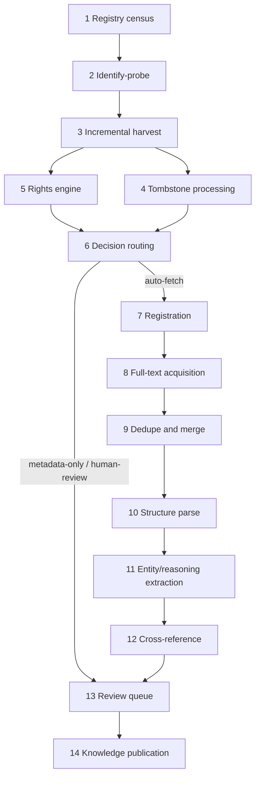

## 4. Automated Ingestion Workflow

This chapter specifies the automated pipeline that moves a thesis from a remote repository endpoint to a published, provenance-complete entry in the Calyx knowledge base. The design refines the project brief's sketch with four structural improvements: (1) a registry census with `Identify`-probes replaces ad-hoc endpoint configuration; (2) a rights-verification engine executes before any full-text download, so no copyrighted byte is fetched without a recorded legal basis; (3) full-text acquisition is aggregator-first, per-host download second; and (4) deduplication runs before parsing, so parse and extraction compute is never spent twice. Each stage specifies input, tooling, output, and failure handling; Chapters 5 and 6 detail the parse and extraction logic named here — this chapter defines only their interfaces.

### 4.1 Reference Pipeline

#### 4.1.1 The improved fourteen-stage pipeline

The pipeline is event-driven: every stage emits a typed event onto a message bus and every downstream stage consumes events, so that each document moves through the system independently and a stalled stage never blocks an upstream one.

For renderers without Mermaid support, the equivalent ordered list:

1. **Registry census** — enumerate candidate endpoints from OpenDOAR, union-archive source lists, and the connection matrix in Chapter 3; persist one registry row per endpoint.
2. **Identify-probe** — issue an OAI-PMH `Identify` request per endpoint; cache granularity, `earliestDatestamp`, `deletedRecord` policy, and `adminEmail`.
3. **Incremental metadata harvest** — `ListIdentifiers`/`ListRecords` with `from = last_successful_run − 2 days`; checkpoint every `resumptionToken` page.
4. **Tombstone processing** — headers with `status="deleted"` become registry tombstone events; associated full text is quarantined.
5. **Rights engine** — run the license-signal cascade of §4.2.1 against each record.
6. **Decision matrix routing** — assign each record to auto-fetch, metadata-only, or human-review per §4.2.2.
7. **Registration** — create or update the InvenioRDM record with the `calyx:` lineage namespace.
8. **Polite full-text acquisition** — aggregator-first resolution, then per-host token-bucket download, ClamAV quarantine, SHA-256 content-addressed storage.
9. **Deduplication and merge** — exact identifier crosswalk, then blocked fuzzy title scoring; merges are links, never deletions.
10. **Structure parse and chapter segmentation** — GROBID 0.9.0 plus layout parser; emits TEI/JSON with section hierarchy.
11. **Entity and reasoning extraction** — taxon names, scientific entities, reasoning spans (interfaces only; Chapters 5–6).
12. **Cross-reference** — link the thesis to derived publications and retraction/correction signals.
13. **Review queue** — three lanes (rights, dedupe, extraction confidence) with human adjudication.
14. **Knowledge publication** — registry exposure via OAI-PMH provider, OpenSearch index, and annual DOI'd snapshots.

Table 4.1 gives the full stage-by-stage specification, including the failure-handling contract that makes the pipeline resumable at scale.

Table 4.1. Stage-by-stage pipeline specification (versions verified against vendor repositories and PyPI, 2026-07-21).

| # | Stage | Input | Process/tool | Output | Failure handling |
|---|---|---|---|---|---|
| 1 | Registry census | Endpoint candidates (OpenDOAR, source lists) | Registry DB (PostgreSQL); seed from connection matrix | Endpoint registry rows | Duplicate endpoint URLs merged; unreachable seed lists logged for manual triage |
| 2 | Identify-probe | Registry row | oaipmh-scythe 0.14.2 `Identify` call [^1^] | Cached capability profile (granularity, deletedRecord policy, adminEmail) | Endpoint marked `unreachable` after 3 retries; re-probed on 30-day cycle |
| 3 | Incremental harvest | Capability profile + last checkpoint | oaipmh-scythe; `from = last_run − 2d`; httpx retry transport honoring `Retry-After` | Raw OAI XML pages (WORM store) + parsed records | resumptionToken checkpoint per page; crash recovery re-issues last token (protocol idempotent); persistent 503 → backoff, max 6 retries, freshness-lag alert |
| 4 | Tombstone processing | Deleted headers (`status="deleted"`) | Tombstone worker; full `ListIdentifiers` diff fallback for `deletedRecord = no/transient` repos | Tombstone events; quarantine orders for held files | For `no`-policy repos, scheduled monthly diff; diff failures escalate to admin-email contact |
| 5 | Rights engine | Parsed metadata record | License-signal cascade (§4.2.1); reservation scanner (robots.txt per RFC 9309, TDMRep, X-Robots-Tag) | Rights verdict object: license ID/URI, signal source, embargo dates, reservation flags | Unparseable license text → verdict `unknown` → metadata-only lane; never auto-fetch on ambiguous parse |
| 6 | Decision routing | Rights verdict | Rules engine (config-driven, Table 4.2) | Lane assignment + routing event | Rule-eval errors default to human-review; every decision logged with rule version |
| 7 | Registration | Record + verdict | InvenioRDM v13 REST deposit; `calx:` UUIDv7 PID; `calyx:` custom-field namespace | Registry record with lineage fields | Deposit conflicts resolved by OAI-ID upsert; API 5xx → retry with jitter; poison records to dead-letter queue |
| 8 | Full-text acquisition | Registry record, auto-fetch lane | Aggregator-first (OpenAlex Content API, CORE, HTRC); else per-host token bucket 1 req/2 s, per-host semaphore 1–2; ClamAV `clamd` quarantine→scan→promote; SHA-256 CAS | `sha256/ab/cd/<hash>.pdf` blob + size/hash in registry | 403/Cloudflare → aggregator fallback → admin contact → manual queue; 429/503 → backoff; ClamAV detection → permanent quarantine; no challenge-solving or stealth user agents |
| 9 | Dedupe/merge | Registry record + blob hash | Exact crosswalk (DOI, Handle, URN:NBN, OAI-ID, SHA-256); blocking (surname+year, title-4-gram); RapidFuzz `token_sort_ratio` | Merge decision or cluster link (`IsIdenticalTo`) | Review band 0.85–0.95 (consistent with published cross-database dedupe thresholds [^15^]) → dedupe lane; merged records tombstoned-as-duplicate with PROV link, never deleted |
| 10 | Structure parse | CAS blob URI | GROBID 0.9.0 (CPU, Docker) + layout parser tier (interface to Chapter 5) | TEI XML + section-hierarchy JSON in object store | Parse failure / low structure confidence → parse-error lane; magic-byte and smoke-test validation before parse (fail-fast) |
| 11 | Entity/reasoning extraction | TEI/JSON + sections | gnfinder/gnverifier sidecars; classifiers and scoped LLM passes (interface to Chapter 6) | Anchored span objects with confidence scores | Confidence below threshold → extraction lane; model version pinned per run |
| 12 | Cross-reference | Record + extracted citations | OpenAlex/Crossref matching; retraction-flag merge | Publication-link edges; retraction/correction annotations | Unmatched references kept as raw strings; ambiguous matches → extraction lane |
| 13 | Review queue | Lane-routed items | INCEpTION 41.1 with external-recommender HTTP loop | Adjudicated decisions fed back to stages 5/9/11 | Queue aging alerts; disagreement → senior-reviewer escalation; corrections re-run only the affected stage |
| 14 | Knowledge publication | Cleared records + spans + edges | InvenioRDM OAI provider; OpenSearch indexer; annual snapshot job with DataCite DOI | Public metadata/claims exposure; versioned snapshot | Publish gate: no record exits without rights verdict and provenance graph; snapshot aborts on incomplete manifest |

Three properties deserve emphasis. First, the ordering of stages 5–9 is the main improvement over the original sketch: rights verification precedes download, and dedupe precedes parsing, so parse compute — the second-largest cost center after LLM passes — is spent at most once per unique document. Second, failure handling is fail-fast and stage-local, following CORE's CHARS production pattern: validation after each task rather than at end-of-pipeline, and automatic task resumption after failure because the queue re-delivers rather than loses [^5^]. Third, every stage writes both a data artifact and a provenance event (§4.3.2).

On throughput, a harvest worker politeness-limited to 1–2 s per paged request of roughly 100 records sustains about 180,000–360,000 records per host-day serially; parallelized across hundreds of endpoints, a first full pass over a multi-million-record thesis universe is a days-to-two-weeks operation [^3^]. Full text is the tighter constraint: a 2 s per-host cadence across 64 workers yields a theoretical 1.5–2.7 million fetch attempts per day, realistically 300,000–800,000 after retries and failures (operational estimates, not measured benchmarks) — consistent with CHARS sustaining 70M-record aggregation with the same worker/queue shape [^5^].

#### 4.1.2 Queue architecture and orchestration

The backbone replicates the CHARS pattern verified in production at CORE: Celery workers behind RabbitMQ 4.3.3 queues with priority classes `{new-repo bootstrap, freshness re-harvest, takedown-urgent, manual}` [^5^]. RabbitMQ is chosen over Kafka for the same reason CORE chose it — message *priorities* and task-queue semantics, not log replay — and because RabbitMQ is already embedded in InvenioRDM, so one broker serves both [^5^]. Dead-letter queues absorb rights-rejected and poison records; the takedown-urgent queue lets tombstone events preempt routine traffic.

Orchestration (scheduled harvest flows, embargo-lift re-check timers, snapshot and retraining jobs) runs on Prefect 3.7.8, chosen over Airflow because self-hosted Airflow costs an estimated 0.5–1 FTE of operations a 1–3-engineer team cannot absorb, while Prefect runs on one VM with PostgreSQL [^20^]. Two contracts are load-bearing. First, every harvest flow persists the last `resumptionToken` plus request parameters per page; oaipmh-scythe follows tokens within a run but provides no cross-restart checkpointing, so Calyx implements this itself — re-issuing the last token is the correct recovery primitive because OAI-PMH servers must accept re-issued tokens [^2^][^3^]. Second, flows honor server flow control: a 503 with `Retry-After` is respected via the httpx retry transport, since ignoring it may escalate to 403 [^2^][^13^]. Where a repository exposes a ResourceSync capability list (ANSI/NISO Z39.99-2017), Calyx prefers ResourceSync change lists and dumps — the basis of CORE FastSync — and falls back to OAI-PMH otherwise, which remains near-universal on DSpace, EPrints, and Digital Commons [^4^].

### 4.2 Rights Verification as a Machine

Compliance here is treated as a policy engine, not as legal judgment: the five hard rules (lawful access only, no redistribution of non-Creative-Commons full text, honoring machine-readable opt-outs, default all-rights-reserved, embargo compliance via deleted records) are all mechanically encodable, while genuinely ambiguous cases are routed to humans. The engine therefore has exactly three output lanes — auto-fetch, metadata-only, human-review — sized for an initial review fraction of roughly 10–30% of records, shrinking as repository-default policies accumulate [^10^].

#### 4.2.1 The license-extraction cascade

The engine evaluates signals in fixed precedence, stopping at the first decisive signal and recording both verdict and *where* it was found:

1. **DataCite `rightsList`** (schema 4.4): machine-parseable `rightsURI`, `rightsIdentifier` (e.g., `CC-BY-4.0`), and SPDX `rightsIdentifierScheme`; also `info:eu-repo/semantics/openAccess` access values [^6^].
2. **`dc:rights`** in oai_dc or oai_etdms records — free text or URL, matched against SPDX URIs and a Creative Commons URL regex; OhioLINK's oai_etdms rights text is a verified example of license text machine-capturable at this layer [^7^].
3. **Embargo and access fields**: EThOS-pattern embargo end dates, `dc.date.available`, DSpace `dc.embargo.lift` and bitstream policies. The engine parses `dc:accessRights` (who may access — the embargo dimension) separately from `dc:license` (reuse terms), per the DCMI distinction [^6^].
4. **CC REL on landing pages and in PDFs**: the W3C ccREL submission defines RDFa (`rel="license"`, `cc:attributionName`) as the default syntax for web pages and XMP for standalone media; the engine fetches and parses the landing page when metadata is silent [^8^].
5. **Repository-default policy**: deposit-license or `Identify`-level rights statements stored per endpoint with confidence tag `repo-default`, used only to shrink the review queue, never to justify redistribution [^7^].

In parallel, a **reservation scanner** checks opt-out surfaces on every host: robots.txt per RFC 9309 (404 robots = allowed; 5xx robots = assume full disallow; cache ≤24 h) [^9^]; the W3C TDMRep standard finalized May 2024 (`/.well-known/tdmrep.json`, `<meta name="tdm-reservation" content="1">`, the `tdm-reservation` HTTP header); and `X-Robots-Tag: noai` [^10^]. Machine-readability is the operative legal test: *Kneschke v. LAION* (OLG Hamburg, 2025-12-10) held an Article 4(3) DSM Directive opt-out valid only if machine-readable — robots.txt, X-Robots-Tag, and TDMRep qualify; natural-language terms do not — and the EU AI Act (Art. 53(1)(c), in force for general-purpose AI providers since 2025-08-02) likewise requires RFC 9309 compliance [^10^]. Embargoed records are registered immediately as metadata-only with a re-check at lift date +1 day; deleted-record events are honored immediately regardless of lane (§4.2.2).

#### 4.2.2 Decision matrix

Table 4.2 is the routing core of the rights engine. Signal mechanics are HIGH-confidence (verified against specifications, 2026-07-21); the action column encodes a conservative policy posture for counsel review, particularly the TDM-reservation rows.

Table 4.2. Rights decision matrix.

| Signal combination | Lane | Rationale |
|---|---|---|
| CC license (SPDX ID or CC URI in rightsList / dc:rights / CC REL), open access, no reservation | Auto-fetch | License grants reuse; store license ID, attribution, and signal source with the blob |
| CC license, open access, TDMRep/robots reservation on the PDF host | Auto-fetch with reservation logged; NC/ND excluded from AI-training uses; periodic review | License grants reuse, but the reservation is a live legal signal (OLG Hamburg); posture under counsel review as of July 2026 |
| No license; `info:eu-repo/semantics/openAccess` or OA repository default; no reservation | Auto-fetch for internal text-and-data mining only; flagged no-redistribution | EU Art. 3 (research TDM, no opt-out, lawful access required) / US fair-use precedent; redistribution never excused |
| No license; unknown access status; no reservation | Metadata-only | Default all-rights-reserved; registration preserves discoverability without copying |
| Any license; embargo active (`dc.date.available`, EThOS end-date, DSpace lift) | Metadata-only; scheduled re-check at lift +1 day | Register now, fetch later; embargo is a temporal access restriction, not a rights denial |
| Conflicting signals (CC in metadata vs © on landing page; NC vs intended use) | Human review | Conflict implies at least one signal is wrong; automation must not guess |
| Landing page 403/login wall; persistent anti-bot challenge | Human review → admin contact → aggregator copy | Legitimate paths only; no challenge-solving, stealth user agents, or IP rotation |
| Deleted header / takedown notice | Tombstone within 72 h; file quarantined | OAI deleted-record compliance path; takedown-urgent queue priority |
| Positive TDM reservation, no CC license | Metadata-only (EU Art. 4 posture); logged | Reservation is honored as config, not code — jurisdictional drift is expected [^10^] |

The matrix converts unbounded legal risk into a bounded workload: three lanes, one review queue, a complete decision log. Every routing decision records rule version, signals, and sources, so any historical decision is reproducible after policy change. The 72-hour takedown target is an operational commitment (no external standard mandates a latency); the takedown-urgent queue class exists to make it attainable. For repositories with `Identify.deletedRecord` policy `no` or `transient`, deletions are detected by periodic full `ListIdentifiers` diffs — the technique InvenioRDM recommends to its own harvesters [^2^][^12^].

### 4.3 Acquisition, Dedupe, and Provenance

#### 4.3.1 Polite full-text acquisition

Direct long-tail endpoint crawling is operationally fragile — peer-reviewed infrastructure measurement as of 2026 finds roughly 44% of OAI-PMH endpoints dead and about a quarter of repository HTTP requests failing — and anti-bot escalation is systemic rather than incidental across the target regions. Acquisition is therefore **aggregator-first**: the engine first attempts OpenAlex's Content API (which serves 60M+ open-access PDFs and GROBID TEI at $0.01 per file under the 2026 keyed-credit model [^14^]), then CORE (≈57M full texts, API and ODC-BY-licensed dumps), then HathiTrust/HTRC channels (Extracted Features for non-consumptive use), and only then falls back to direct per-host download [^6^][^19^]. Everything consumed from an aggregator is mirrored into Calyx's own store on first touch, so no serving path ever depends on a live upstream query.

Direct download, when required, is deliberately conservative: a descriptive User-Agent with contact information plus a `From` header; a per-host token bucket defaulting to 1 request per 2 s; a per-host concurrency semaphore of 1–2 (arXiv's published rule of one request per 3 s on a single connection is the exemplar ceiling); `Crawl-delay` and `Retry-After` honored with exponential backoff, jitter, and at most six retries; robots.txt fetched and cached ≤24 h with 5xx-on-robots treated as disallow-all [^3^][^9^][^21^]. Cloudflare-blocked hosts have exactly three legitimate resolutions — alternate aggregator copy, email to the `adminEmail` from the endpoint's `Identify` response requesting bulk or ResourceSync access, or the manual-contact queue — and stealth techniques are excluded by policy as both abusive and incompatible with the AI-Act compliance posture [^10^]. Every downloaded file streams to temporary storage, is scanned by ClamAV `clamd` in a quarantine→scan→promote flow (the daemon run sandboxed with resource limits and auto-restart, since ClamAV's own PDF parser has a CVE history), passes a `%PDF-` magic-byte and size check, and is then promoted to a SHA-256 content-addressed store of the form `sha256/ab/cd/<hash>.pdf`, with size and hash recorded in the registry and cross-checked against ResourceSync fixity where available [^4^][^18^].

#### 4.3.2 Provenance: PROV-O, WORM retention, and nanopublication-compatible registration

Every pipeline activity emits a W3C PROV-O record: `prov:Entity` (the harvested record version, identified by content hash), `prov:Activity` (harvest run, rights decision, download, dedupe merge, parse, extraction), `prov:Agent` (pipeline version, endpoint) [^16^]. Recorded fields include source endpoint, OAI identifier, harvest timestamp, metadata prefix, the license observed and *where* (metadata, landing page, or PDF), the transformation chain from raw XML to registry record, and software versions. Two retention rules make this audit-grade: raw OAI XML responses are kept in write-once-read-many (WORM) storage for at least the license-dispute horizon, and a **license snapshot is taken at acquisition time** — a document's license state is frozen when fetched, so a later upstream license change never silently alters the basis on which Calyx holds a copy. Registration is nanopublication-compatible: each document emits a registration nanopublication with assertion, provenance, and pubinfo graphs (CC0 on the record itself), so claim-level publication in later chapters inherits a consistent provenance shape [^17^]. InvenioRDM v13's audit logs and compare-revisions complement this at platform level [^11^].

#### 4.3.3 Registry: InvenioRDM as system of record

InvenioRDM v13 (released 2025-07-22, MIT license) is the registry. Three v13 features are directly load-bearing: the Thesis optional-field group and dedicated copyright field (a first-class home for ETD metadata and rights statements); audit logs with compare-revisions (platform-level auditability); and the Celery-backed Jobs feature for recurrent tasks [^11^]. Calyx adds a `calyx:` custom-field namespace — configured via `RDM_NAMESPACES`, `RDM_CUSTOM_FIELDS`, and `RDM_CUSTOM_FIELDS_UI` and initialized with `invenio rdm-records custom-fields init` — carrying lineage fields: source endpoint, harvest run ID, license-observed plus license-source, PROV record URI, dedupe cluster ID, and SHA-256 [^11^]. Internal persistent identifiers are `calx:` + UUIDv7 (time-ordered), with all external identifiers kept in a typed `alternateIdentifiers` crosswalk (DOI, Handle, URN:NBN, `oai:{repo}:{id}`, OpenAlex work ID, ProQuest); the exact crosswalk precedence is specified in Chapter 3's connection matrix and applied at ingest. Because InvenioRDM is itself an OAI-PMH provider (invenio-oaiserver, with configurable set definitions, ID prefix, granularity, page size, and resumption-token expiry), Calyx re-exposes its registry through the same protocol it consumes — feeding the corpus back into NDLTD, OpenAlex, and OpenAIRE at zero marginal cost — while publishing annual versioned snapshots with DataCite DOIs on the WCVP model, so that each "Calyx Corpus vN" is a citable, reproducible scholarly object [^12^]. One caveat is mirrored honestly: InvenioRDM's own deleted-record policy is `no`, so Calyx's downstream consumers must diff `ListIdentifiers` against it — and Calyx documents this in its own `Identify` response, closing the loop on the same compliance discipline it demands of upstream endpoints [^12^].

The pipeline specified here is deliberately unglamorous: every stage a small, replaceable service behind a queue; every legal constraint a logged rule evaluation; every artifact content-addressed and provenance-complete. That shape lets a 1–3-engineer team operate a rights-clean corpus at 100k-thesis scale, and makes the parse and extraction machinery of Chapters 5 and 6 safe to attach at full throughput — because nothing reaches them that has not already been cleared, registered, and deduplicated. How well that machinery copes with the messy, chapter-structured reality of thesis PDFs is where the report turns next.

<!-- SOURCES
[^1^] oaipmh-scythe repository (features: 6 verbs, httpx/lxml, ignore_deleted, actively maintained Sickle fork) | https://github.com/afuetterer/oaipmh-scythe
[^2^] OAI-PMH 2.0 specification (from/until inclusive; Identify granularity/deletedRecord; resumptionToken; 503 Retry-After) | http://oai.dlib.vt.edu/OAI/2.0/openarchivesprotocol.htm
[^3^] UIUC OAI harvester etiquette guidance (User-Agent/From, 2-day overlap, token re-issue recovery, request pacing) | https://dli.grainger.uiuc.edu/Publications/TWCole/JCDL-OAI/
[^4^] ResourceSync framework (ANSI/NISO Z39.99-2017) and resync client changelog (sha-256 fixity) | https://github.com/resync/resync/blob/main/CHANGES.md
[^5^] Cancellieri et al., Ingestion Pipelines in CORE (CHARS): RabbitMQ+scheduler+workers, priorities, fail-fast, auto-resume (MTSR 2017) | https://oro.open.ac.uk/51070/1/ingestion-pipelines-microservices-cancellieri-pontika-pearce-anastasiou-knoth-3-MTSR2017.pdf
[^6^] CASRAI guide to reuse rights: DataCite rightsList fields; DCMI dc:rights vs dc:license vs dc:accessRights | https://casrai.org/guides/how-to-describe-reuse-rights-and-permissions-for-a-shared-dataset
[^7^] NDLTD ETD-MS v1.1 metadata standard (thesis.degree.*, dc.rights→MARC 540 crosswalk) | https://ndltd.org/wp-content/uploads/2021/04/etd-ms-v1.1.html
[^8^] W3C ccREL submission (RDFa for web, XMP for standalone media, rel="license") | https://www.w3.org/Submission/2008/SUBM-ccREL-20080501/
[^9^] RFC 9309 — Robots Exclusion Protocol (4xx→allowed, 5xx→disallow-all, ≤24h caching) | https://www.rfc-editor.org/rfc/rfc9309
[^10^] TDMRep surfaces and OLG Hamburg Kneschke v. LAION machine-readable opt-out ruling; AI Act Art. 53(1)(c) RFC 9309 posture | https://blckalpaca.at/en/knowledge-base/seo-geo/technical-seo/robotstxt-and-ai-eu-legal-situation-and-tdm-opt-out
[^11^] InvenioRDM v13 release notes (Thesis fields, copyright field, audit logs, compare revisions, Jobs) | https://inveniosoftware.org/blog/2025-07-22-invenio-rdm-13/
[^12^] InvenioRDM OAI-PMH documentation (sets, deleted-record policy "no", ListIdentifiers diff guidance, OAISERVER settings) | https://inveniordm.docs.cern.ch/reference/oai_pmh/
[^13^] OAI-PMH 2.0 implementation guidelines (resumptionToken semantics, 503/403 escalation ladder) | https://www.cs.odu.edu/~mln/jcdl02/oai-2.0-adv-final.pdf
[^14^] OpenAlex developer documentation (keyed credits, quarterly free snapshot, Content API pricing) | https://developers.openalex.org/
[^15^] RapidFuzz token_sort_ratio 0.85 cross-database dedupe threshold study | https://arxiv.org/html/2603.00399v1
[^16^] PROV-O: The PROV Ontology (W3C Recommendation 2013; Entity/Activity/Agent) | https://semantic-web-journal.net/system/files/swj1606.pdf
[^17^] Nanopublication model (assertion/provenance/pubinfo graphs; Trusty URIs) | https://peerj.com/articles/cs-78/
[^18^] ClamAV clamd quarantine→scan→promote pattern; ClamAV PDF-parser CVE-2025-20260 | https://www.sentinelone.com/vulnerability-database/cve-2025-20260/
[^19^] HTRC Extracted Features and non-consumptive research policy | https://jawalsh.github.io/assets/pdf/walsh2023.pdf
[^20^] Prefect/Airflow/Dagster 2026 operational comparisons (Airflow self-host ≈0.5–1 FTE; Prefect lightest) | https://getbruin.com/blog/best-data-pipeline-tools-2026/
[^21^] arXiv crawl rule (1 request/3 s, single connection) as politeness ceiling exemplar | https://www.kim.uni-konstanz.de/en/services/research-and-teaching/text-and-data-mining/
-->
