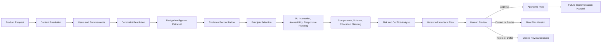
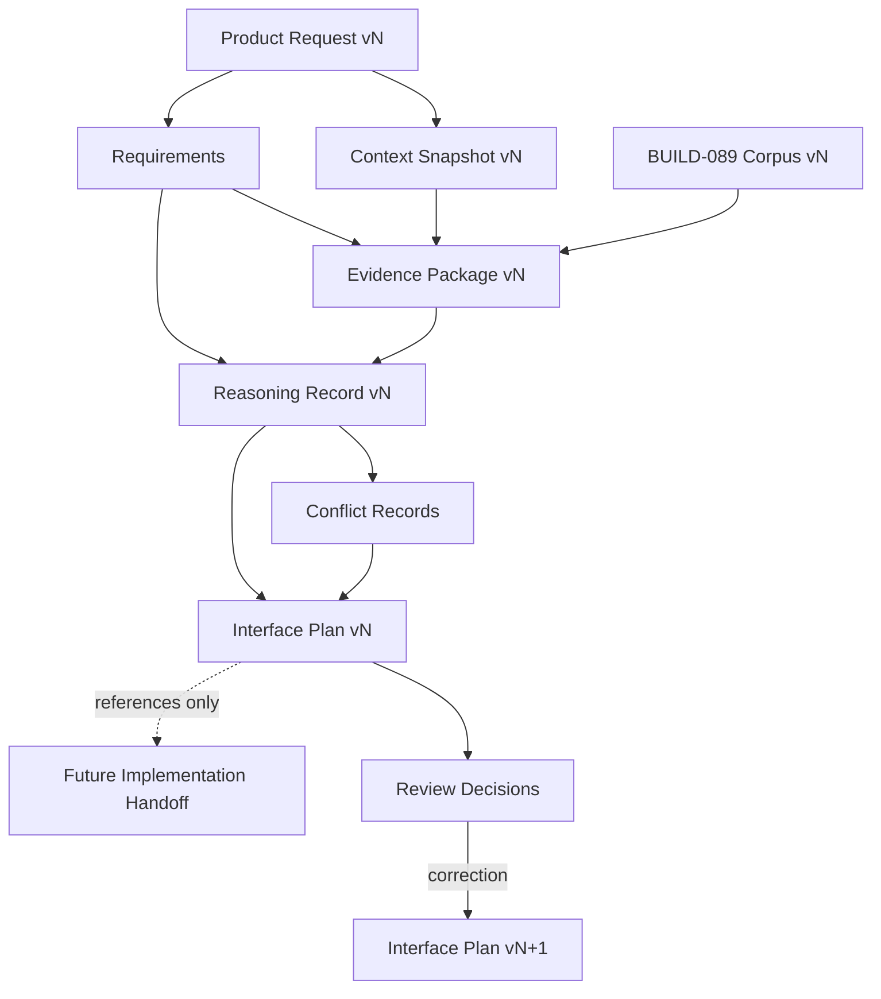
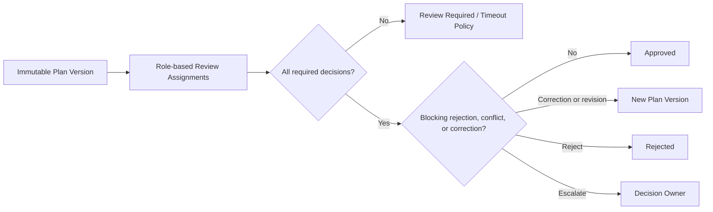
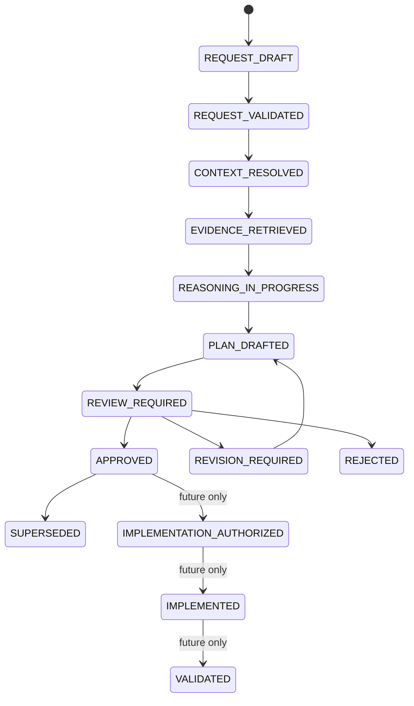
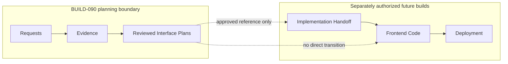

# BUILD-090A — Design Reasoning and Interface Planning Architecture

## 1. Executive summary

This architecture defines a controlled backend planning layer that transforms a versioned product request into an evidence-grounded, implementation-neutral Interface Plan. Every recommendation is traceable to requirements, constraints, retrieved BUILD-089 evidence, explicit corpus gaps, and a concise human-reviewable rationale. BUILD-090A creates no generator, UI, endpoint, migration, production publication, or database population.

The system reuses the BUILD-089A corpus and publication controls, BUILD-089B decomposition, classification, deterministic embeddings, hybrid retrieval and Design Knowledge Graph, and BUILD-089C population, coverage reporting, provenance, rights restrictions, and validation. It also references—not replaces—the BUILD-082–088 scientific evidence, interpretation, review, audit, and controlled-publication boundaries.

## 2. Scope

The future system may plan interfaces for My Conservatory, Mission Control, Orchid University, Species Explorer, Research Platform, public and administrative sites, Calyx show management, judging, volunteering, and collections. Its output is a reviewed planning artifact, never executable frontend code. This document defines models, lifecycle, policies, services, persistence boundaries, failure semantics, scale assumptions, and BUILD-090B implementation scope.

Excluded are frontend screens, React components, product implementations, deployment, production database population, public corpus access, Knowledge Graph publication, write endpoints, and changes to existing corpus or scientific architecture.

## 3. Governing principles

1. Requirements, evidence, recommendations, and approvals are independent artifacts.
2. Confirmed requirements outrank generalized guidance; inferred and proposed requirements never masquerade as confirmed.
3. Scientific integrity, accessibility, privacy, security, rights, and owner-approved hard constraints fail closed.
4. `NOT_PRESENT_IN_SOURCE_CORPUS` is a legitimate result; `RETRIEVAL_UNAVAILABLE` is an operational failure.
5. Material conflicts remain explicit until an authorized decision owner resolves them.
6. Artifacts are immutable and append-only; correction creates a new version with supersession links.
7. Stored rationale is concise and auditable; unrestricted hidden model reasoning is never persisted.
8. Human approval authority cannot be delegated to retrieval or model providers.
9. Internal-only evidence is not redistributed publicly.
10. Planning remains implementation-neutral unless an approved project constraint requires specificity.

## 4. Existing-system integration

| Existing capability | BUILD-090 use | Prohibited change |
|---|---|---|
| BUILD-089A corpus, review, publication, PostgreSQL repository | Published-latest document eligibility, licenses, source metadata | No corpus rewrite |
| BUILD-089B semantic units, classifiers, embeddings, relationships, hybrid search | Bounded retrieval and explainable ranking | No replacement index |
| BUILD-089C population, coverage outcomes, archive provenance | Corpus version and honest coverage state | No fabricated coverage |
| BUILD-082–086 evidence and aggregation | Project scientific-context references | No evidence mutation |
| BUILD-087 interpretation layers | Preserve observation/interpretation/assertion distinctions | No canonical assertion rewrite |
| BUILD-088 controlled publication | Future boundary only | No graph publication |
| Existing audit infrastructure | Append-only planning events | No destructive updates |

Adapters expose read-only interfaces: `ProductContextReader`, `DesignEvidenceRetriever`, `ScientificContextReader`, `DesignSystemCatalogReader`, and `AuditAppender`. PostgreSQL remains authoritative; disposable caches may contain identifiers and rankings but not unrestricted source text.

### End-to-end planning workflow

## 5. Product Request model

`ProductRequest` has a stable `request_id`, monotonic `version`, integrity hash, product name/family, requester/owner, business/scientific/educational objectives, intended users and roles, primary/secondary tasks, required data/workflows, platform/device targets, accessibility/privacy/security/legal/licensing requirements, dependencies, performance expectations, branding constraints, known decisions, unresolved questions, excluded scope, priority, and requested phase.

Each `Requirement` has `requirement_id`, category, statement, source reference, status (`CONFIRMED`, `INFERRED`, `PROPOSED`, `UNRESOLVED`, `REJECTED`), hardness, rationale, actor, timestamp, and supersession reference. Only an authorized owner can confirm, reject, or change hardness. Validation rejects a request lacking identity, owner, objective, intended user, or source for confirmed requirements.

## 6. Project Context model

`ProjectContextSnapshot` immutably records request version and versioned references to owner instructions, approved architecture, observed application behavior, database/API contracts, prior design and review decisions, user research, accessibility/scientific/educational obligations, technical constraints, component and brand catalogs, and deployment constraints. It records capture time, readers/provider versions, freshness limits, inaccessible sources, and hash.

Precedence is: law/rights/security/privacy and conservation safeguards; scientific-integrity and accessibility hard constraints; explicit owner-approved requirements; approved product architecture/API contracts; approved prior decisions; validated user research; technical feasibility; corpus guidance; inferred or proposed guidance. Lower-precedence evidence may open a conflict but cannot silently override higher-precedence context. Stale or incomplete hard-constraint context blocks planning.

## 7. Retrieval architecture

The `DesignEvidenceRetriever` composes semantic, keyword, domain, knowledge-type, educational-framework, provenance, citation, relationship-traversal, and project-context filters. Queries are normalized and hashed with request/context/corpus/provider versions. Retrieval is bounded by configurable top-k, per-domain quotas, traversal depth, source diversity, excerpt limits, and rights policy.

Hybrid ranking retains lexical, semantic, classification, provenance, recency/applicability, and relationship contributions separately. It never converts similarity into factual authority. Results are filtered to eligible publication/review states and exact rights policy before packaging.

Every requested domain reports `COVERED`, `PARTIALLY_COVERED`, `NOT_PRESENT_IN_SOURCE_CORPUS`, or `RETRIEVAL_UNAVAILABLE`. The first three describe evidence coverage; the last describes system failure. Absent guidance creates an acquisition recommendation or explicit project decision—not invented evidence.

## 8. Design Evidence Package

An immutable, versioned `DesignEvidencePackage` is scoped to a feature or workflow and contains package identity/version/hash, product-request version, requirement and constraint identifiers, semantic-unit and source-document references, exact source locations, citations, provenance, corpus/provider/classifier versions, query and filters, ranking explanation, supporting/conflicting guidance, related concepts, gaps, confidence decomposition, rights decisions, and curator/reviewer decisions.

Packages store permitted excerpts only when policy allows. Restricted content is referenced by identifier and authorized retrieval boundary. Any changed input creates a new package version; existing packages cannot be updated.

## 9. Design Reasoning Record

`DesignReasoningRecord` contains recommendation identity/version, product area, user role, requirement and evidence-package references, considered and rejected alternatives, selected approach, concise rationale, supporting/conflicting evidence, assumptions, unresolved questions, risks, accessibility/scientific/educational effects, implementation implications, decomposed confidence factors, reviewer status, and supersession chain.

The record is a decision summary, not chain-of-thought. It may state factors, evidence, rules, trade-offs, and why alternatives failed, but never hidden prompts, unrestricted internal deliberation, secrets, or restricted source text.

## 10. Conflict-resolution architecture

`ConflictRecord` identifies conflicting requirements/principles, severity, hard-constraint flags, affected users/workflows, alternatives, recommended resolution, evidence-package references, decision owner, status, and review history. Material conflicts cannot be auto-closed. Resolution statuses are `OPEN`, `DECISION_REQUIRED`, `RESOLVED`, `ACCEPTED_RISK`, `DEFERRED`, and `SUPERSEDED`.

Safety, rights, privacy, security, scientific-integrity, and applicable accessibility conflicts block approval. Other conflicts require the designated owner to select an alternative, accept a documented risk, defer affected scope, or revise requirements. The selected resolution creates new reasoning and plan versions.

## 11. Interface Plan model

`InterfacePlan` is an immutable version containing product/feature scope; users and roles; journeys; primary/secondary workflows; task hierarchy; information architecture and navigation; screen/view inventory; responsive rules; interactions and components; state, empty, loading, failure, offline/degraded behavior; accessibility, keyboard, screen-reader, focus, motion, science, education, content, terminology, provenance and uncertainty display; privacy/security; analytics/observability; integrations; acceptance criteria; unresolved questions; evidence/reasoning/conflict references; review history; status; and integrity hash.

Acceptance criteria map to requirement identifiers and evidence where applicable. Technology names occur only when a confirmed constraint requires them.

### Artifact relationships

## 12. Scientific-interface requirements

Plans for scientific/botanical products must preserve scientific names and nomenclatural status, uncertainty, synonyms and accepted names, provenance, evidence/confidence classes, conflicting assertions, temporal/geographic scope, units/method context, specimen/observation context, conservation sensitivity, protected locality, licensing/attribution, image provenance, citations, graph relationships, and explainable decisions. They must visibly distinguish source observation, machine/human interpretation, and canonical assertion. Simplification cannot remove qualifiers, negation, scope, conflict, or uncertainty.

## 13. Accessibility architecture

Accessibility is a hard planning stream, not a final checklist. `AccessibilityPlan` references evidence and requirements for WCAG-aligned criteria, semantic structure, keyboard order, visible focus, accessible names/descriptions, screen-reader behavior, scaling, contrast, color-independent meaning, reduced motion, targets, errors/forms, tables, chart alternatives, cognitive and plain-language support, scientific terminology, and responsive accessibility.

Every applicable finding maps to acceptance criteria and a responsible review role. Missing required evidence may use an explicitly identified standard/owner constraint; it cannot be attributed to the corpus. Unresolved critical accessibility findings block approval.

## 14. Educational-interface architecture

Educational planning is optional and activated only by request objectives. Bloom, Mayer, Cognitive Load, Universal Design for Learning, Active Learning, and Inquiry Learning are independently coverage-checked. Each decision identifies `CORPUS_EVIDENCE`, `PARTIAL_CORPUS_EVIDENCE`, `SOURCE_ABSENT_PROJECT_DECISION`, or `UNAVAILABLE`. A source-absent project decision needs an authorized educational reviewer and cannot cite nonexistent corpus support.

## 15. Design-system integration

The read-only `DesignSystemCatalogReader` returns versioned components, tokens, typography, spacing, responsive/color/state rules, accessibility contracts, provenance, and approval state. Planning prefers eligible reuse, then records component gaps. Reuse is rejected when it cannot satisfy functional, scientific, accessibility, rights, or security constraints. Exceptions require rationale, affected criteria, owner/design-system approval, and new plan version.

## 16. Human-review architecture

Review assignments derive from plan risk and scope: product owner always; UX for interaction/IA; accessibility for applicable plans; scientific, educational, technical, privacy/security, and branding reviewers when their domains are affected. Decisions are `APPROVE`, `APPROVE_WITH_CORRECTIONS`, `REQUEST_REVISION`, `REJECT`, `DEFER`, or `ESCALATE`.

`APPROVE_WITH_CORRECTIONS` records structured corrections and creates a new candidate plan; it does not mutate the reviewed plan. Required-role approvals must apply to the same plan hash. Any material new version invalidates stale approvals.

### Review flow

## 17. Lifecycle and transition matrix

| From | To | Guard | Authority |
|---|---|---|---|
| REQUEST_DRAFT | REQUEST_VALIDATED | Required fields and statuses valid | request validator |
| REQUEST_VALIDATED | CONTEXT_RESOLVED | Fresh required context; no missing hard source | context resolver |
| CONTEXT_RESOLVED | EVIDENCE_RETRIEVED | Coverage recorded; retrieval operational | retrieval coordinator |
| EVIDENCE_RETRIEVED | REASONING_IN_PROGRESS | Immutable evidence package exists | planner |
| REASONING_IN_PROGRESS | PLAN_DRAFTED | Rationale, risks, conflicts, criteria complete | planner |
| PLAN_DRAFTED | REVIEW_REQUIRED | Required reviewers assigned | review coordinator |
| REVIEW_REQUIRED | APPROVED | Same-hash required approvals; no blocker | authorized reviewers/owner |
| REVIEW_REQUIRED | REVISION_REQUIRED/REJECTED | Structured decision recorded | reviewer |
| APPROVED | SUPERSEDED | Approved replacement exists | owner |

BUILD-090A/090B must not implement `IMPLEMENTATION_AUTHORIZED`, `IMPLEMENTED`, or `VALIDATED` transitions.

## 18. Idempotency and concurrency

Deterministic attempt identity hashes canonical request version, context hash, corpus version, retrieval/provider configuration, constraints, and policy version. Identical immutable inputs return the existing equivalent attempt. Changed inputs create a new attempt/version.

Repository writes use unique natural fingerprints, transactions, optimistic version checks, and per-request advisory locks. Concurrent identical submissions converge; competing revisions produce explicit conflict responses, never last-write-wins. Failed transactions roll back all artifacts and release locks. Resume starts from the last complete immutable stage.

## 19. Versioning and supersession

Requests, snapshots, queries, packages, reasoning, conflicts, plans, reviews, and approvals each have stable logical identity plus monotonic version. Content hashes detect equivalence. Supersession is a new append-only record linking predecessor and successor with actor/rationale. Approved plans cannot be edited; material change requires a successor and fresh review. Corpus/provider/policy changes mark affected plans for deterministic re-evaluation without invalidating historical truth.

## 20. Provenance and audit

Every event records artifact identity/version/hash, actor or component, timestamp, input versions, corpus/source/semantic-unit/evidence/requirement references, retrieval configuration, action, concise rationale, lifecycle transition, reviewer identity, and supersession links. Audit append is transactionally required for state change; audit failure rolls back and fails closed.

Logs contain identifiers and policy-safe summaries, never secrets, unrestricted source content, hidden reasoning, or unsafe prompts. Integrity verification recomputes hashes and validates reference/version chains.

## 21. Security and rights controls

Access is authenticated and internal. Authorization separates requester, planner, domain reviewer, product owner, auditor, and system operator; only owners can approve final plans. Corpus queries execute through restricted read-only services. BUILD-089C content remains `USER_SUPPLIED_INTERNAL_RESEARCH_ONLY`, reuse license `NOT_SUPPLIED`, and not publicly redistributable.

Derived internal recommendations may use citations and minimal restricted excerpts under policy. Public-output handoff requires a separate future review gate that removes restricted text and verifies attribution/rights. Ingested documents are untrusted data: instructions inside them cannot change system policy, tool access, filters, or lifecycle. Retrieval isolates content from control instructions, validates structured outputs, redacts secrets, bounds excerpts, and records policy decisions.

## 22. Failure handling

| Condition | Classification and response |
|---|---|
| Corpus unavailable/provider/database failure | `RETRIEVAL_UNAVAILABLE`; retry safely, no plan approval |
| No relevant evidence/source gap | coverage result; record gap, do not fabricate |
| Partial coverage | label limitations and require reviewer/project decision |
| Conflicting evidence | create ConflictRecord; material conflict blocks approval |
| Invalid request | reject validation with field/status errors |
| Missing/stale hard context | fail closed at context resolution |
| Unsupported requirement | record unresolved requirement and decision owner |
| Inaccessible source/rights restriction | omit restricted content, retain reference/finding, block if essential |
| Model/provider failure | rollback stage; deterministic resume with same inputs |
| Review timeout | remain `REVIEW_REQUIRED`; notify/escalate, never auto-approve |
| Concurrent revision | optimistic conflict; preserve both attempts for resolution |
| Audit failure | rollback state change and alert operator |

## 23. Performance and scale

Routine planning uses indexed/filterable retrieval, bounded top-k and traversal, batched embedding queries, source diversity limits, pagination, and cached disposable projections keyed by immutable hashes. It never requires full-corpus scans. Incremental corpus changes trigger dependency-indexed re-evaluation only for plans referencing affected units/domains/versions.

Future measures are p50/p95 retrieval latency, evidence-package and plan creation time, traversal nodes/edges, review latency, re-evaluation fan-out, cache hit/eviction rate, concurrency conflicts, memory ceilings, and corpus-transition completion. Targets require measurement during BUILD-090B/C; this architecture makes no unsupported production-scale claim.

## 24. Bias and design-governance risks

Risks include archive coverage imbalance, over-ranking repeated guidance, false consensus from dependent sources, classifier blind spots, accessibility tokenism, Western/English design assumptions, automation authority bias, stale product context, brand dominance over usability, and scientific simplification. Controls are coverage labels, duplicate/dependence signals, source diversity, decomposed confidence, conflict retention, domain reviewers, explicit assumptions, acquisition recommendations, periodic policy evaluation, appeal/correction pathways, and immutable audit.

## 25. Future implementation boundaries

BUILD-090 planning may emit immutable reviewed specifications. It cannot write frontend repositories, generate/deploy production code, mutate corpus/scientific evidence, publish graph knowledge, or authorize implementation. A later build must define handoff authentication, approval, code-generation constraints, repository permissions, validation, and rollback.

## 26. Proposed BUILD-090B scope

Implement additive backend foundations only: enums and immutable models; repository protocols plus memory/PostgreSQL append-only repositories; additive migration; deterministic identity/version utilities; request validation; context snapshot assembly interfaces; bounded adapter over BUILD-089 retrieval; evidence-package creation; coverage/failure distinction; reasoning/conflict/plan records; lifecycle guards through `APPROVED`; role-based review decisions; audit/integrity checks; idempotency/concurrency; authenticated internal planning APIs; and comprehensive unit/PostgreSQL/regression/security tests.

Exclude UI, frontend code generation, product-specific interfaces, public endpoints/content, production population, Knowledge Graph publication, and implementation transitions.

## 27. Validation against architectural goals

| Goal | Result |
|---|---|
| Consume rather than replace BUILD-089A/B/C | PASS — explicit read-only adapters and version references |
| Preserve provenance and citations | PASS — immutable packages, exact locations, hashes, audit |
| Separate requirements/recommendations | PASS — independent models and statuses |
| Separate gaps/failures | PASS — four-state coverage contract |
| Prevent fabricated guidance | PASS — gaps require acquisition/project decision |
| Preserve human authority | PASS — same-hash role approvals and owner control |
| Restrict redistribution | PASS — internal-only policy and future public gate |
| Scientific/accessibility integrity | PASS — hard constraints and dedicated plan sections |
| Retain conflicts/alternatives | PASS — immutable Conflict and Reasoning records |
| Immutable history/idempotency | PASS — versions, fingerprints, supersession, concurrency guards |
| No application behavior, migration, endpoint, frontend, or production publication | PASS — documentation-only BUILD-090A |

## 28. Final readiness verdict

The architecture is complete for an additive BUILD-090B backend implementation. It makes evidence traceability, honest corpus coverage, immutable reasoning summaries, human authority, scientific/accessibility integrity, and restricted-corpus handling mandatory while keeping interface implementation outside the boundary.

**READY FOR BUILD-090B**
