# BUILD-080 Dependency Graph

```mermaid
graph TD
  backend[backend] --> brain[brain]
  backend[backend] --> brain[brain]
  backend[backend] --> brain[brain]
  backend[backend] --> brain[brain]
  backend[backend] --> brain[brain]
  backend[backend] --> brain[brain]
  backend[backend] --> brain[brain]
  backend[backend] --> brain[brain]
  backend[backend] --> brain[brain]
  backend[backend] --> brain[brain]
  backend[backend] --> brain[brain]
  backend[backend] --> brain[brain]
  backend[backend] --> brain[brain]
  backend[backend] --> brain[brain]
  backend[backend] --> brain[brain]
  backend[backend] --> brain[brain]
  backend[backend] --> brain[brain]
  backend[backend] --> brain[brain]
  backend[backend] --> brain[brain]
  backend[backend] --> brain[brain]
  backend[backend] --> brain[brain]
  backend[backend] --> brain[brain]
  backend[backend] --> brain[brain]
  backend[backend] --> brain[brain]
  backend[backend] --> brain[brain]
  backend[backend] --> database[database]
  backend[backend] --> database[database]
  backend[backend] --> database[database]
  backend[backend] --> database[database]
  backend[backend] --> database[database]
  backend[backend] --> database[database]
  backend[backend] --> database[database]
  backend[backend] --> database[database]
  backend[backend] --> database[database]
  backend[backend] --> database[database]
  backend[backend] --> database[database]
  backend[backend] --> database[database]
  backend[backend] --> database[database]
  backend[backend] --> database[database]
  backend[backend] --> database[database]
  backend[backend] --> database[database]
  backend[backend] --> database[database]
  backend[backend] --> database[database]
  backend[backend] --> database[database]
  backend[backend] --> database[database]
  backend[backend] --> database[database]
  backend[backend] --> database[database]
  backend[backend] --> database[database]
  backend[backend] --> database[database]
  backend[backend] --> database[database]
  backend[backend] --> database[database]
  backend[backend] --> database[database]
  backend[backend] --> database[database]
  backend[backend] --> database[database]
  backend[backend] --> database[database]
  backend[backend] --> database[database]
  backend[backend] --> database[database]
  backend[backend] --> database[database]
  backend[backend] --> database[database]
  backend[backend] --> database[database]
  backend[backend] --> database[database]
  backend[backend] --> database[database]
  backend[backend] --> database[database]
  backend[backend] --> database[database]
  backend[backend] --> database[database]
  backend[backend] --> database[database]
  backend[backend] --> database[database]
  backend[backend] --> database[database]
  backend[backend] --> database[database]
  backend[backend] --> database[database]
  backend[backend] --> database[database]
  backend[backend] --> database[database]
  backend[backend] --> database[database]
  backend[backend] --> database[database]
  backend[backend] --> database[database]
  backend[backend] --> database[database]
  backend[backend] --> database[database]
  backend[backend] --> database[database]
  backend[backend] --> database[database]
  backend[backend] --> frontend[frontend]
  backend[backend] --> frontend[frontend]
  backend[backend] --> frontend[frontend]
  backend[backend] --> frontend[frontend]
  backend[backend] --> frontend[frontend]
  backend[backend] --> frontend[frontend]
  backend[backend] --> frontend[frontend]
  backend[backend] --> frontend[frontend]
  backend[backend] --> frontend[frontend]
  backend[backend] --> frontend[frontend]
  backend[backend] --> frontend[frontend]
  backend[backend] --> frontend[frontend]
  backend[backend] --> frontend[frontend]
  backend[backend] --> frontend[frontend]
  backend[backend] --> frontend[frontend]
  backend[backend] --> frontend[frontend]
  backend[backend] --> frontend[frontend]
  backend[backend] --> frontend[frontend]
  backend[backend] --> frontend[frontend]
  backend[backend] --> frontend[frontend]
  backend[backend] --> frontend[frontend]
  backend[backend] --> frontend[frontend]
  backend[backend] --> frontend[frontend]
  backend[backend] --> frontend[frontend]
  backend[backend] --> frontend[frontend]
  backend[backend] --> frontend[frontend]
  backend[backend] --> frontend[frontend]
  backend[backend] --> frontend[frontend]
  backend[backend] --> frontend[frontend]
  backend[backend] --> frontend[frontend]
  backend[backend] --> frontend[frontend]
  backend[backend] --> frontend[frontend]
  backend[backend] --> frontend[frontend]
  backend[backend] --> frontend[frontend]
  backend[backend] --> frontend[frontend]
  backend[backend] --> frontend[frontend]
  backend[backend] --> frontend[frontend]
  backend[backend] --> frontend[frontend]
  backend[backend] --> frontend[frontend]
  backend[backend] --> frontend[frontend]
  backend[backend] --> frontend[frontend]
```

## Edge Provenance
- `backend` -> `brain` from `docs-brain-backed-config-integration-md`
- `backend` -> `brain` from `docs-build-013-brain-integration-md`
- `backend` -> `brain` from `docs-build-014-autonomous-discovery-md`
- `backend` -> `brain` from `docs-build-016-knowledge-gap-discovery-md`
- `backend` -> `brain` from `docs-build-017-brain-backed-gap-diagnostics-md`
- `backend` -> `brain` from `docs-build-017-brain-gap-diagnostics-md`
- `backend` -> `brain` from `docs-build-019-connector-runtime-md`
- `backend` -> `brain` from `docs-build-020-md`
- `backend` -> `brain` from `docs-build-031-md`
- `backend` -> `brain` from `docs-build-040-kernel-md`
- `backend` -> `brain` from `docs-build-049-runtime-integration-readiness-md`
- `backend` -> `brain` from `docs-build-052-md`
- `backend` -> `brain` from `docs-build-053-md`
- `backend` -> `brain` from `docs-build-061-scientific-knowledge-graph-dry-run-verification-md`
- `backend` -> `brain` from `docs-build-063-md`
- `backend` -> `brain` from `docs-build-064-md`
- `backend` -> `brain` from `docs-build-076a-md`
- `backend` -> `brain` from `docs-build-079-controlled-mission-orchestration-md`
- `backend` -> `brain` from `docs-builds-build-049-harvester-command-center-md`
- `backend` -> `brain` from `docs-orchid-continuum-scientific-knowledge-graph-completion-report-md`
- `backend` -> `brain` from `docs-preservation-build-196a-current-state-preservation-index-md`
- `backend` -> `brain` from `docs-preservation-build-197-root-level-script-triage-md`
- `backend` -> `brain` from `docs-preservation-build-197-root-script-start-here-md`
- `backend` -> `brain` from `docs-preservation-build-200-dependency-graph-md`
- `backend` -> `brain` from `docs-preservation-calyx-and-orchid-continuum-capability-audit-md`
- `backend` -> `database` from `docs-brain-backed-config-integration-md`
- `backend` -> `database` from `docs-build-012a-autonomous-runtime-engine-md`
- `backend` -> `database` from `docs-build-012a-implementation-note-md`
- `backend` -> `database` from `docs-build-012b-cds-runtime-registry-md`
- `backend` -> `database` from `docs-build-012c-runtime-planner-md`
- `backend` -> `database` from `docs-build-012d-runtime-executor-md`
- `backend` -> `database` from `docs-build-013-brain-integration-md`
- `backend` -> `database` from `docs-build-017-brain-backed-gap-diagnostics-md`
- `backend` -> `database` from `docs-build-017-brain-gap-diagnostics-md`
- `backend` -> `database` from `docs-build-020-md`
- `backend` -> `database` from `docs-build-031-md`
- `backend` -> `database` from `docs-build-034-md`
- `backend` -> `database` from `docs-build-040-kernel-md`
- `backend` -> `database` from `docs-build-044-calyx-autonomous-orchestrator-md`
- `backend` -> `database` from `docs-build-045-restore-calyx-autonomous-runtime-md`
- `backend` -> `database` from `docs-build-049-runtime-integration-readiness-md`
- `backend` -> `database` from `docs-build-051-md`
- `backend` -> `database` from `docs-build-053-md`
- `backend` -> `database` from `docs-build-054-md`
- `backend` -> `database` from `docs-build-055-md`
- `backend` -> `database` from `docs-build-056-md`
- `backend` -> `database` from `docs-build-060-knowledge-graph-orchestrator-operator-guide-md`
- `backend` -> `database` from `docs-build-061-scientific-knowledge-graph-dry-run-verification-md`
- `backend` -> `database` from `docs-build-062-scientific-knowledge-graph-source-connection-md`
- `backend` -> `database` from `docs-build-063-md`
- `backend` -> `database` from `docs-build-064-md`
- `backend` -> `database` from `docs-build-066a-md`
- `backend` -> `database` from `docs-build-067-completion-report-md`
- `backend` -> `database` from `docs-build-068-report-md`
- `backend` -> `database` from `docs-build-068-runbook-md`
- `backend` -> `database` from `docs-build-068a-independent-reverification-md`
- `backend` -> `database` from `docs-build-069-implementation-report-md`
- `backend` -> `database` from `docs-build-074-implementation-status-md`
- `backend` -> `database` from `docs-build-074-md`
- `backend` -> `database` from `docs-build-076a-md`
- `backend` -> `database` from `docs-build-077-md`
- `backend` -> `database` from `docs-build-078-controlled-publication-gate-md`
- `backend` -> `database` from `docs-build-079-controlled-mission-orchestration-md`
- `backend` -> `database` from `docs-builds-build-039-mission-control-backend-telemetry-md`
- `backend` -> `database` from `docs-builds-build-047-scientific-integration-pr-package-md`
- `backend` -> `database` from `docs-builds-build-048-scientific-integration-coordinator-md`
- `backend` -> `database` from `docs-builds-build-049-harvester-command-center-md`
- `backend` -> `database` from `docs-calyx-runtime-v0-1-md`
- `backend` -> `database` from `docs-orchid-continuum-scientific-knowledge-graph-completion-report-md`
- `backend` -> `database` from `docs-preservation-build-196a-current-state-preservation-index-md`
- `backend` -> `database` from `docs-preservation-build-196a-start-here-md`
- `backend` -> `database` from `docs-preservation-build-197-root-level-script-triage-md`
- `backend` -> `database` from `docs-preservation-build-197-root-script-start-here-md`
- `backend` -> `database` from `docs-preservation-build-198-schema-alignment-audit-md`
- `backend` -> `database` from `docs-preservation-build-199-emergency-legacy-script-safety-lock-md`
- `backend` -> `database` from `docs-preservation-build-199a-safety-lock-verification-md`
- `backend` -> `database` from `docs-preservation-build-200-dependency-graph-md`
- `backend` -> `database` from `docs-preservation-calyx-and-orchid-continuum-capability-audit-md`
- `backend` -> `database` from `readme-md`
- `backend` -> `frontend` from `docs-brain-backed-config-integration-md`
- `backend` -> `frontend` from `docs-build-012a-autonomous-runtime-engine-md`
- `backend` -> `frontend` from `docs-build-012a-implementation-note-md`
- `backend` -> `frontend` from `docs-build-012a-smoke-test-md`
- `backend` -> `frontend` from `docs-build-012b-cds-runtime-registry-md`
- `backend` -> `frontend` from `docs-build-012c-runtime-planner-md`
- `backend` -> `frontend` from `docs-build-012d-runtime-executor-md`
- `backend` -> `frontend` from `docs-build-013-brain-integration-md`
- `backend` -> `frontend` from `docs-build-014-autonomous-discovery-md`
- `backend` -> `frontend` from `docs-build-015-discovery-memory-md`
- `backend` -> `frontend` from `docs-build-016-knowledge-gap-discovery-md`
- `backend` -> `frontend` from `docs-build-017-brain-backed-gap-diagnostics-md`
- `backend` -> `frontend` from `docs-build-017-brain-gap-diagnostics-md`
- `backend` -> `frontend` from `docs-build-019-connector-runtime-md`
- `backend` -> `frontend` from `docs-build-020-md`
- `backend` -> `frontend` from `docs-build-031-md`
- `backend` -> `frontend` from `docs-build-032-md`
- `backend` -> `frontend` from `docs-build-034-md`
- `backend` -> `frontend` from `docs-build-040-kernel-md`
- `backend` -> `frontend` from `docs-build-044-calyx-autonomous-orchestrator-md`
- `backend` -> `frontend` from `docs-build-045-restore-calyx-autonomous-runtime-md`
- `backend` -> `frontend` from `docs-build-046-scientific-priority-realignment-md`
- `backend` -> `frontend` from `docs-build-049-runtime-integration-readiness-md`
- `backend` -> `frontend` from `docs-build-049-windows-path-repair-md`
- `backend` -> `frontend` from `docs-build-051-md`
- `backend` -> `frontend` from `docs-build-052-md`
- `backend` -> `frontend` from `docs-build-053-md`
- `backend` -> `frontend` from `docs-build-054-md`
- `backend` -> `frontend` from `docs-build-055-md`
- `backend` -> `frontend` from `docs-build-056-md`
- `backend` -> `frontend` from `docs-build-060-knowledge-graph-orchestrator-operator-guide-md`
- `backend` -> `frontend` from `docs-build-061-scientific-knowledge-graph-dry-run-verification-md`
- `backend` -> `frontend` from `docs-build-062-scientific-knowledge-graph-source-connection-md`
- `backend` -> `frontend` from `docs-build-063-md`
- `backend` -> `frontend` from `docs-build-064-md`
- `backend` -> `frontend` from `docs-build-066a-md`
- `backend` -> `frontend` from `docs-build-067-completion-report-md`
- `backend` -> `frontend` from `docs-build-068-report-md`
- `backend` -> `frontend` from `docs-build-068-runbook-md`
- `backend` -> `frontend` from `docs-build-068a-independent-reverification-md`
- `backend` -> `frontend` from `docs-build-069-implementation-report-md`
