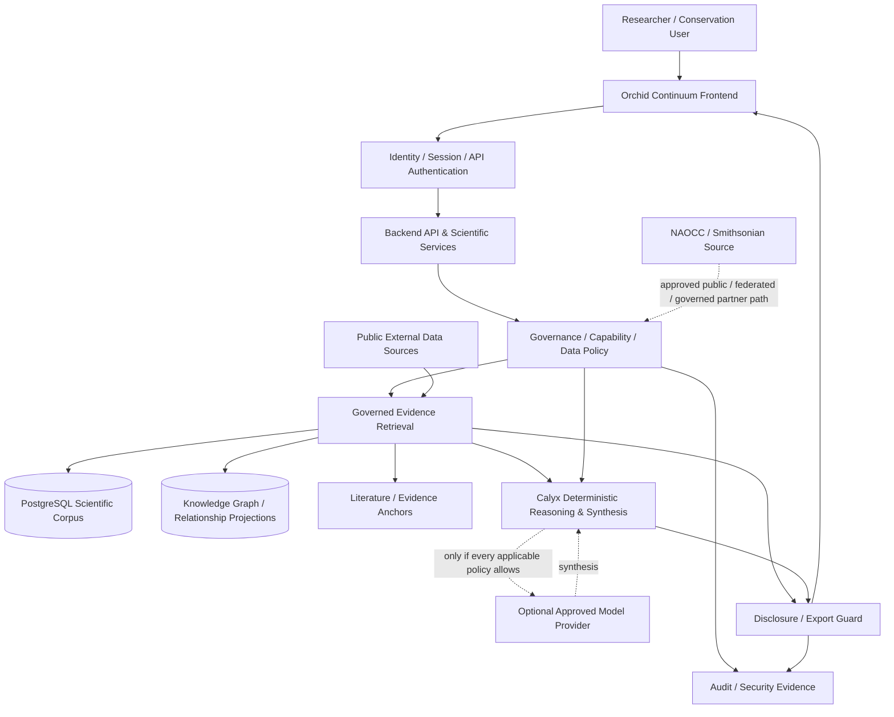

# Orchid Continuum — Technical Architecture, Security, and Partner-Integration Review

**Audience:** NAOCC scientific leadership; Smithsonian/NAOCC data-management, software, cybersecurity, privacy, records, and research-IT reviewers  
**Prepared:** 2026-08-25  
**Primary active repositories reviewed:** `jsp1440/orchid-calyx-backend`, `jsp1440/orchid-continuum-frontend`  
**Document status:** DRAFT FOR TECHNICAL REVIEW — update the readiness section immediately before external delivery.  
**Claim boundary:** This is a repository-grounded architecture/security review. It is not a penetration test, FedRAMP certification, Authority to Operate, legal opinion, or proof that every repository control has already been activated in the live environment.

---

# 1. Executive summary

The Orchid Continuum is an orchid biodiversity-intelligence platform intended to connect taxonomy, occurrences, traits, ecology, literature, images, conservation evidence, and biological relationships into an evidence-aware research environment.

For NAOCC, the central proposal is **not** “give Orchid Continuum your data.” It is a two-way research partnership in which NAOCC can use Continuum capabilities while remaining authoritative over NAOCC data and deciding, independently for each dataset/project, whether any partner-held information may be stored, analyzed, disclosed, sent to an external model, displayed as media, or exported.

The architecture is moving in the correct direction for that relationship. Current code and security design deliberately separate:

- source authority from Continuum custody;
- storage permission from scientific-use permission;
- scientific use from disclosure;
- disclosure from export;
- exact-locality computation from exact-locality display;
- textual/record access from media access;
- ordinary application administration from sealed-partner entitlement;
- deterministic scientific services from optional generative-model synthesis;
- user questions/navigation context from scientific evidence;
- source records from derived claims;
- “unknown/unmeasured” from measured zero.

The repository also draws a necessary boundary: **Orchid Continuum is not yet approved to accept unpublished or highly restricted NAOCC/Smithsonian data.** The partner policy foundation, persistent governance registry, default-deny RLS scaffolding, locality hardening, disclosure controls, model gates, and security tests are meaningful progress, but restricted-partner readiness additionally requires live/non-production proof of database role isolation and domain-table RLS, policy propagation through graph/search/cache/vector/model paths, restricted-media controls, audit operations, backup/restore validation, inference-attack tests, network/API review, and independent security assessment.

A P0 engineering program, `NAOCC-SECURITY-READINESS`, now defines those items as acceptance gates. Its internal finish line is `READY_FOR_INDEPENDENT_REVIEW`; a genuinely independent reviewer/institutional authority is required before any claim of independent validation for restricted partner data.

This does **not** block a useful NAOCC collaboration. A first pilot can be run entirely on public or otherwise explicitly permitted data, allowing NAOCC researchers to evaluate Continuum taxonomy, Atlas, literature/evidence, relationship, and Calyx workflows before any decision about restricted data.

---

# 2. What NAOCC should be able to do with the Continuum

A partner-facing implementation should support an authenticated NAOCC researcher moving through a bounded research workflow such as:

```text
NAOCC researcher
   ↓
Taxon/name resolution
   ↓
Species dossier / evidence receipts
   ↓
Atlas occurrence, range, elevation, habitat context
   ↓
Literature and extracted scientific evidence
   ↓
Pollinator / mycorrhizal / trait / conservation relationships
   ↓
Calyx governed synthesis
   ↓
Source/provenance inspection
   ↓
Policy-approved report/export
```

NAOCC should be able to use this workflow even if NAOCC never transfers a restricted dataset to Orchid Continuum.

Potential uses include:

- accepted-name and synonym reconciliation;
- cross-dataset taxon matching;
- occurrence/range/elevation analysis;
- literature discovery tied to taxa and claims;
- evidence-backed species dossiers;
- pollinator and mycorrhizal relationship exploration;
- trait comparison and pattern discovery;
- conservation evidence review;
- provenance and data-quality diagnostics;
- graph exploration across taxa, evidence, places, traits, interactions, and publications;
- AI-assisted synthesis that remains subordinate to governed evidence and policy;
- governed exports/reports when permitted.

Capability maturity varies by module. Partner demonstrations should therefore be acceptance-tested workflow by workflow rather than presented as a blanket claim that every module is production-complete.

---

# 3. Logical system architecture



This is the **target governed architecture**. It intentionally distinguishes architecture present in repository code from controls that still need complete runtime/deployment evidence.

---

# 4. Main components

## 4.1 Frontend / research workspaces

The active frontend is `jsp1440/orchid-continuum-frontend`.

Current module families include:

- Species Dossier / federation;
- Atlas / Atlas Next;
- Research Station;
- Calyx Workspace;
- Conservation surfaces;
- Mission Control / completion observability;
- Conservatory / collection workflows;
- cross-module evidence and navigation contracts.

A useful architectural property is the completion census: untested capability state is represented as `UNKNOWN` rather than assigned a fabricated completion percentage. Individual gates can separately record architecture, implementation, integration, provenance/security, browser end-to-end, and deployed-operational evidence.

Recent frontend hardening also demonstrates the intended information-boundary model: route/navigation context can preserve a canonical taxon while refusing to carry coordinates, locality, occurrence identifiers, evidence, confidence, or conclusions into a downstream Calyx context; user questions are explicitly non-evidentiary; and collection-local location names can remain inside the collection boundary.

## 4.2 Backend / API / scientific services

The active backend is `jsp1440/orchid-calyx-backend`.

It contains:

- authentication/session helpers;
- server-side role/capability resolution;
- Calyx services;
- data-governance policy objects and disclosure rules;
- partner governance migrations;
- scientific-data adapters and retrieval logic;
- Knowledge Graph publication/materialization work;
- literature extraction/evidence structures;
- Mission Control/readiness services;
- security and governance CI.

Deployment/runtime topology must be treated as an evidence question, not inferred from old README text. The partner-readiness gate requires an inventory of the actual deployed service identities, database roles, connection pool, storage, secrets, network boundaries, and public endpoints before restricted partner data is accepted.

## 4.3 Scientific corpus

The Continuum uses PostgreSQL as a canonical relational scientific corpus. Current Knowledge Graph work has documented large relational datasets such as orchid occurrences, normalized trait consensus, and research documents, but partner review should verify exact current row counts and schema identities on the release/commit being assessed rather than relying on historical counts.

## 4.4 Knowledge Graph

The Knowledge Graph is intended to represent evidence-bearing relationships among:

- taxa and accepted names/synonyms;
- occurrences;
- traits;
- habitats/elevation;
- pollinators and other interactions;
- mycorrhizal associates;
- conservation evidence;
- publications;
- observations, hypotheses, methods, measurements, results, conclusions, references, figures, and tables;
- claims and exact evidence anchors.

For partner data, every graph node, edge, derived relationship, and traversal result must retain sufficient policy lineage to ensure that graph traversal cannot reveal information that direct table access would deny.

## 4.5 Calyx

Calyx is the governed reasoning/synthesis layer.

Its intended architecture keeps deterministic planning/retrieval and scientific policy independent of a generative model. A language model may synthesize or explain approved evidence, but it must not decide access rights, create evidence, widen partner permissions, or silently convert user/navigation context into scientific evidence.

For restricted data, model-processing permission is a separate decision. A record can be usable by an authorized researcher while still prohibited from being transmitted to any external model provider.

---

# 5. Scientific evidence and provenance model

The platform's credibility depends on distinguishing scientific evidence from context and synthesis.

Target distinctions include:

| Item | Scientific evidence? | Required handling |
|---|---:|---|
| Source occurrence/specimen record | Yes, subject to source quality/policy | Preserve source id, authority, license/agreement, provenance |
| Reviewed publication evidence span | Yes, when eligible and bound | Preserve publication/source hash and evidence anchor |
| User question | No | May guide retrieval; never promoted to evidence |
| Navigation/route context | No | May carry safe taxon context; no implied scientific claim |
| AI-generated prose | No independent authority | Must point back to admitted evidence and be disclosure-checked |
| Missing measurement | No measurement | Render unavailable/unknown, not zero |
| Derived aggregate | Derived evidence | Preserve contributing lineage and effective restrictions |

The objective is an inspectable chain:

```text
answer / relationship
    → claim
        → evidence record or publication span
            → canonical taxon/source identity
                → source organization / license / policy
```

---

# 6. Partner-data governance model

## 6.1 Sensitivity classes

The current canonical security foundation defines:

- `PUBLIC`
- `ATTRIBUTED`
- `RESEARCH_RESTRICTED`
- `SENSITIVE_CONSERVATION`
- `SEALED_PARTNER`

These classes are only the beginning; a real decision also considers project, purpose, dataset entitlement, disclosure mode, media rights, export permission, and model-processing permission.

## 6.2 Separate permissions

For every partner record, the architecture should answer independently:

1. **Storage:** may Continuum hold/cache/index this record?
2. **Use:** may this principal/project analyze it for this declared purpose?
3. **Exact locality computation:** may exact values participate in analysis?
4. **Disclosure:** what may this audience see?
5. **Media:** may images/files be displayed or delivered?
6. **Model processing:** may an external model receive any form of the record, and which provider/environment?
7. **Export:** may the raw record or a derivative leave the boundary?
8. **Authority/provenance:** who remains authoritative, what attribution/agreement applies?
9. **Retention/revocation:** how long may the record/derivatives remain and how is access revoked?

No permission may silently widen another.

## 6.3 Most-restrictive composition

Where multiple source/dataset policies contribute to an answer, the effective rule must be the intersection/most restrictive applicable rule. In particular:

- any applicable deny can deny use;
- export requires every applicable policy to permit it;
- external model processing requires every applicable policy to permit it;
- provider allowlists must all be satisfied;
- locality uses the most restrictive disclosure mode;
- image/media rights remain independent;
- attribution and provenance obligations accumulate rather than disappear.

---

# 7. Sensitive locality architecture

The canonical principle is:

> **store exact → authorize use → compute exact → authorize disclosure → transform/redact for audience → separately authorize export**

Exact locality may be scientifically essential for range, climate, habitat, elevation, population, and conservation analysis. Removing precision from the scientific store would harm research. The correct control point is authorized disclosure.

However, hiding decimal latitude/longitude alone is insufficient. A protected locality may be reconstructable from combinations of:

- county or locality text;
- elevation;
- collection date;
- habitat description;
- landowner/site information;
- specimen metadata;
- distinctive imagery;
- small aggregates;
- linked graph relationships.

The restricted-data acceptance suite must therefore include both direct-leak and inference/reconstruction tests.

---

# 8. Database-level isolation / PostgreSQL RLS

## 8.1 Current foundation

The repository includes a persistent `oc_security` governance registry and default-deny RLS scaffolding on governance surfaces. That is useful but is **not proof that every scientific table capable of holding restricted partner data is protected in the deployed database**.

## 8.2 Required runtime role topology

The target database deployment should distinguish at least:

1. migration/schema owner;
2. public/read application role;
3. trusted Calyx/evidence-service role;
4. ingestion/background worker role;
5. security/audit reader;
6. append-only security/audit writer;
7. separately controlled break-glass operator.

A shared superuser/owner credential for all workloads is unacceptable for restricted partner data.

## 8.3 Required discovery before activation

The readiness audit must collect, without publishing credentials:

- actual `current_user` for each deployed service;
- `rolsuper` / `rolbypassrls` status;
- schema/table ownership;
- grants on scientific/media/security objects;
- `SECURITY DEFINER` functions and views/materialized views;
- connection-pool identities and session-state behavior;
- whether any browser/frontend connects directly to PostgreSQL;
- migration credential storage/rotation path;
- alternate bulk/export/script access paths.

## 8.4 Required proof

Before restricted data is accepted, a non-production deployment using the actual role topology must prove:

- public/anonymous cannot select restricted raw rows;
- ordinary authenticated user cannot select them;
- administrator without partner entitlement cannot read `SEALED_PARTNER` rows;
- authorized project user can access only its permitted slice/purpose;
- connection pooling cannot leak one principal's context into another request;
- denied raw access cannot be bypassed through view, graph, search, cache, export, worker, or model paths;
- allow/deny decisions are audited.

Production RLS activation remains an owner-controlled operational change and should not be performed merely because repository code is ready.

---

# 9. Policy-aware search, graph, cache, embeddings, and derivation

This is one of the most important remaining security boundaries.

A secure relational table is insufficient if a protected record leaks through a secondary system. The final design must ensure:

- search indexes never expose protected content to an unauthorized principal;
- vector/embedding indexes exclude or segregate restricted evidence according to policy;
- caches are principal/policy aware and cannot return another user's protected response;
- graph nodes/edges carry policy lineage;
- multi-hop graph traversal computes an effective restrictive disclosure decision;
- existence-only or aggregate-only policies cannot be defeated by search-result counts or autocomplete;
- derived aggregates retain source authority, policy identifiers, and contributing-record lineage;
- revocation invalidates or makes inaccessible stale cached/indexed derivatives.

A mixed synthesis of `PUBLIC + SEALED_PARTNER` evidence is a required adversarial test: public evidence must never widen the sealed contribution.

---

# 10. External AI/model boundary

A partner should be able to choose:

- no external model processing;
- approved provider(s) only;
- approved project/purpose only;
- deterministic Continuum tools without generative synthesis.

For every model-capable path:

1. evidence retrieval is authorized first;
2. every contributing policy is evaluated for model processing;
3. provider/environment is explicit and allowed;
4. protected payload is minimized;
5. output is re-checked against disclosure policy;
6. direct protected literals are redacted when unauthorized;
7. inference/reconstruction tests are applied;
8. raw restricted evidence, secrets, or private reasoning are not persisted to unsafe logs/artifacts.

Provider identity is provenance/operational metadata—not authority. Switching from one model to another must never change what the caller is allowed to access.

---

# 11. Restricted media

Images and files are data, not decoration.

The target restricted-media design requires:

- private object storage for non-public media;
- no permanent public URL for restricted objects;
- short-lived authorized delivery after policy evaluation;
- independent record-vs-media permission;
- restrictive cache controls;
- no restricted thumbnails/media in public CDN/search/vector indexes;
- derivative-only or watermark modes when required by agreement;
- ownership/reference checks so a media identifier from another record cannot be attached to a protected record;
- audit events for restricted media reads, denials, and exports.

Provider-neutral interfaces are preferred; no new paid service should be purchased solely to complete repository code without owner authorization.

---

# 12. Auditability and security operations

Every restricted-data decision should create a durable, secret-safe event sufficient for incident investigation without copying protected scientific payload into logs.

At minimum, audit:

- successful protected read;
- denied read;
- project/purpose/capability decision;
- locality generalization/transformation;
- model-processing decision + provider identity;
- generated-output guard action;
- restricted media access;
- raw/derived export;
- policy/entitlement change;
- migration/security-boundary administrative action;
- break-glass access.

Recommended event properties:

- immutable/event-style id;
- actor/service/project/dataset/policy identifiers;
- decision and reason code;
- timestamp;
- request/correlation id;
- no credentials/secrets;
- no unnecessary raw coordinates, locality strings, media URLs, or scientific payload;
- retention/query path for incident review.

---

# 13. Backup, restore, retention, deletion, and revocation

Restricted-data governance is incomplete if it disappears during disaster recovery.

The acceptance gate should prove:

- backup encryption/access assumptions are documented;
- backup copies are inventoried without exposing secrets;
- a restore drill occurs only into an isolated non-production target appropriate for the data;
- RLS, roles, policy bindings, and audit controls are verified **before** restored application access;
- restricted media remains private after restore;
- revoked entitlements remain revoked after restore;
- stale cache/search/vector state cannot resurrect access;
- retention/deletion obligations and partner revocation procedures are documented and tested;
- restore evidence records target identity, timestamps, checksums/receipts when available, and test results.

A production backup restore or destructive deletion is an owner/provider operational gate, not an autonomous coding-agent action.

---

# 14. Supply-chain and CI security

Current security-readiness work includes SBOM/dependency inventory, immutable GitHub Action pinning, vulnerability triage, and fail-closed readiness evidence.

For partner readiness the final packet should contain:

- runtime + build dependency inventory;
- checksum-backed SBOM;
- vulnerability findings and disposition based on exploitability/reachability as well as severity;
- secret scanning/security-test evidence;
- least workflow permissions;
- immutable-pinned remote Actions where applicable;
- reproducible installs/lockfiles where feasible;
- exact-head CI evidence for the reviewed commit;
- explicit distinction between a workflow that genuinely executed and a check that existed but never ran.

---

# 15. Threat model / primary trust boundaries

## 15.1 Assets to protect

- unpublished partner scientific records;
- exact sensitive localities;
- landowner/site information;
- restricted media;
- partner agreements and policy metadata;
- credentials/service identities;
- taxonomic/scientific authoritative state;
- audit evidence;
- source provenance/licensing;
- private user/project data.

## 15.2 Principal threat categories

- unauthenticated public extraction;
- authenticated user crossing project/dataset boundaries;
- administrator privilege incorrectly overriding partner policy;
- direct database/RLS bypass;
- connection-pool identity leakage;
- legacy endpoint/script/export bypass;
- graph/search/vector/cache side-channel leakage;
- indirect sensitive-locality reconstruction;
- restricted image exposure through permanent/public URLs;
- external-model egress contrary to partner agreement;
- prompt/context injection causing unauthorized tool/data access;
- logging of raw protected values or credentials;
- dependency/supply-chain compromise;
- stale entitlement after revocation;
- insecure backup/restore copy;
- accidental publication/export of restricted evidence.

## 15.3 Architectural response

The desired response is **deny before retrieval or execution where possible**, minimize data at every egress boundary, and independently re-check disclosure at the output/export boundary.

---

# 16. Partner integration patterns

The architecture should allow NAOCC/Smithsonian to select the least risky pattern that still provides scientific value.

## Pattern A — Continuum tools over public data only

No restricted partner data is transferred. Lowest-risk first pilot.

## Pattern B — read-only federation to a NAOCC-approved public endpoint

NAOCC remains authoritative; Continuum resolves/links data through a governed connector subject to attribution, rate, caching, and source rules.

## Pattern C — explicitly approved partner subset

A specific dataset/project is governed by an agreement, sensitivity classification, project membership, purpose, entitlement, disclosure/media/model/export rules, and audit.

## Pattern D — protected computation with generalized/aggregate output

Exact partner data is available to a governed computation path, but only policy-approved aggregates/generalized results leave the protected boundary.

## Pattern E — computation deployed closer to partner-controlled infrastructure

Where institutional policy favors it, a bounded connector/analysis service can be evaluated for execution inside or adjacent to a Smithsonian/NAOCC-controlled environment so raw protected records need not be copied into a general public-service datastore.

Pattern E is an integration design option, not a claim that such deployment is already operational.

---

# 17. Smithsonian/federal-style governance considerations

The Smithsonian's public research-data guidance strongly emphasizes Data Management Plans (DMPs), including how data will be collected, protected from loss, shared, restricted, and governed through roles and responsibilities. Smithsonian storage/archiving guidance also calls for documenting data ownership/responsibility, access restrictions, backup procedures, and—for collaborative projects—MOUs describing roles and responsibilities.

Relevant public references:

- Smithsonian Libraries and Archives, **Data Management Plans**: https://library.si.edu/research/data-management-plans
- Smithsonian Libraries and Archives, **Best Practices for Storing, Archiving and Preserving Data**: https://library.si.edu/research/best-practices-storing-archiving-and-preserving-data
- Smithsonian Research Computing, **Data Management**: https://researchcomputing.si.edu/data-management
- Smithsonian Institution, **Public Access Plan (2025)**: https://scholarlypress.si.edu/wp-content/uploads/2024/12/SI-PA-PLAN-2025.pdf

For security-control organization, NIST SP 800-53 Rev. 5 / current release materials provide a useful control-family framework, including Access Control, Audit and Accountability, Assessment/Authorization/Monitoring, Configuration Management, Contingency Planning, Identification and Authentication, Incident Response, Media Protection, Risk Assessment, System and Communications Protection, System and Information Integrity, and Supply Chain Risk Management.

- NIST SP 800-53 Rev. 5: https://csrc.nist.gov/pubs/sp/800/53/r5/upd1/final
- NIST SP 800-53A Rev. 5 assessment procedures: https://csrc.nist.gov/pubs/sp/800/53/a/r5/final

### FedRAMP applicability must be decided by the federal/Smithsonian use case

Current FedRAMP 2026 scope guidance states that only a federal agency can determine whether its use case falls within FedRAMP scope. In general, scope includes cloud services that create, collect, process, store, or maintain Federal information on behalf of a Federal agency, subject to identified exclusions. Some single-agency systems and public-information use cases may be outside scope depending on the architecture and use case.

- FedRAMP 2026 Scope guidance: https://www.fedramp.gov/2026/scope/
- OMB M-24-15 / FedRAMP policy memo: https://www.fedramp.gov/resources/documents/FedRAMP_Policy_Memo.pdf

Therefore Orchid Continuum should **not self-declare “FedRAMP required,” “FedRAMP exempt,” or “Smithsonian approved.”** NAOCC/Smithsonian security/IT/procurement/legal authorities should classify the proposed use case after reviewing the actual data, hosting, identity integration, and responsibility model.

---

# 18. Recommended NIST-style evidence crosswalk

The final independent-review packet should map implemented evidence to at least these control families without claiming formal compliance unless assessed by the appropriate authority:

| Review area | Example evidence expected from Continuum |
|---|---|
| Access Control (AC) | project/dataset entitlements, least privilege, RLS tests, no admin universal override |
| Audit & Accountability (AU) | append-only protected access/deny/export/model/media/policy events |
| Assessment/Authorization/Monitoring (CA) | exact-release evidence packet, security regression results, independent review |
| Configuration Management (CM) | versioned migrations/config, immutable CI actions, change review |
| Contingency Planning (CP) | backup/restore drill, restored-policy verification, recovery runbook |
| Identification & Authentication (IA) | signed sessions/API identities/service identities, project principal mapping |
| Incident Response (IR) | escalation, credential compromise, protected-data incident procedure |
| Media Protection (MP) | private restricted-media storage and authorized delivery |
| Risk Assessment (RA) | threat model, attack-surface inventory, vulnerability disposition |
| System & Communications Protection (SC) | network/API boundary, TLS/provider controls, secret boundary, cache policy |
| System & Information Integrity (SI) | dependency scanning, security tests, integrity/checksum evidence |
| Supply Chain Risk Management (SR) | SBOM, pinned actions, dependency provenance/triage |

---

# 19. Current readiness assessment — update before sending

## Implemented / meaningful foundation

Repository evidence currently supports these claims:

- canonical partner sensitivity classes and fail-closed policy evaluation;
- source authority separated from access rights;
- purpose and dataset capability restrictions;
- independent locality/image disclosure concepts;
- independent export and model-processing permissions;
- provider allowlist logic;
- generated-output direct-literal leak guard;
- signed/expiring owner sessions and API authentication helpers;
- server-side role/capability concepts;
- scientific-review authority separated from ordinary administration;
- persistent partner governance registry in `oc_security`;
- default-deny RLS scaffolding on governance surfaces;
- exact-coordinate API/export hardening;
- focused partner-data security tests;
- security/SBOM/zero-day readiness work in progress;
- frontend contracts that prevent scientific/locality evidence from silently traveling as navigation context.

## Not yet sufficient for a restricted-data approval claim

The project still requires complete evidence for:

- actual deployed/non-production database role topology;
- RLS/least-privilege enforcement on every relevant scientific domain table;
- policy-aware graph/search/vector/cache propagation;
- all Calyx/model-processing paths passing the canonical gate;
- comprehensive output/inference protection;
- private restricted-media storage/delivery;
- complete audit-event coverage;
- backup/restore/revocation proof;
- route/network/rate-limit/bulk-extraction review;
- exact-head security validation on the release being reviewed;
- independent security review/penetration assessment appropriate to sensitivity;
- Smithsonian institutional determination/approval for the selected integration pattern.

## P0 program

Backend issue `#1177 — P0 NAOCC-SECURITY-READINESS` converts those remaining items into explicit acceptance gates and defines two different finish lines:

- `READY_FOR_INDEPENDENT_REVIEW` — internal engineering/testing/runtime evidence complete;
- `INDEPENDENTLY_VALIDATED_FOR_RESTRICTED_PARTNER_DATA` — may be used only after genuine independent review evidence and applicable owner/institutional gates.

No internal AI agent is authorized to label its own work independent external validation.

---

# 20. Adversarial acceptance suite required before restricted data

Use synthetic fixtures; do not use real NAOCC restricted records merely to prove security.

Minimum required cases:

1. unauthenticated requester vs sealed data;
2. administrator without partner entitlement;
3. correct researcher, wrong project;
4. correct project, unapproved purpose;
5. exact computation allowed but exact disclosure denied;
6. generalized output from exact internal evidence;
7. view allowed but raw export denied;
8. deterministic analysis allowed but external model denied;
9. one approved and one denied model provider;
10. restricted media denied while textual scientific record is allowed;
11. PUBLIC + SEALED mixed synthesis;
12. graph multi-hop leakage attempt;
13. search/vector leakage attempt;
14. cross-user cache leakage attempt;
15. direct coordinate leak attempt;
16. indirect locality reconstruction attempt;
17. revoked entitlement and stale derived/indexed state;
18. backup/restore retaining restrictions;
19. audit event produced without protected payload leakage;
20. unknown/malformed policy fails closed.

Frontend end-to-end tests should separately prove protected fields do not leak into browser URLs, navigation handoffs, analytics payloads, or public rendering.

---

# 21. Independent review package

Before requesting a genuinely independent security review, freeze an exact release/commit and provide:

- architecture/data-flow diagram;
- trust-boundary diagram;
- asset/data-classification inventory;
- endpoint and attack-surface inventory;
- threat model;
- authentication/authorization matrix;
- database role/RLS evidence;
- SBOM and vulnerability disposition;
- adversarial partner-security regression report;
- backup/restore evidence;
- incident response procedure;
- retention/revocation/deletion procedure;
- known-risk register;
- exact release and deployment identities;
- reproducible security-test instructions;
- explicit list of owner/Smithsonian gates not yet exercised.

The independent reviewer should be asked to challenge the architecture, not merely confirm that tests pass.

---

# 22. Recommended NAOCC collaboration sequence

### Phase 1 — public-data value demonstration

No unpublished or restricted NAOCC data. Demonstrate an NAOCC researcher using Continuum capabilities and inspecting provenance.

### Phase 2 — technical/security architecture review

NAOCC/Smithsonian reviews this blueprint, P0 readiness evidence, data-governance model, and proposed integration patterns.

### Phase 3 — independent security assessment

Use the frozen candidate release and evidence packet. Remediate findings before any restricted-data pilot.

### Phase 4 — bounded non-production partner pilot

Use a deliberately small, explicitly authorized synthetic or partner-approved dataset; validate project/purpose/RLS/media/model/export/audit/revocation controls.

### Phase 5 — institutional decision and controlled activation

Only after NAOCC/Smithsonian determines the applicable security, data-management, procurement, records, legal, and hosting requirements should any real restricted-data path be activated.

---

# 23. Bottom line for NAOCC

The desired partnership model is:

> **NAOCC gains a useful orchid research and synthesis platform without surrendering authority over NAOCC data. Orchid Continuum may use only the data and permissions NAOCC/Smithsonian explicitly authorizes, and sensitive data should remain analyzable without becoming broadly disclosed.**

The correct near-term goal is not to ask NAOCC to trust an unfinished security claim. It is to finish and evidence the restricted-data boundary, obtain independent review, and meanwhile demonstrate the scientific value of the Continuum using public or explicitly permitted evidence.
