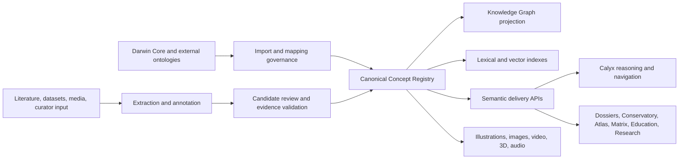

# BUILD-SEM-001 — Semantic Knowledge Architecture

## Architectural intent

The Semantic Knowledge System (SKS) is the shared meaning layer of the Orchid Continuum. It is not merely a glossary UI, an embedding index, or the Knowledge Graph. It assigns stable identity to concepts, governs their labels and meanings, connects them to evidence and external standards, and exposes those meanings consistently to people and machines.

## Principles

1. Stable concept identity is independent of labels and database row IDs.
2. Evidence and provenance accompany definitions, mappings, and assertions.
3. Human review gates canonical changes.
4. External standards are reused and mapped, not copied without provenance.
5. Darwin Core is the biodiversity interoperability layer, not the universal ontology.
6. SKOS is the default knowledge-organization representation; OWL is used only where formal semantics create measurable value.
7. Search relevance never changes canonical truth.
8. Taxon concepts, scientific names, anatomical concepts, traits, and observations remain distinguishable.
9. Every consumer receives the same concept identifiers through versioned contracts.
10. Accessibility, language, and audience are part of the content model.

## Logical architecture

The Concept Registry is authoritative for concept identity and lifecycle. The Knowledge Graph is an optimized relationship projection. The semantic index is an optimized retrieval projection. Neither projection owns canonical meaning.

## Bounded contexts

| Context | Responsibility | Existing foundation |
|---|---|---|
| Concept governance | identity, schemes, lifecycle, releases, stewardship | `app/ontology` |
| Lexical knowledge | preferred/alternate/historical labels, abbreviations, languages | ontology terms/synonyms |
| Definitions and explanations | scientific definitions plus audience variants | term definition field |
| Annotation | recognize and link source spans to concepts | `app/semantic` |
| Evidence/provenance | source anchors, validation, attribution, change history | semantic evidence and ontology evidence registry |
| External mappings | Darwin Core and ontology mappings with confidence/status | `external_ids` foundation |
| Semantic assets | concept-linked media and interactive resources | new bounded context |
| Retrieval | lexical, vector and concept-expanded search | `app/semantic_index` |
| Graph projection | typed concept relationships and scientific assertions | `runtime/knowledge_graph` |
| Delivery | stable query, resolve, explain and traverse APIs | extension/new façade |

## Consumer support

### Literature Intelligence

The extraction pipeline should recognize mentions, abbreviations and candidate relationships; resolve mentions to concept IDs; preserve exact source selectors; represent uncertainty and negation; and return unresolved or ambiguous candidates for review. Synonym expansion must be scheme-, language-, and context-aware.

### Knowledge Graph

Canonical concepts become graph nodes. Hierarchical, partonomic, developmental, ecological, evidential and mapping relations become typed edges. Graph publication remains gated and provenance-bearing. Assertions about organisms must remain separate from vocabulary relations between concepts.

### Species Dossiers

Dossiers request concept cards by ID and context. A card may contain a concise definition, labeled structure, illustration, related concepts, evidence, pronunciation, and deeper scientific explanation. Dossiers link organism assertions to the concepts that define their traits and structures.

### Conservatory

The same concept can provide a grower-oriented explanation and safe operational guidance without overwriting its scientific definition. Care terms should link to plant structures, symptoms, environmental factors, and evidence strength.

### Education

Concept prerequisites and learning objectives support adaptive pathways, quizzes, spaced review, diagrams, and age/knowledge-level explanations. Educational content is a presentation layer attached to canonical concepts, not a competing ontology.

### Research

Researchers require exact terminology, source and version history, ontology mappings, trait context, structured query filters, semantic expansion controls, and exportable identifiers.

## Darwin Core placement

Darwin Core is canonical for exchanged biodiversity record semantics: occurrences, events, locations, organisms, material samples, identifications, taxa, names, references, measurements/facts, media-associated references, and record-level attribution.

Natural mappings include `scientificName`, `acceptedNameUsage`, `taxonID`, `nameAccordingTo`, `taxonRank`, `vernacularName`, `occurrenceID`, `eventDate`, `recordedBy`, `identifiedBy`, `locality`, `decimalLatitude`, `decimalLongitude`, `habitat`, `associatedTaxa`, `associatedMedia`, `measurementType`, `measurementValue`, `measurementUnit`, and `measurementMethod`.

Extensions or complementary profiles are required for rich traits, botanical anatomy, pollination and mycorrhizal interactions, annotation selectors, evidence confidence, media regions, educational content, and concept histories. Interactive media, UI help, learning paths, prompts, and reasoning traces belong outside Darwin Core.

## AI and Calyx

Calyx should receive a semantic context envelope containing:

- recognized concept IDs and matched labels;
- preferred labels and audience-appropriate definitions;
- safe synonym and broader/narrower expansion;
- linked taxa, traits, structures and evidence;
- ontology/release versions;
- ambiguity candidates and confidence;
- navigation targets across workbenches;
- citations sufficient to explain grounding.

Calyx must not create canonical concepts during question answering. It may propose candidates through the reviewed intake path. Prompt grounding should use bounded, versioned concept packages; reasoning output should distinguish retrieved facts, inferred relationships, and generated explanations.

## Future presentation capabilities

Clickable papers and hover definitions are near-term delivery features. Concept graphs, interactive diagrams and adaptive learning follow once relationships and audience variants are stable. 3D/animated structures and voice explanations require an asset manifest with format, language, accessibility alternatives, spatial selectors, licensing, provenance, and device capability. All visual/audio experiences require text alternatives, captions/transcripts, keyboard navigation, reduced-motion behavior, and pronunciation metadata.

## Non-goals

This architecture does not authorize schema changes, automatic ontology imports, graph republishing, prompt changes, or UI redesign. Each requires a separately reviewed implementation build.
